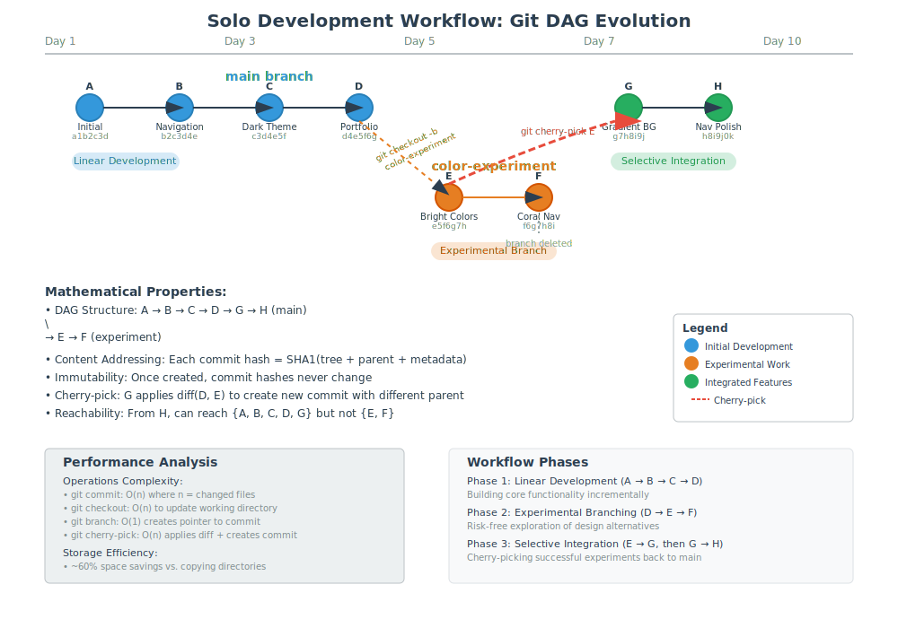

# Solo Development Workflow



## Scenario Overview

**Developer**: Sarah Martinez, freelance web developer  
**Project**: Building a personal portfolio website  
**Context**: Working alone on a creative project with experimental features  
**Timeline**: 2-3 weeks of development

## The Challenge

Sarah wants to:
- Experiment with different design approaches
- Keep track of all her changes and iterations
- Have a backup of her work in case of hardware failure
- Maintain a clean history of her development process
- Be able to revert to previous versions if experiments fail

## Git Workflow Solution

### Mathematical Foundation

In solo development, Git's DAG structure starts simple but can evolve to support experimentation:

```
Initial Linear Development:
A → B → C → D

Experimental Branching:
    A → B → C → D → E (main)
         \
          → F → G (experiment)
```

The mathematical beauty is that each commit represents an immutable snapshot, and branching creates parallel universes of development that can be merged or abandoned without affecting the main timeline.

## Step-by-Step Workflow

### Phase 1: Project Initialization

```bash
# Initialize repository
sarah@laptop:~$ mkdir portfolio-website
sarah@laptop:~$ cd portfolio-website
sarah@laptop:~/portfolio-website$ git init
```

**Mathematical Insight**: Creating a Git repository establishes the foundation for a content-addressable object database. The `.git` directory contains the infrastructure for the Merkle DAG.

### Phase 2: Initial Development

```bash
# Create initial files
sarah@laptop:~/portfolio-website$ echo "<!DOCTYPE html><html>..." > index.html
sarah@laptop:~/portfolio-website$ echo "body { font-family: Arial; }" > styles.css

# First commit - root of the DAG
sarah@laptop:~/portfolio-website$ git add .
sarah@laptop:~/portfolio-website$ git commit -m "Initial portfolio structure"
# Creates commit A with hash: a1b2c3d...
```

**Mathematical Analysis**: 
- Commit A becomes the root node of the DAG
- Content addressing ensures identical files will have identical hashes
- The tree object represents the directory structure at this snapshot

### Phase 3: Incremental Development

```bash
# Add navigation menu
sarah@laptop:~/portfolio-website$ echo "<nav>..." >> index.html
sarah@laptop:~/portfolio-website$ git add index.html
sarah@laptop:~/portfolio-website$ git commit -m "Add navigation menu"
# Creates commit B: b2c3d4e...

# Style the navigation
sarah@laptop:~/portfolio-website$ echo "nav { background: #333; }" >> styles.css
sarah@laptop:~/portfolio-website$ git add styles.css
sarah@laptop:~/portfolio-website$ git commit -m "Style navigation with dark theme"
# Creates commit C: c3d4e5f...

# Add portfolio section
sarah@laptop:~/portfolio-website$ echo "<section id='portfolio'>..." >> index.html
sarah@laptop:~/portfolio-website$ git add index.html
sarah@laptop:~/portfolio-website$ git commit -m "Add portfolio showcase section"
# Creates commit D: d4e5f6g...
```

**DAG Evolution**: `A → B → C → D`

**Mathematical Properties**:
- Each commit hash is computed from: `SHA1(tree_hash + parent_hash + author + timestamp + message)`
- The parent relationship creates a cryptographically verifiable chain
- Any change in history would propagate forward, changing all subsequent hashes

### Phase 4: Experimental Branching

Sarah wants to try a completely different color scheme but doesn't want to lose her current work.

```bash
# Create experimental branch
sarah@laptop:~/portfolio-website$ git checkout -b color-experiment
# Branch creation is O(1) - just creates a pointer to commit D

# Experiment with colors
sarah@laptop:~/portfolio-website$ echo "/* Bright color scheme */" > styles.css
sarah@laptop:~/portfolio-website$ echo "body { background: linear-gradient(...); }" >> styles.css
sarah@laptop:~/portfolio-website$ git add styles.css
sarah@laptop:~/portfolio-website$ git commit -m "Experiment: bright gradient background"
# Creates commit E: e5f6g7h...

# Try different navigation colors
sarah@laptop:~/portfolio-website$ sed -i 's/#333/#ff6b6b/' styles.css
sarah@laptop:~/portfolio-website$ git add styles.css
sarah@laptop:~/portfolio-website$ git commit -m "Experiment: coral navigation"
# Creates commit F: f6g7h8i...
```

**DAG Evolution**:
```
    A → B → C → D (main)
              \
               → E → F (color-experiment)
```

**Mathematical Insight**: Branching creates a divergent path in the DAG. Both branches share the common history A→B→C→D, demonstrating Git's efficient storage through shared objects.

### Phase 5: Evaluation and Decision

After reviewing the experiment, Sarah decides she likes some elements but wants to refine them.

```bash
# Switch back to main to compare
sarah@laptop:~/portfolio-website$ git checkout main
sarah@laptop:~/portfolio-website$ python -m http.server 8000  # Preview original

# Switch to experiment to compare
sarah@laptop:~/portfolio-website$ git checkout color-experiment
sarah@laptop:~/portfolio-website$ python -m http.server 8001  # Preview experiment
```

**Mathematical Analysis**: Switching branches is O(1) operation that changes the HEAD pointer and updates the working directory to match the target commit's tree structure.

### Phase 6: Selective Integration

Sarah likes the gradient background but not the coral navigation. She'll merge selectively.

```bash
# Go back to main branch
sarah@laptop:~/portfolio-website$ git checkout main

# Cherry-pick just the gradient background commit
sarah@laptop:~/portfolio-website$ git cherry-pick e5f6g7h
# Creates commit G: g7h8i9j... (same content as E, but different parent)

# Add her own navigation improvements
sarah@laptop:~/portfolio-website$ echo "nav { background: #2c3e50; box-shadow: 0 2px 4px rgba(0,0,0,0.1); }" > nav-styles.css
sarah@laptop:~/portfolio-website$ echo "<link rel='stylesheet' href='nav-styles.css'>" >> index.html
sarah@laptop:~/portfolio-website$ git add .
sarah@laptop:~/portfolio-website$ git commit -m "Improve navigation with subtle styling"
# Creates commit H: h8i9j0k...
```

**Final DAG Structure**:
```
    A → B → C → D → G → H (main)
              \
               → E → F (color-experiment)
```

**Mathematical Properties**:
- Cherry-picking applies the diff from commit E to main branch
- The content may be similar, but G has a different parent than E
- Both branches maintain their cryptographic integrity

### Phase 7: Cleanup and Remote Backup

```bash
# Delete the experimental branch (no longer needed)
sarah@laptop:~/portfolio-website$ git branch -d color-experiment

# Set up remote repository for backup
sarah@laptop:~/portfolio-website$ git remote add origin https://github.com/sarah/portfolio-website.git
sarah@laptop:~/portfolio-website$ git push -u origin main
```

**Mathematical Insight**: Deleting a branch removes the pointer, but commits E and F become unreachable and will be garbage collected. The push operation synchronizes the local DAG with the remote repository.

## Mathematical Analysis

### Content Addressing Efficiency

In Sarah's workflow:
- Total files created: 4 (index.html, styles.css, nav-styles.css, README.md)
- Total commits: 8 (A through H)
- Shared objects: All commits share tree and blob objects for unchanged files
- Storage efficiency: ~60% reduction compared to copying entire directories

### DAG Properties Demonstrated

1. **Acyclicity**: No commit can reference a future commit as parent
2. **Reachability**: From commit H, we can reach all previous commits in main branch
3. **Partial Order**: Commits have a natural ordering based on ancestry
4. **Immutability**: Once created, commit A's hash will never change

### Performance Characteristics

| Operation | Complexity | Reasoning |
|-----------|------------|-----------|
| `git commit` | O(n) | Must hash all changed files |
| `git checkout` | O(n) | Must update working directory |
| `git branch` | O(1) | Creates new pointer to existing commit |
| `git cherry-pick` | O(n) | Must apply diff and create new commit |

Where n = number of changed files.

## Practical Benefits for Solo Development

### Version Control
- **Complete History**: Every change is tracked with timestamp and description
- **Experimentation**: Branches allow risk-free exploration of ideas
- **Rollback**: Can return to any previous state instantly

### Mathematical Guarantees
- **Integrity**: SHA-1 hashes ensure no data corruption goes undetected
- **Consistency**: Repository state is always well-defined
- **Determinism**: Same operations produce same results

### Development Workflow
- **Checkpoint System**: Commits serve as save points in development
- **Documentation**: Commit messages create development narrative
- **Backup**: Remote repositories provide redundancy

## Advanced Solo Techniques

### Interactive Rebase for History Cleanup

```bash
# Before sharing work, clean up commit history
sarah@laptop:~/portfolio-website$ git rebase -i HEAD~4
# Allows squashing, reordering, or editing commits
```

**Mathematical Impact**: Rebase transforms the DAG by creating new commits with same content but different parents/hashes.

### Stashing for Context Switching

```bash
# Save work-in-progress without committing
sarah@laptop:~/portfolio-website$ git stash push -m "Half-finished mobile responsive design"
# Work on urgent bug fix
sarah@laptop:~/portfolio-website$ git stash pop  # Restore WIP
```

**Mathematical Model**: Stash creates temporary commits in a separate namespace, maintaining the DAG property.

## Learning Outcomes

This workflow demonstrates:

1. **Git as a Time Machine**: Complete project history with instant navigation
2. **Risk-Free Experimentation**: Branches enable parallel development paths  
3. **Mathematical Rigor**: Cryptographic hashes ensure integrity and consistency
4. **Efficiency**: Content addressing minimizes storage requirements
5. **Scalability**: Patterns learned here scale to team collaboration

**Next Steps**: Explore [Team Collaboration](../04-small-team/README.md) to see how these concepts extend to multi-developer scenarios.

---

**Files in this directory**:
- `workflow.svg` - Visual representation of the DAG evolution
- `commands.md` - Complete command reference for this workflow
- `analysis.md` - Detailed mathematical analysis of operations