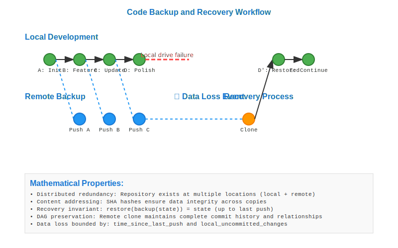

# Code Backup and Recovery Workflow



## Scenario Overview

**Developer**: Elena Rodriguez, freelance game developer  
**Project**: Indie game development with critical asset protection  
**Context**: Working from multiple locations with unreliable internet  
**Timeline**: 6-month project with daily backup needs and occasional recovery scenarios

## The Challenge

Elena needs to:
- Protect against hardware failure and data loss
- Work seamlessly across multiple devices (laptop, desktop, cloud instances)
- Maintain complete project history even with connectivity issues
- Recover specific versions when experiments go wrong
- Ensure game assets and code are always backed up
- Handle large binary files (textures, audio, models) efficiently

## Mathematical Foundation

Backup and recovery leverages Git's **distributed DAG replication** across multiple repositories:

```
Distributed Repository Network:
Local Laptop: A → B → C → D
              ↓ push   ↓ push
Remote Backup: A → B → C → D
              ↓ clone  ↓ pull
Cloud Instance: A → B → C → D
```

**Key Mathematical Properties**:
- **Content Integrity**: SHA-1 hashing ensures bit-perfect replication
- **Distributed Consistency**: All repositories eventually converge to same DAG state
- **Redundancy**: Multiple copies provide fault tolerance
- **Incremental Transfer**: Only new objects are transferred during sync

## Step-by-Step Workflow

### Phase 1: Initial Backup Infrastructure Setup

```bash
# Elena sets up her local development environment
elena@laptop:~$ mkdir indie-game-project
elena@laptop:~$ cd indie-game-project
elena@laptop:~/indie-game-project$ git init
elena@laptop:~/indie-game-project$ git config user.name "Elena Rodriguez"
elena@laptop:~/indie-game-project$ git config user.email "elena@gamedev.com"

# Add initial project structure
elena@laptop:~/indie-game-project$ mkdir src assets docs
elena@laptop:~/indie-game-project$ echo "# Indie Game Project" > README.md
elena@laptop:~/indie-game-project$ echo "*.tmp" > .gitignore
elena@laptop:~/indie-game-project$ git add .
elena@laptop:~/indie-game-project$ git commit -m "Initial project structure"
# Creates commit A: a1b2c3d...
```

### Phase 2: Remote Backup Repository Setup

```bash
# Set up remote backup on GitHub/GitLab
elena@laptop:~/indie-game-project$ git remote add origin https://github.com/elena/indie-game.git
elena@laptop:~/indie-game-project$ git push -u origin main

# Add additional backup remote (e.g., self-hosted GitLab)
elena@laptop:~/indie-game-project$ git remote add backup https://gitlab.gamedev.com/elena/indie-game.git
elena@laptop:~/indie-game-project$ git push backup main

# Verify remote configuration
elena@laptop:~/indie-game-project$ git remote -v
# origin    https://github.com/elena/indie-game.git (fetch)
# origin    https://github.com/elena/indie-game.git (push)
# backup    https://gitlab.gamedev.com/elena/indie-game.git (fetch)
# backup    https://gitlab.gamedev.com/elena/indie-game.git (push)
```

**Mathematical Insight**: Multiple remotes create a **redundant distributed system** where failure of any single node doesn't result in data loss.

### Phase 3: Daily Development with Automatic Backup

```bash
# Daily development work
elena@laptop:~/indie-game-project$ echo "class Player { ... }" > src/player.js
elena@laptop:~/indie-game-project$ echo "player_sprite.png" > assets/player.png
elena@laptop:~/indie-game-project$ git add .
elena@laptop:~/indie-game-project$ git commit -m "Add player character implementation"
# Creates commit B: b2c3d4e...

# Automatic backup to multiple remotes
elena@laptop:~/indie-game-project$ git push origin main
elena@laptop:~/indie-game-project$ git push backup main

# Continue development
elena@laptop:~/indie-game-project$ echo "class Enemy { ... }" > src/enemy.js
elena@laptop:~/indie-game-project$ git add src/enemy.js
elena@laptop:~/indie-game-project$ git commit -m "Add enemy AI system"
# Creates commit C: c3d4e5f...

# Daily backup routine
elena@laptop:~/indie-game-project$ git push origin main
elena@laptop:~/indie-game-project$ git push backup main
```

**DAG Replication**: Each push operation replicates the DAG structure to remote repositories, ensuring consistency across all backup locations.

### Phase 4: Multi-Device Synchronization

```bash
# Elena moves to her desktop workstation
elena@desktop:~$ git clone https://github.com/elena/indie-game.git indie-game-project
elena@desktop:~$ cd indie-game-project

# Continue development on desktop
elena@desktop:~/indie-game-project$ echo "class GameEngine { ... }" > src/engine.js
elena@desktop:~/indie-game-project$ git add src/engine.js
elena@desktop:~/indie-game-project$ git commit -m "Add core game engine"
# Creates commit D: d4e5f6g...

elena@desktop:~/indie-game-project$ git push origin main
elena@desktop:~/indie-game-project$ git push backup main

# Later, sync back to laptop
elena@laptop:~/indie-game-project$ git pull origin main
# Fast-forward merge brings in commit D
```

**Mathematical Analysis**: The distributed nature ensures that work from any device can be synchronized to all others through the shared DAG structure.

### Phase 5: Recovery Scenarios

#### Scenario 1: Recent Work Corruption

```bash
# Elena accidentally corrupts recent work
elena@laptop:~/indie-game-project$ echo "CORRUPTED DATA" > src/player.js
elena@laptop:~/indie-game-project$ rm src/enemy.js

# Recover from last good commit
elena@laptop:~/indie-game-project$ git status
elena@laptop:~/indie-game-project$ git checkout HEAD -- src/player.js
elena@laptop:~/indie-game-project$ git checkout HEAD -- src/enemy.js

# Or reset to last known good state
elena@laptop:~/indie-game-project$ git reset --hard HEAD
```

#### Scenario 2: Hardware Failure Recovery

```bash
# Elena's laptop crashes, she gets a new machine
elena@new-laptop:~$ git clone https://github.com/elena/indie-game.git indie-game-project
elena@new-laptop:~$ cd indie-game-project

# Verify complete project recovery
elena@new-laptop:~/indie-game-project$ git log --oneline
# d4e5f6g Add core game engine
# c3d4e5f Add enemy AI system
# b2c3d4e Add player character implementation
# a1b2c3d Initial project structure

# All history and files are recovered
elena@new-laptop:~/indie-game-project$ ls -la
# Complete project structure restored
```

#### Scenario 3: Point-in-Time Recovery

```bash
# Elena wants to recover a specific version from 2 weeks ago
elena@laptop:~/indie-game-project$ git log --since="2 weeks ago" --until="1 week ago"
elena@laptop:~/indie-game-project$ git checkout b2c3d4e  # Specific commit from that time

# Create new branch from that point for comparison
elena@laptop:~/indie-game-project$ git checkout -b recovery-point b2c3d4e
elena@laptop:~/indie-game-project$ git checkout main

# Cherry-pick specific changes if needed
elena@laptop:~/indie-game-project$ git cherry-pick b2c3d4e
```

### Phase 6: Advanced Backup Strategies

#### Large File Management with Git LFS

```bash
# Set up Git LFS for large assets
elena@laptop:~/indie-game-project$ git lfs install
elena@laptop:~/indie-game-project$ git lfs track "*.png" "*.wav" "*.mp3" "*.fbx"
elena@laptop:~/indie-game-project$ git add .gitattributes
elena@laptop:~/indie-game-project$ git commit -m "Configure Git LFS for large assets"

# Add large game assets
elena@laptop:~/indie-game-project$ cp ~/textures/*.png assets/
elena@laptop:~/indie-game-project$ git add assets/
elena@laptop:~/indie-game-project$ git commit -m "Add high-resolution texture assets"
elena@laptop:~/indie-game-project$ git push origin main
```

#### Automated Backup Scripts

```bash
# Create backup automation script
elena@laptop:~/indie-game-project$ cat > backup.sh << 'EOF'
#!/bin/bash
git add -A
if [ -n "$(git diff --cached)" ]; then
    git commit -m "Automated backup: $(date)"
    git push origin main
    git push backup main
    echo "Backup completed: $(date)"
else
    echo "No changes to backup: $(date)"
fi
EOF

elena@laptop:~/indie-game-project$ chmod +x backup.sh

# Set up cron job for automatic backups
elena@laptop:~/indie-game-project$ crontab -e
# Add: 0 */2 * * * cd /home/elena/indie-game-project && ./backup.sh
```

## Mathematical Analysis

### Reliability Metrics

**Single Point of Failure Probability**: With n backup repositories, probability of total data loss = p^n, where p is probability of individual repository failure.

**Recovery Time**: 
- Local corruption: O(1) - instant reset/checkout
- Hardware failure: O(|repository_size|) - time to clone
- Network-based recovery: O(|changes|) - only changed objects transferred

### Consistency Guarantees

**Strong Consistency**: All repositories eventually contain identical DAG structures due to Git's content-addressable design.

**Conflict Resolution**: Distributed development requires merge strategies when multiple devices modify the same files.

### Storage Efficiency

**Deduplication**: Identical files across commits and repositories share storage through content addressing.

**Compression**: Git's pack files provide efficient storage for large histories.

## Benefits and Trade-offs

### Benefits
- **Zero Data Loss**: Multiple repository copies eliminate single points of failure
- **Version History**: Complete project history preserved across all backups
- **Device Independence**: Work from any device with full project access
- **Offline Capability**: Full Git functionality works without network connectivity
- **Granular Recovery**: Recover specific files, commits, or entire project states

### Trade-offs
- **Storage Overhead**: Multiple repository copies consume more total storage
- **Sync Complexity**: Managing multiple remotes requires careful workflow design  
- **Large File Challenges**: Binary assets can bloat repository size without LFS
- **Connectivity Dependence**: Backup effectiveness depends on reliable network access

## Best Practices

1. **Multiple Remotes**: Use at least 2 remote repositories for redundancy
2. **Regular Pushes**: Push changes frequently to maintain fresh backups
3. **Automated Backups**: Use scripts and cron jobs for consistent backup schedules
4. **LFS for Assets**: Use Git LFS for large binary files to prevent repository bloat
5. **Backup Verification**: Periodically test recovery procedures to ensure backups work
6. **Local Backup**: Consider additional local backup (external drive) for offline redundancy

## Recovery Procedures

### Quick Recovery Checklist
1. **Assess Damage**: Determine what was lost (files, commits, entire repository)
2. **Choose Recovery Point**: Identify the last known good state
3. **Select Recovery Method**: Reset, checkout, cherry-pick, or full clone
4. **Verify Recovery**: Ensure all expected files and history are present
5. **Resume Development**: Continue work with confidence in backup system

## Mathematical Insights

The backup and recovery workflow showcases Git's **fault-tolerant distributed architecture**:

- **Merkle Tree Integrity**: Cryptographic hashing ensures backup authenticity
- **DAG Replication**: Distributed repositories maintain identical commit graphs  
- **Content Addressing**: Identical content shares storage across all repositories
- **Atomic Operations**: All Git operations maintain repository consistency

This mathematical foundation makes Git an exceptionally robust backup and recovery system for software development.