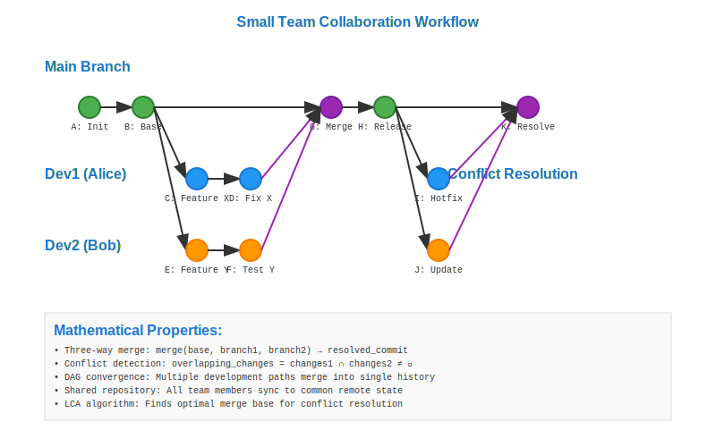

# Small Team Collaboration Workflow



## Scenario Overview

**Team**: WebDev Solutions - 4-person development team  
**Project**: Client portfolio website with CMS integration  
**Team Members**: Sarah (Lead), Mike (Backend), Lisa (Frontend), Tom (Designer)  
**Timeline**: 3-week sprint with shared repository collaboration

## The Challenge

The team needs to:
- Work simultaneously on different components without conflicts
- Review each other's code before integration
- Maintain stable main branch for client demos
- Handle merge conflicts when they arise
- Track who made what changes and when

## Mathematical Foundation

Small team collaboration creates a **convergent DAG** with regular merge points:

```
Collaborative Development Pattern:
A → B → C → F → H (main - Sarah)
 \       ↗   ↗
  → D → E   G (Mike's work)
```

**Key Properties**:
- **Frequent Integration**: Regular merges keep branches synchronized
- **Conflict Resolution**: Three-way merge algorithm handles overlapping changes
- **Attribution**: Each commit preserves author information in DAG

## Workflow Steps

### Phase 1: Repository Setup and Branching Strategy

```bash
# Sarah sets up shared repository
sarah@dev:~$ git clone https://github.com/webdev/client-portfolio.git
sarah@dev:~$ cd client-portfolio

# Team members create feature branches
mike@dev:~/client-portfolio$ git checkout -b feature/cms-backend
lisa@dev:~/client-portfolio$ git checkout -b feature/responsive-ui  
tom@dev:~/client-portfolio$ git checkout -b feature/design-system
```

### Phase 2: Parallel Development

```bash
# Mike implements CMS backend
mike@dev:~/client-portfolio$ echo "class CMSController { ... }" > src/cms.js
mike@dev:~/client-portfolio$ git add src/cms.js
mike@dev:~/client-portfolio$ git commit -m "Add CMS controller implementation"

# Lisa works on responsive UI
lisa@dev:~/client-portfolio$ echo "@media queries { ... }" >> styles/responsive.css
lisa@dev:~/client-portfolio$ git commit -am "Add responsive breakpoints"

# Tom creates design system
tom@dev:~/client-portfolio$ echo ":root { --primary: #007acc; }" > styles/tokens.css
tom@dev:~/client-portfolio$ git commit -am "Add design tokens"
```

### Phase 3: Integration and Review

```bash
# Team members push their branches
mike@dev:~/client-portfolio$ git push origin feature/cms-backend
lisa@dev:~/client-portfolio$ git push origin feature/responsive-ui
tom@dev:~/client-portfolio$ git push origin feature/design-system

# Sarah reviews and merges (via pull requests or direct merge)
sarah@dev:~/client-portfolio$ git checkout main
sarah@dev:~/client-portfolio$ git merge feature/cms-backend
sarah@dev:~/client-portfolio$ git merge feature/responsive-ui
sarah@dev:~/client-portfolio$ git merge feature/design-system
```

### Phase 4: Conflict Resolution

```bash
# When conflicts occur during merge
sarah@dev:~/client-portfolio$ git merge feature/responsive-ui
# CONFLICT (content): Merge conflict in styles/main.css

# Resolve conflicts manually
sarah@dev:~/client-portfolio$ vim styles/main.css  # Edit to resolve conflicts
sarah@dev:~/client-portfolio$ git add styles/main.css
sarah@dev:~/client-portfolio$ git commit -m "Resolve merge conflict in main.css"
```

## Mathematical Analysis

### Merge Complexity
- **Three-way merge**: Uses common ancestor to intelligently merge changes
- **Conflict detection**: Algorithms identify overlapping modifications
- **Time complexity**: O(n) where n = number of changed lines

### Collaboration Metrics
- **Integration frequency**: More frequent merges = fewer conflicts
- **Branch divergence**: Measured by commits since common ancestor
- **Team coordination**: Communication reduces mathematical merge complexity

## Benefits and Best Practices

### Benefits
- **Parallel Development**: Team members work independently on features
- **Code Review**: Pull request model enables quality control
- **History Preservation**: Full audit trail of who changed what
- **Stable Main**: Protected main branch ensures deployable code

### Best Practices
1. **Regular Communication**: Coordinate work to minimize conflicts
2. **Frequent Integration**: Merge changes regularly to prevent drift
3. **Atomic Commits**: Small, focused commits are easier to review and merge
4. **Branch Naming**: Use descriptive names like `feature/user-auth`
5. **Code Reviews**: Always review changes before merging to main

## Mathematical Insights

Small team collaboration leverages Git's **distributed merge capabilities**:
- **DAG Structure**: Enables non-linear development with convergence points
- **Content Addressing**: Ensures integrity across all team members' repositories  
- **Conflict Resolution**: Mathematical algorithms handle overlapping changes
- **Attribution**: Cryptographic signatures preserve change authorship

This foundation makes Git ideal for coordinated team development while maintaining individual productivity.