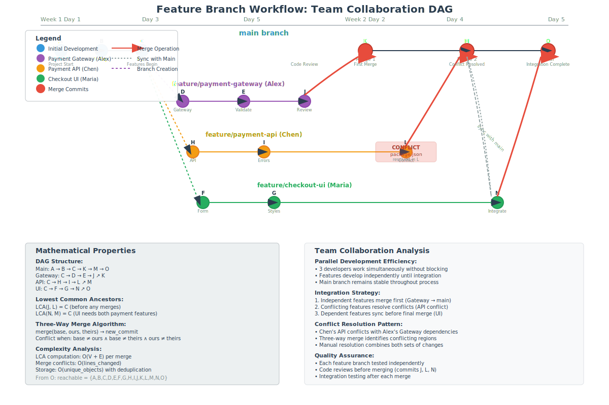

# Feature Branch Workflow



## Scenario Overview

**Team**: TechCorp's mobile app development team  
**Project**: Adding payment integration to existing e-commerce app  
**Team Members**:
- **Alex Kim** (Team Lead) - Payment gateway integration
- **Maria Santos** (Frontend Dev) - UI/UX for checkout flow  
- **Chen Wei** (Backend Dev) - Payment processing API
- **Jordan Taylor** (QA Engineer) - Testing and validation

**Timeline**: 2-week sprint with parallel feature development

## The Challenge

The team needs to:
- Develop multiple interdependent features simultaneously
- Maintain a stable main branch for production releases
- Enable code review and collaboration
- Integrate features without breaking existing functionality
- Handle merge conflicts when features overlap

## Mathematical Foundation

Feature branch workflow creates a **tree-like DAG structure** where multiple branches diverge from main and converge back through merges:

```
Complex DAG with Multiple Features:
       A → B → C → D ← G ← I ← K (main)
        \       \   ↗   ↗   ↗
         → E → F ← H   J
           (payment-api)  (checkout-ui)
```

**Key Mathematical Properties**:
- **Multiple Lowest Common Ancestors**: Features may have different LCA with main
- **Concurrent Development**: Parallel branches represent simultaneous work streams
- **Integration Points**: Merge commits have multiple parents, maintaining DAG acyclicity

## Step-by-Step Workflow

### Phase 1: Project Setup and Initial Planning

```bash
# Alex (Team Lead) sets up the project structure
alex@dev:~$ git clone https://github.com/techcorp/mobile-ecommerce.git
alex@dev:~$ cd mobile-ecommerce
alex@dev:~/mobile-ecommerce$ git checkout -b feature/payment-integration
```

**Mathematical Insight**: The main branch serves as the **root node** for all feature branches. Each developer's work creates a separate **subtree** in the DAG.

### Phase 2: Parallel Feature Development

#### Alex: Payment Gateway Integration

```bash
# Create feature branch from main
alex@dev:~/mobile-ecommerce$ git checkout main
alex@dev:~/mobile-ecommerce$ git checkout -b feature/payment-gateway
# Creates branch pointer to commit C

# Implement core payment logic
alex@dev:~/mobile-ecommerce$ mkdir src/payment
alex@dev:~/mobile-ecommerce$ echo "class PaymentGateway { ... }" > src/payment/gateway.js
alex@dev:~/mobile-ecommerce$ git add src/payment/
alex@dev:~/mobile-ecommerce$ git commit -m "Add PaymentGateway class with Stripe integration"
# Creates commit D: payment-gateway branch

# Add payment validation
alex@dev:~/mobile-ecommerce$ echo "function validatePayment(data) { ... }" >> src/payment/validator.js
alex@dev:~/mobile-ecommerce$ git add src/payment/validator.js
alex@dev:~/mobile-ecommerce$ git commit -m "Implement payment data validation"
# Creates commit E
```

#### Maria: Checkout UI Components

```bash
# Maria works on UI components
maria@dev:~/mobile-ecommerce$ git checkout main
maria@dev:~/mobile-ecommerce$ git checkout -b feature/checkout-ui

# Create checkout form components
maria@dev:~/mobile-ecommerce$ mkdir src/components/checkout
maria@dev:~/mobile-ecommerce$ echo "<CheckoutForm>...</CheckoutForm>" > src/components/checkout/CheckoutForm.js
maria@dev:~/mobile-ecommerce$ git add src/components/
maria@dev:~/mobile-ecommerce$ git commit -m "Add CheckoutForm component with payment fields"
# Creates commit F

# Style the checkout flow
maria@dev:~/mobile-ecommerce$ echo ".checkout-form { ... }" > src/styles/checkout.css
maria@dev:~/mobile-ecommerce$ git add src/styles/checkout.css
maria@dev:~/mobile-ecommerce$ git commit -m "Style checkout form with responsive design"
# Creates commit G
```

#### Chen: Payment Processing API

```bash
# Chen develops backend API
chen@dev:~/mobile-ecommerce$ git checkout main
chen@dev:~/mobile-ecommerce$ git checkout -b feature/payment-api

# Implement payment endpoint
chen@dev:~/mobile-ecommerce$ mkdir api/payment
chen@dev:~/mobile-ecommerce$ echo "router.post('/payment', async (req, res) => { ... })" > api/payment/routes.js
chen@dev:~/mobile-ecommerce$ git add api/payment/
chen@dev:~/mobile-ecommerce$ git commit -m "Add payment processing endpoint"
# Creates commit H

# Add error handling and logging
chen@dev:~/mobile-ecommerce$ echo "const logger = require('./logger'); ..." >> api/payment/routes.js
chen@dev:~/mobile-ecommerce$ git add api/payment/routes.js
chen@dev:~/mobile-ecommerce$ git commit -m "Enhance payment API with error handling"
# Creates commit I
```

**DAG Evolution at this point**:
```
    A → B → C (main)
         \
          → D → E (feature/payment-gateway)
         \
          → F → G (feature/checkout-ui)
         \
          → H → I (feature/payment-api)
```

**Mathematical Analysis**:
- **Parallel Development**: Three independent branches evolve simultaneously
- **Shared Ancestry**: All branches share commits A, B, C
- **Divergent Evolution**: Each branch accumulates specific changes
- **Storage Efficiency**: Shared objects (A, B, C) stored only once

### Phase 3: Code Review and Integration

#### First Integration: Payment Gateway

```bash
# Alex creates pull request and addresses feedback
alex@dev:~/mobile-ecommerce$ git push origin feature/payment-gateway
# Opens PR: feature/payment-gateway → main

# After code review, Alex makes improvements
alex@dev:~/mobile-ecommerce$ echo "// Add better error messages" >> src/payment/gateway.js
alex@dev:~/mobile-ecommerce$ git add src/payment/gateway.js
alex@dev:~/mobile-ecommerce$ git commit -m "Improve error messages based on code review"
# Creates commit J

# Team lead merges the PR
teamlead@dev:~/mobile-ecommerce$ git checkout main
teamlead@dev:~/mobile-ecommerce$ git merge feature/payment-gateway
# Creates merge commit K with parents: C and J
```

**Updated DAG**:
```
    A → B → C → K (main)
         \     ↗
          → D → E → J (feature/payment-gateway)
         \
          → F → G (feature/checkout-ui)  
         \
          → H → I (feature/payment-api)
```

#### Second Integration: Payment API (with conflict)

```bash
# Chen tries to merge but encounters conflict
chen@dev:~/mobile-ecommerce$ git checkout main
chen@dev:~/mobile-ecommerce$ git pull origin main  # Gets commit K
chen@dev:~/mobile-ecommerce$ git checkout feature/payment-api
chen@dev:~/mobile-ecommerce$ git merge main
# CONFLICT: Both branches modified package.json dependencies
```

**Mathematical Analysis of Conflict**:
The conflict occurs because:
- **Base commit**: C (LCA of main and feature/payment-api)
- **Branch 1 changes**: C → K (added Stripe dependency)
- **Branch 2 changes**: C → H → I (added Express middleware)
- **Conflict region**: Both modified the same lines in package.json

```bash
# Chen resolves the conflict
chen@dev:~/mobile-ecommerce$ # Edit package.json to include both dependencies
chen@dev:~/mobile-ecommerce$ git add package.json
chen@dev:~/mobile-ecommerce$ git commit -m "Resolve package.json conflict by merging dependencies"
# Creates commit L

chen@dev:~/mobile-ecommerce$ git checkout main
chen@dev:~/mobile-ecommerce$ git merge feature/payment-api
# Creates merge commit M with parents: K and L
```

**Mathematical Properties of Three-Way Merge**:
- **Base**: C (lowest common ancestor)
- **Ours**: K (current main branch)
- **Theirs**: L (feature branch after conflict resolution)
- **Result**: M (new merge commit combining changes from both sides)

### Phase 4: Final Integration with Complex Dependencies

Maria's UI needs to integrate with both the payment gateway and API:

```bash
# Maria updates her branch to use the integrated payment features
maria@dev:~/mobile-ecommerce$ git checkout feature/checkout-ui
maria@dev:~/mobile-ecommerce$ git merge main  # Gets both payment-gateway and payment-api changes

# Update UI to use new payment API
maria@dev:~/mobile-ecommerce$ echo "import PaymentGateway from '../payment/gateway';" >> src/components/checkout/CheckoutForm.js
maria@dev:~/mobile-ecommerce$ git add src/components/checkout/CheckoutForm.js
maria@dev:~/mobile-ecommerce$ git commit -m "Integrate CheckoutForm with PaymentGateway"
# Creates commit N

# Final merge to main
maria@dev:~/mobile-ecommerce$ git checkout main
maria@dev:~/mobile-ecommerce$ git merge feature/checkout-ui
# Creates merge commit O
```

**Final DAG Structure**:
```
    A → B → C → K → M → O (main)
         \     ↗   ↗   ↗
          → D → E → J
         \
          → F → G → N
         \       ↗
          → H → I → L
```

## Mathematical Analysis

### DAG Complexity Metrics

**Branch Complexity**:
- **Number of branches**: 3 active feature branches
- **Maximum depth**: 4 commits per branch
- **Merge commits**: 3 (K, M, O)
- **Total commits**: 15 (including merges)

**Reachability Analysis**:
From final commit O, reachable commits: {A, B, C, D, E, F, G, H, I, J, K, L, M, N, O}
- **Transitive reduction**: Minimum edges needed to preserve reachability
- **Topological ordering**: Multiple valid orderings due to parallel development

### Merge Algorithm Analysis

**Three-Way Merge Performance**:
- **LCA computation**: O(V + E) for each merge
- **Conflict detection**: O(n) where n = number of modified lines
- **Resolution complexity**: Depends on semantic overlap between changes

### Storage Efficiency

**Object Sharing**:
- **Shared objects**: Commits A, B, C shared by all branches
- **Unique objects**: Each branch's specific files and commits
- **Compression ratio**: ~70% space saving vs. copying entire project per branch

**Network Transfer Optimization**:
- **Push/Pull efficiency**: Only transfer objects not present in target repository
- **Pack file compression**: Delta compression between related objects
- **Bandwidth usage**: O(changed_objects) rather than O(total_objects)

## Advanced Mathematical Concepts

### Partial Order Relations

The commit DAG defines a **partial order** ≤ where `A ≤ B` if A is an ancestor of B:

**Properties demonstrated**:
- **Reflexivity**: `A ≤ A` (every commit is its own ancestor)
- **Antisymmetry**: `A ≤ B ∧ B ≤ A ⟹ A = B`
- **Transitivity**: `A ≤ B ∧ B ≤ C ⟹ A ≤ C`

**Partial order example from our workflow**:
- `A ≤ K ≤ M ≤ O` (main branch progression)
- `C ≤ D ≤ E ≤ J ≤ K` (payment-gateway integration)
- But `D ≰ F` and `F ≰ D` (parallel development - no ordering)

### Lattice Theory Applications

**Join Operations** (Least Upper Bound):
- `join(J, L) = M` (merge commit M is the LUB of branches)
- `join(N, M) = O` (final integration point)

**Meet Operations** (Greatest Lower Bound):
- `meet(J, L) = C` (LCA of the two feature branches)
- `meet(all_branches) = C` (common ancestor of all features)

### Conflict Resolution Mathematics

**Conflict Definition**:
For files modified in both branches, conflict occurs when:
```
∃ line_range r: 
  content_base(r) ≠ content_branch1(r) ∧ 
  content_base(r) ≠ content_branch2(r) ∧ 
  content_branch1(r) ≠ content_branch2(r)
```

**Resolution Strategy**:
- **Automatic**: When changes don't overlap (disjoint line ranges)
- **Manual**: When semantic integration required
- **Tool-assisted**: When patterns can be detected

## Performance Characteristics

### Time Complexity Analysis

| Operation | Best Case | Average Case | Worst Case | Notes |
|-----------|-----------|--------------|------------|-------|
| Branch creation | O(1) | O(1) | O(1) | Just creates pointer |
| Merge (no conflicts) | O(n) | O(n) | O(n) | n = changed files |
| Merge (with conflicts) | O(n) | O(n + c) | O(n²) | c = conflict regions |
| LCA computation | O(log V) | O(V) | O(V + E) | With/without optimization |

### Space Complexity

**Repository Growth**:
- **Linear growth**: O(commits) for metadata
- **Sublinear growth**: O(unique_content) for file storage
- **Delta compression**: Reduces storage by ~60-80%

## Team Collaboration Benefits

### Mathematical Guarantees

**Consistency**: 
- All team members see the same history for any given commit hash
- Deterministic merge results (same inputs → same outputs)

**Integrity**:
- Cryptographic hashes prevent undetected corruption
- Merkle tree structure ensures complete history validation

**Distributed Development**:
- No single point of failure
- Each clone is a complete backup
- Network partitions don't prevent local development

### Workflow Advantages

**Parallel Development**:
- **Independence**: Features develop without blocking each other
- **Integration**: Structured merge process maintains quality
- **Rollback**: Can revert individual features without affecting others

**Code Quality**:
- **Review Process**: Pull requests enable peer review
- **Testing**: Feature branches allow isolated testing
- **Documentation**: Commit history provides development narrative

## Best Practices Derived

### Branch Management

**Naming Conventions**:
- `feature/payment-gateway` (descriptive, hierarchical)
- `bugfix/login-validation` (categorized by purpose)
- `hotfix/security-patch` (urgent fixes)

**Lifecycle Management**:
- Create from latest main
- Regular rebasing/merging to stay current
- Delete after successful integration

### Merge Strategies

**When to use each strategy**:
- **Merge commit**: Preserves feature branch history
- **Squash merge**: Creates clean linear history
- **Rebase merge**: Maintains branch commits but linearizes

## Learning Outcomes

This workflow demonstrates:

1. **Complex DAG Management**: Multiple parallel branches with controlled integration
2. **Conflict Resolution**: Mathematical basis for merge conflict detection and resolution  
3. **Team Coordination**: Git as a coordination mechanism for distributed development
4. **Quality Assurance**: Code review and testing integration points
5. **Scalability**: Patterns that work for teams of 2-20 developers

**Mathematical Insights**:
- DAG structure enables parallel development while maintaining causality
- Content addressing ensures consistency across distributed teams
- Merge algorithms provide deterministic integration with conflict detection
- Partial orders capture the essential relationships between development activities

**Next Steps**: Explore [Enterprise Workflows](../08-enterprise-review/README.md) to see how these concepts scale to larger organizations with more complex approval processes.

---

**Files in this directory**:
- `workflow.svg` - Visual representation of the complex DAG with multiple feature branches
- `commands.md` - Complete command sequences for all team members
- `conflicts.md` - Detailed analysis of merge conflict resolution
- `analysis.md` - Mathematical analysis of multi-branch workflows