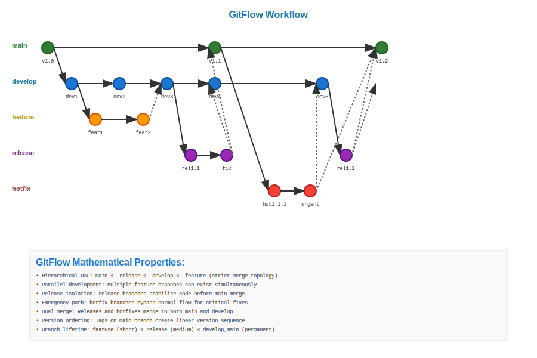

# GitFlow Workflow

## Scenario Overview

**Team**: Medium-sized software company (10-15 developers)  
**Product**: Customer relationship management (CRM) software  
**Context**: Structured release cycles with feature development, testing, and production deployment  
**Timeline**: 3-month release cycles with continuous hotfix support

## The Challenge

The development team needs to:
- Maintain stable production code while developing new features
- Support multiple concurrent feature development
- Handle emergency hotfixes without disrupting feature development
- Manage structured releases with proper testing phases
- Coordinate between development, testing, and production environments

## Git Workflow Solution

### Mathematical Foundation

GitFlow creates a structured DAG with well-defined branch hierarchies:

```
Master Branch (Production):
A → B → C (v1.0) → D (hotfix) → E (v1.1) → F (v2.0)

Develop Branch (Integration):
A → G → H → I → J → K → L

Feature Branches:
G → M → N → O (feature-1)
I → P → Q → R (feature-2)

Release Branch:
J → S → T (v2.0-rc)
```

The mathematical elegance lies in the clear separation of concerns through branch hierarchy, enabling parallel development while maintaining integration points.

## Step-by-Step Workflow

### Phase 1: Repository Setup

```bash
# Initialize GitFlow structure
git init crm-system
cd crm-system

# Create initial commit on master
echo "# CRM System v1.0" > README.md
git add README.md
git commit -m "Initial commit"

# Create develop branch
git checkout -b develop
git push -u origin develop
```

**Mathematical Insight**: The master and develop branches represent two parallel evolutionary paths in the DAG, with master containing only stable releases and develop containing the latest integrated changes.

### Phase 2: Feature Development

```bash
# Developer starts new feature
git checkout develop
git pull origin develop
git checkout -b feature/customer-dashboard

# Feature development commits
git add customer-dashboard.js
git commit -m "Add customer data fetching"
git add dashboard-ui.js
git commit -m "Implement dashboard UI components"
git add dashboard-tests.js
git commit -m "Add comprehensive test suite"

# Push feature branch
git push -u origin feature/customer-dashboard
```

**DAG Evolution**: Feature branches create isolated development paths that can be merged back to develop without affecting other features.

### Phase 3: Feature Integration

```bash
# Create pull request and merge to develop
git checkout develop
git pull origin develop
git merge --no-ff feature/customer-dashboard
git push origin develop

# Clean up feature branch
git branch -d feature/customer-dashboard
git push origin --delete feature/customer-dashboard
```

**Mathematical Analysis**: The `--no-ff` flag ensures merge commits preserve the feature branch topology in the DAG, maintaining historical context.

### Phase 4: Release Preparation

```bash
# Create release branch from develop
git checkout develop
git pull origin develop
git checkout -b release/v2.0

# Release-specific commits
git add version.js
git commit -m "Bump version to 2.0.0"
git add CHANGELOG.md
git commit -m "Update changelog for v2.0"

# Bug fixes during release testing
git add bug-fix.js
git commit -m "Fix critical bug in customer search"
```

**Mathematical Properties**: Release branches allow final stabilization without blocking new feature development on the develop branch.

### Phase 5: Production Release

```bash
# Merge release to master
git checkout master
git pull origin master
git merge --no-ff release/v2.0
git tag -a v2.0 -m "Release version 2.0"
git push origin master --tags

# Merge release changes back to develop
git checkout develop
git merge --no-ff release/v2.0
git push origin develop

# Clean up release branch
git branch -d release/v2.0
git push origin --delete release/v2.0
```

### Phase 6: Emergency Hotfix

```bash
# Critical bug discovered in production
git checkout master
git pull origin master
git checkout -b hotfix/security-patch

# Implement urgent fix
git add security-fix.js
git commit -m "Fix SQL injection vulnerability"
git add version.js
git commit -m "Bump version to 2.0.1"

# Deploy hotfix to production
git checkout master
git merge --no-ff hotfix/security-patch
git tag -a v2.0.1 -m "Security hotfix v2.0.1"
git push origin master --tags

# Merge hotfix to develop
git checkout develop
git merge --no-ff hotfix/security-patch
git push origin develop

# Clean up hotfix branch
git branch -d hotfix/security-patch
git push origin --delete hotfix/security-patch
```

## Mathematical Analysis

### DAG Structure Properties

**Branch Hierarchy**:
- Master: O(releases) commits - only merge commits from releases and hotfixes
- Develop: O(features × commits_per_feature) - continuous integration branch
- Features: O(commits_per_feature) - isolated development contexts
- Releases: O(release_preparation_commits) - stabilization phase
- Hotfixes: O(urgent_fixes) - emergency production patches

**Merge Patterns**:
- Feature → Develop: Regular integration merges
- Develop → Release: Preparation branch creation
- Release → Master: Production deployment
- Release → Develop: Backflow of release changes
- Master → Hotfix → Master + Develop: Emergency patches

### Performance Characteristics

**Time Complexity**:
- Branch creation: O(1) - lightweight references
- Feature integration: O(n) where n is number of changed files
- Release deployment: O(1) for merge commit creation
- History traversal: O(log n) with proper merge commit structure

**Space Complexity**:
- Multiple active branches increase reference storage: O(branches)
- Merge commits preserve topology: additional O(merges) storage
- Tagged releases enable efficient version queries: O(tags)

## Advantages and Trade-offs

### Mathematical Advantages

**Structured Parallelism**: GitFlow enables mathematical proof that feature development cannot interfere with production stability, as they exist in separate DAG subgraphs.

**Controlled Integration**: The develop branch serves as an integration testing ground, allowing mathematical verification of feature compatibility before release.

**Emergency Response**: Hotfix branches provide O(1) response time for critical production issues, with guaranteed propagation to all active development branches.

### Computational Trade-offs

**Branch Overhead**: Maintaining multiple long-lived branches requires additional repository metadata and can complicate history visualization.

**Merge Complexity**: The numerous merge points can create complex DAG topologies that are harder to analyze algorithmically.

**Context Switching**: Developers must understand and navigate the branch hierarchy, increasing cognitive overhead.

## Integration with Development Tools

### Automated Workflows

```bash
# Example CI/CD integration
# .github/workflows/gitflow.yml
on:
  push:
    branches: [develop, 'release/*']
  pull_request:
    branches: [develop]

jobs:
  test:
    runs-on: ubuntu-latest
    steps:
      - uses: actions/checkout@v2
      - run: npm test
      
  deploy-staging:
    if: github.ref == 'refs/heads/develop'
    runs-on: ubuntu-latest
    steps:
      - run: deploy-to-staging.sh
      
  deploy-production:
    if: github.ref == 'refs/heads/master'
    runs-on: ubuntu-latest
    steps:
      - run: deploy-to-production.sh
```

## Conclusion

GitFlow represents a mathematically structured approach to version control that maps software development phases to specific DAG patterns. While it introduces complexity, it provides predictable workflows that scale well for teams requiring structured release management.

**Key Mathematical Insights**:
- Branch hierarchy creates clear separation of concerns in the DAG
- Merge strategies preserve historical context and enable efficient queries
- The structured approach enables automated tooling and process verification

**Workflow Visualization**: 

## Navigation

**Previous**: [05. Feature Branch Workflow](../05-feature-branches/README.md)  
**Next**: [07. GitHub Flow](../07-github-flow/README.md)  
**Home**: [Use Cases Overview](../README.md)