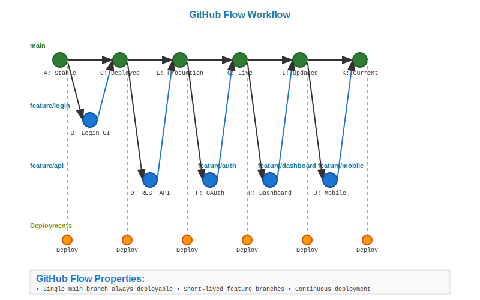

# GitHub Flow Workflow

## Scenario Overview

**Team**: Modern web development startup (8-12 developers)  
**Product**: Real-time collaboration platform  
**Context**: Continuous deployment with automated testing and feature flags  
**Timeline**: Daily deployments with immediate hotfix capability

## The Challenge

The development team needs to:
- Deploy features quickly and frequently to production
- Maintain high code quality with automated testing
- Enable rapid hotfix deployment for critical issues
- Support feature flags for gradual rollouts
- Minimize branching complexity while ensuring stability

## Git Workflow Solution

### Mathematical Foundation

GitHub Flow creates a simplified DAG structure focused on continuous integration:

```
Main Branch (Production + Development):
A → B → C → D → E → F → G → H

Feature Branches (Short-lived):
B → I → J (feature-1) ─┐
                       ├─→ D
D → K → L (feature-2) ─┘

E → M → N (hotfix) ───→ F
```

The mathematical elegance lies in the linear main branch evolution with minimal branching overhead, optimizing for deployment velocity while maintaining integration safety.

## Step-by-Step Workflow

### Phase 1: Repository Setup

```bash
# Initialize with main branch (GitHub default)
git init collaboration-platform
cd collaboration-platform

# Create initial application structure
echo "# Real-time Collaboration Platform" > README.md
mkdir src tests docs
echo "console.log('App starting...');" > src/app.js
git add .
git commit -m "Initial application structure"
git branch -M main
git push -u origin main
```

**Mathematical Insight**: GitHub Flow uses a single long-lived branch (main) as the canonical source of truth, reducing DAG complexity to O(1) permanent branches.

### Phase 2: Feature Development

```bash
# Developer starts new feature
git checkout main
git pull origin main
git checkout -b add-real-time-chat

# Implement feature with atomic commits
echo "// Real-time chat implementation" > src/chat.js
git add src/chat.js
git commit -m "Add real-time chat module"

echo "// Chat UI components" > src/chat-ui.js
git add src/chat-ui.js
git commit -m "Add chat user interface"

echo "// Chat tests" > tests/chat.test.js
git add tests/chat.test.js
git commit -m "Add comprehensive chat testing"

# Push feature branch
git push -u origin add-real-time-chat
```

**DAG Evolution**: Feature branches create temporary parallel paths that merge back quickly, maintaining a predominantly linear history.

### Phase 3: Automated Testing and Review

```bash
# Create pull request (via GitHub UI or CLI)
gh pr create --title "Add real-time chat feature" \
             --body "Implements WebSocket-based chat with typing indicators"

# Automated CI/CD runs tests
# .github/workflows/ci.yml triggers:
# - Unit tests
# - Integration tests  
# - Security scans
# - Performance tests
```

**Mathematical Analysis**: Automated testing creates a verification gate that ensures main branch stability with high probability, reducing the risk of regression in the linear DAG.

### Phase 4: Continuous Deployment

```bash
# After PR approval and CI success
git checkout main
git pull origin main
git merge --no-ff add-real-time-chat
git push origin main

# Automated deployment triggers
# - Staging deployment
# - Production deployment (with feature flags)
# - Monitoring setup

# Clean up feature branch
git branch -d add-real-time-chat
git push origin --delete add-real-time-chat
```

**Mathematical Properties**: The merge to main triggers deterministic deployment pipelines, ensuring consistent state transitions from development to production.

### Phase 5: Hotfix Scenario

```bash
# Critical bug discovered in production
git checkout main
git pull origin main
git checkout -b fix-chat-crash

# Implement urgent fix
echo "// Add null check to prevent crash" >> src/chat.js
git add src/chat.js
git commit -m "Fix null pointer crash in chat module"

# Push and create urgent PR
git push -u origin fix-chat-crash
gh pr create --title "URGENT: Fix chat crash" \
             --body "Fixes critical null pointer issue affecting 15% of users"

# Fast-track review and merge
git checkout main
git merge --no-ff fix-chat-crash
git push origin main

# Immediate production deployment
# Clean up
git branch -d fix-chat-crash
git push origin --delete fix-chat-crash
```

### Phase 6: Feature Flag Integration

```bash
# Deploy feature behind feature flag
git checkout main
git checkout -b gradual-video-calls

# Implement with feature flag
cat > src/video-calls.js << 'EOF'
if (featureFlags.videoCallsEnabled) {
  // Video call implementation
  console.log('Video calls feature activated');
}
EOF

git add src/video-calls.js
git commit -m "Add video calls behind feature flag"
git push -u origin gradual-video-calls

# Deploy to production (feature disabled)
# Gradually enable for user segments
# Monitor performance and user feedback
```

## Mathematical Analysis

### DAG Structure Properties

**Branch Characteristics**:
- Main: O(n) commits where n grows linearly with development time
- Feature branches: O(1-10) commits - short-lived and focused
- Total active branches: O(active_developers) at any time
- Merge frequency: O(deployments_per_day)

**Integration Patterns**:
- Feature → Main: Frequent, small integrations
- Main evolution: Continuous, linear progression
- Hotfix integration: Immediate, high-priority merges

### Performance Characteristics

**Time Complexity**:
- Branch creation: O(1) - minimal overhead
- Feature integration: O(commits_in_feature) - typically small
- Deployment: O(1) - automated pipeline trigger
- History analysis: O(log n) - predominantly linear history

**Deployment Velocity**:
- Time to production: O(hours) rather than O(days/weeks)
- Rollback time: O(minutes) with feature flags or git revert
- Bug fix propagation: O(minutes) for critical issues

### Automation Integration

**Continuous Integration Pipeline**:

```yaml
# .github/workflows/github-flow.yml
name: GitHub Flow CI/CD

on:
  pull_request:
    branches: [main]
  push:
    branches: [main]

jobs:
  test:
    runs-on: ubuntu-latest
    steps:
      - uses: actions/checkout@v3
      - name: Run tests
        run: |
          npm test
          npm run security-scan
          npm run performance-test

  deploy-staging:
    needs: test
    if: github.event_name == 'pull_request'
    runs-on: ubuntu-latest
    steps:
      - name: Deploy to staging
        run: deploy-staging.sh ${{ github.head_ref }}

  deploy-production:
    needs: test
    if: github.ref == 'refs/heads/main'
    runs-on: ubuntu-latest
    steps:
      - name: Deploy to production
        run: deploy-production.sh
      - name: Update feature flags
        run: update-flags.sh
```

**Feature Flag Mathematics**:

```javascript
// Gradual rollout algorithm
function shouldEnableFeature(userId, featureName) {
  const hash = sha256(userId + featureName);
  const hashInt = parseInt(hash.substring(0, 8), 16);
  const rolloutPercentage = getFeatureRollout(featureName);
  return (hashInt % 100) < rolloutPercentage;
}
```

## Advantages and Trade-offs

### Mathematical Advantages

**Simplicity**: Single long-lived branch reduces cognitive overhead and DAG complexity from O(branches²) to O(branches) where branches ≈ 1.

**Velocity**: Continuous integration enables deployment frequency limited only by testing time, not branching complexity.

**Reliability**: Automated testing and feature flags provide statistical confidence in deployments while enabling rapid rollback.

### Computational Trade-offs

**Main Branch Pressure**: All changes flow through main, potentially creating bottlenecks during high-activity periods.

**Testing Requirements**: Success depends on comprehensive automated testing, requiring significant infrastructure investment.

**Rollback Complexity**: Without release branches, rollbacks may require careful commit analysis or feature flag toggles.

## Integration Patterns

### Feature Flag Strategies

**Percentage Rollouts**:
```javascript
// Mathematical distribution of users across feature variants
const rolloutGroups = {
  control: 70,      // 70% see old feature
  variant_a: 20,    // 20% see new feature
  variant_b: 10     // 10% see experimental feature
};
```

**Canary Deployments**:
```bash
# Deploy to subset of production servers
kubectl set image deployment/app app=app:$NEW_VERSION
kubectl patch deployment app -p '{"spec":{"replicas":2}}'
# Monitor metrics, then full rollout
```

## Monitoring and Observability

### Deployment Mathematics

**Success Metrics**:
- Deployment frequency: commits_to_main / time_period
- Lead time: time(commit) - time(production_deployment)
- Mean time to recovery: time(incident_detection) - time(resolution)
- Change failure rate: failed_deployments / total_deployments

**Performance Indicators**:
```javascript
// Real-time deployment health scoring
function calculateDeploymentHealth(metrics) {
  const errorRate = metrics.errors / metrics.requests;
  const latencyP99 = metrics.latency_percentile_99;
  const throughput = metrics.requests_per_second;
  
  return (1 - errorRate) * 0.4 + 
         (1 - latencyP99/threshold) * 0.4 + 
         (throughput/baseline) * 0.2;
}
```

## Conclusion

GitHub Flow represents a mathematically optimized workflow for teams prioritizing deployment velocity and simplicity. By minimizing branching complexity and maximizing automation, it enables rapid iteration while maintaining production stability through statistical testing confidence and feature flag safety nets.

**Key Mathematical Insights**:
- Linear DAG evolution minimizes complexity and maximizes velocity
- Automated testing provides statistical confidence in integration safety
- Feature flags enable mathematical user segmentation and gradual rollouts
- Continuous deployment creates predictable, measurable development cycles

**Workflow Visualization**: 

## Navigation

**Previous**: [06. GitFlow Workflow](../06-gitflow/README.md)  
**Next**: [08. Enterprise Code Review](../08-enterprise-review/README.md)  
**Home**: [Use Cases Overview](../README.md)