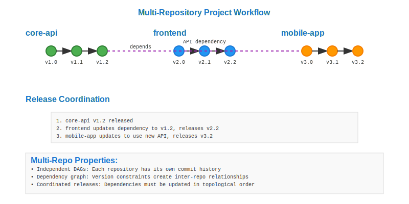

# Multi-Repository Projects Workflow



## Scenario Overview

**Organization**: CloudTech Solutions  
**Project**: Distributed microservices platform  
**Team**: 8 developers across 3 squads  
**Context**: 5 interconnected repositories with shared dependencies  
**Timeline**: 18-month platform development with coordinated releases

## The Challenge

CloudTech needs to:
- Manage dependencies between multiple repositories
- Coordinate releases across related services
- Share common libraries and configurations
- Maintain version compatibility between services
- Enable independent development while ensuring integration
- Track changes across the entire system

## Git Workflow Solution

### Mathematical Foundation

Multi-repository systems create a meta-graph where each repository is a DAG, and dependencies form edges between repositories:

```
Repository Dependency Graph:
auth-service → shared-lib ← user-service
     ↓              ↓           ↓
api-gateway ← monitoring ← deployment-config
```

Each repository maintains its own DAG structure while participating in the larger system dependency graph.

## Step-by-Step Workflow

### Phase 1: Repository Structure Setup

```bash
# Create main repositories
admin@cloudtech:~$ mkdir platform-services && cd platform-services
admin@cloudtech:~/platform-services$ git clone git@github.com:cloudtech/shared-lib.git
admin@cloudtech:~/platform-services$ git clone git@github.com:cloudtech/auth-service.git  
admin@cloudtech:~/platform-services$ git clone git@github.com:cloudtech/user-service.git
admin@cloudtech:~/platform-services$ git clone git@github.com:cloudtech/api-gateway.git
admin@cloudtech:~/platform-services$ git clone git@github.com:cloudtech/monitoring.git
```

**Mathematical Insight**: Each repository clone creates a local copy of its DAG structure, establishing the foundation for coordinated multi-repo development.

### Phase 2: Shared Library Development

```bash
# Develop shared authentication utilities
dev1@cloudtech:~/shared-lib$ git checkout -b feature/jwt-validation
dev1@cloudtech:~/shared-lib$ echo "class JWTValidator..." > jwt_validator.py
dev1@cloudtech:~/shared-lib$ git add jwt_validator.py
dev1@cloudtech:~/shared-lib$ git commit -m "Add JWT validation utilities"

# Create versioned release
dev1@cloudtech:~/shared-lib$ git tag v1.2.0
dev1@cloudtech:~/shared-lib$ git push origin v1.2.0
```

**Mathematical Analysis**: Tagging creates immutable references in the DAG, allowing dependent repositories to reference specific versions with cryptographic certainty.

### Phase 3: Git Submodule Integration

```bash
# Add shared-lib as submodule to auth-service
dev2@cloudtech:~/auth-service$ git submodule add git@github.com:cloudtech/shared-lib.git lib/shared
dev2@cloudtech:~/auth-service$ git submodule update --init
dev2@cloudtech:~/auth-service$ cd lib/shared
dev2@cloudtech:~/auth-service/lib/shared$ git checkout v1.2.0
dev2@cloudtech:~/auth-service$ git add .gitmodules lib/shared
dev2@cloudtech:~/auth-service$ git commit -m "Add shared-lib v1.2.0 as submodule"
```

**DAG Evolution**: The submodule creates a pointer from the auth-service DAG to a specific commit in the shared-lib DAG, establishing mathematical dependency relationships.

### Phase 4: Coordinated Feature Development

```bash
# Update shared library with new feature
dev1@cloudtech:~/shared-lib$ git checkout -b feature/oauth2-support
dev1@cloudtech:~/shared-lib$ echo "class OAuth2Handler..." > oauth2_handler.py
dev1@cloudtech:~/shared-lib$ git add oauth2_handler.py
dev1@cloudtech:~/shared-lib$ git commit -m "Add OAuth2 support"
dev1@cloudtech:~/shared-lib$ git push origin feature/oauth2-support

# Update auth-service to use new feature
dev2@cloudtech:~/auth-service$ git checkout -b feature/integrate-oauth2
dev2@cloudtech:~/auth-service$ cd lib/shared
dev2@cloudtech:~/auth-service/lib/shared$ git checkout feature/oauth2-support
dev2@cloudtech:~/auth-service$ cd ../..
dev2@cloudtech:~/auth-service$ echo "from lib.shared.oauth2_handler import OAuth2Handler" > auth_controller.py
dev2@cloudtech:~/auth-service$ git add .
dev2@cloudtech:~/auth-service$ git commit -m "Integrate OAuth2 support from shared-lib"
```

**Mathematical Properties**: Feature branches in multiple repositories can be developed in parallel, with dependency relationships maintained through submodule references.

### Phase 5: Integration Testing Across Repositories

```bash
# Create integration testing environment
devops@cloudtech:~/platform-services$ git clone git@github.com:cloudtech/integration-tests.git
devops@cloudtech:~/integration-tests$ cat > docker-compose.yml << EOF
version: '3.8'
services:
  auth-service:
    build: ../auth-service
  user-service: 
    build: ../user-service
  api-gateway:
    build: ../api-gateway
EOF

# Run integrated test suite
devops@cloudtech:~/integration-tests$ docker-compose up --build
devops@cloudtech:~/integration-tests$ pytest integration_tests/
```

**Mathematical Insight**: Integration testing validates that the composition of individual repository DAGs produces the expected system behavior.

### Phase 6: Coordinated Release Process

```bash
# Release shared library first
dev1@cloudtech:~/shared-lib$ git checkout main
dev1@cloudtech:~/shared-lib$ git merge feature/oauth2-support
dev1@cloudtech:~/shared-lib$ git tag v1.3.0
dev1@cloudtech:~/shared-lib$ git push origin v1.3.0

# Update all dependent repositories
dev2@cloudtech:~/auth-service$ git checkout main
dev2@cloudtech:~/auth-service$ git merge feature/integrate-oauth2
dev2@cloudtech:~/auth-service$ cd lib/shared
dev2@cloudtech:~/auth-service/lib/shared$ git checkout v1.3.0
dev2@cloudtech:~/auth-service$ cd ../..
dev2@cloudtech:~/auth-service$ git add lib/shared
dev2@cloudtech:~/auth-service$ git commit -m "Update shared-lib to v1.3.0"
dev2@cloudtech:~/auth-service$ git tag v2.1.0
dev2@cloudtech:~/auth-service$ git push origin v2.1.0
```

**DAG Properties**: Coordinated releases create synchronized points across multiple repository DAGs, enabling system-wide version management.

### Phase 7: Dependency Management and Updates

```bash
# Automated dependency update script
#!/bin/bash
for repo in auth-service user-service api-gateway; do
    cd $repo
    git submodule update --remote lib/shared
    if [ $(git diff --name-only | wc -l) -gt 0 ]; then
        git add lib/shared
        git commit -m "Update shared-lib dependency"
        git push origin main
    fi
    cd ..
done
```

**Mathematical Analysis**: Automated updates propagate changes through the dependency graph, maintaining consistency across the multi-repository system.

## Mathematical Analysis

### Dependency Graph Properties

In multi-repository systems:
- **Acyclic Dependencies**: Repositories must form a DAG to avoid circular dependencies
- **Version Lattice**: Each repository-version pair forms a node in a version lattice
- **Compatibility Matrix**: Defines which versions of repositories work together

### Complexity Analysis

| Operation | Single Repo | Multi-Repo | Scaling Factor |
|-----------|-------------|------------|----------------|
| Clone | O(n) | O(kn) | k = number of repos |
| Update | O(m) | O(km) | k = number of dependencies |
| Release | O(1) | O(d) | d = dependency depth |
| Integration Test | O(t) | O(kt²) | Combinatorial explosion |

### Submodule Mathematics

Submodules create pointers in the parent repository's DAG:
- **Immutable Reference**: Each submodule commit points to a specific SHA-1
- **Nested DAGs**: Parent repository DAG contains references to child DAGs
- **Transitive Dependencies**: Changes propagate through the dependency chain

## Practical Benefits for Multi-Repository Development

### Independent Development
- **Parallel Work**: Teams can work on different repositories simultaneously
- **Isolated Testing**: Each repository can be tested independently
- **Release Flexibility**: Components can be released on different schedules

### Dependency Management
- **Version Control**: Exact versions of dependencies are tracked
- **Rollback Safety**: Can revert to previous dependency versions
- **Impact Analysis**: Changes in shared libraries trigger dependent rebuilds

### System Integration
- **Coordinated Releases**: Related repositories can be released together
- **Integration Testing**: System-wide testing with specific version combinations
- **Deployment Orchestration**: Multi-service deployments with version dependencies

## Advanced Multi-Repository Techniques

### Git Subtree for Library Integration

```bash
# Alternative to submodules for tighter integration
dev@cloudtech:~/auth-service$ git subtree add --prefix=lib/shared git@github.com:cloudtech/shared-lib.git v1.3.0 --squash

# Update library code
dev@cloudtech:~/auth-service$ git subtree pull --prefix=lib/shared git@github.com:cloudtech/shared-lib.git v1.4.0 --squash
```

**Mathematical Impact**: Subtrees copy the dependency's DAG into the parent repository, creating a single unified DAG with embedded history.

### Mono-Repository Simulation with Worktrees

```bash
# Create linked working directories
admin@cloudtech:~/platform-services$ git worktree add ../shared-lib-dev shared-lib/main
admin@cloudtech:~/platform-services$ git worktree add ../auth-service-dev auth-service/main
# Enables simultaneous work across repositories with shared .git directory
```

**Mathematical Model**: Git worktrees create multiple working directories sharing the same object database, optimizing storage for related repositories.

### Dependency Resolution Algorithms

```python
def resolve_dependencies(repo_versions):
    """
    Topological sort of repository dependencies
    Returns valid build order or detects cycles
    """
    # Build dependency graph from repository versions
    # Apply topological sort to determine build order
    # Return valid sequence or detect circular dependencies
    pass
```

**Algorithm Complexity**: O(V + E) where V = repositories, E = dependency edges.

## Learning Outcomes

This workflow demonstrates:

1. **System Architecture**: How Git's mathematical properties scale to distributed systems
2. **Dependency Management**: Rigorous version control across multiple codebases  
3. **Coordinated Development**: Parallel work with integration guarantees
4. **Release Engineering**: Mathematical precision in multi-component releases
5. **Scalability Patterns**: Techniques that work for dozens of interconnected repositories

**Next Steps**: Explore [Monorepo Management](../10-monorepo/README.md) to see the alternative approach of single-repository architecture.

---

**Files in this directory**:
- `workflow.svg` - Visual representation of multi-repository dependency DAG
- `commands.md` - Complete command reference for multi-repo workflows  
- `analysis.md` - Detailed mathematical analysis of dependency management
