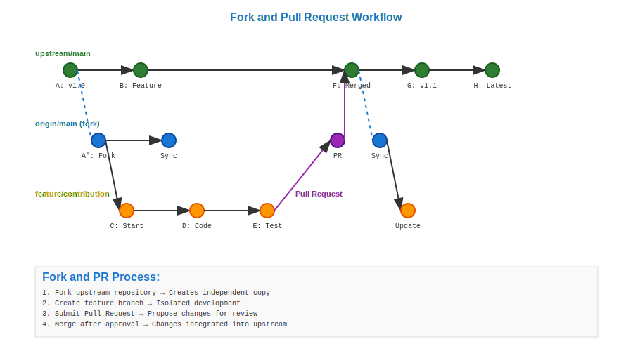

# Fork and Pull Request Workflow



## Scenario Overview

**Project**: OpenWeather API client library  
**Maintainer**: Core development team (3 developers)  
**Contributor**: External developer wanting to add new features  
**Context**: Open source project with community contributions  
**Timeline**: Feature development over 2-week sprint

## The Challenge

Open source development needs to:
- Allow external contributions without direct repository access
- Maintain code quality through review processes
- Enable distributed development across global contributors
- Preserve project integrity and security
- Scale contribution workflows to hundreds of contributors

## Git Workflow Solution

### Mathematical Foundation

Fork and pull creates a distributed DAG system:

```
Original Repository DAG:
A → B → C → D (main)

Forked Repository DAG:
A → B → C → D (main)
              \
               → E → F (feature/new-endpoint)

Pull Request: Merge F into original D
```

The mathematical elegance lies in the distributed nature where multiple independent DAGs can contribute to a central canonical DAG.

## Step-by-Step Workflow

### Phase 1: Repository Fork

```bash
# Contributor forks repository via GitHub/GitLab interface
# This creates a complete copy of the DAG in contributor's namespace

# Clone the forked repository locally
contributor@dev:~$ git clone git@github.com:contributor/openweather-client.git
contributor@dev:~$ cd openweather-client
contributor@dev:~/openweather-client$ git remote add upstream git@github.com:openweather/openweather-client.git
```

**Mathematical Insight**: Forking creates an identical DAG copy, maintaining all cryptographic integrity while enabling independent development.

### Phase 2: Feature Development

```bash
# Create feature branch for new functionality
contributor@dev:~/openweather-client$ git checkout -b feature/historical-data-endpoint

# Implement new feature
contributor@dev:~/openweather-client$ echo "class HistoricalDataAPI..." > historical_api.py
contributor@dev:~/openweather-client$ git add historical_api.py
contributor@dev:~/openweather-client$ git commit -m "Add historical weather data API endpoint"

# Add comprehensive tests
contributor@dev:~/openweather-client$ echo "def test_historical_data..." > test_historical_api.py
contributor@dev:~/openweather-client$ git add test_historical_api.py
contributor@dev:~/openweather-client$ git commit -m "Add tests for historical data endpoint"

# Update documentation
contributor@dev:~/openweather-client$ echo "## Historical Data\n..." >> README.md
contributor@dev:~/openweather-client$ git add README.md
contributor@dev:~/openweather-client$ git commit -m "Update documentation for historical data feature"
```

**DAG Evolution**: The contributor's fork diverges from the original repository, creating new commits that don't exist in the upstream DAG.

### Phase 3: Synchronization with Upstream

```bash
# Fetch latest changes from upstream
contributor@dev:~/openweather-client$ git fetch upstream
contributor@dev:~/openweather-client$ git checkout main
contributor@dev:~/openweather-client$ git merge upstream/main
contributor@dev:~/openweather-client$ git push origin main

# Rebase feature branch on latest main
contributor@dev:~/openweather-client$ git checkout feature/historical-data-endpoint
contributor@dev:~/openweather-client$ git rebase main
contributor@dev:~/openweather-client$ git push --force-with-lease origin feature/historical-data-endpoint
```

**Mathematical Properties**: Rebase operation reconstructs the feature branch DAG on top of the latest upstream state, maintaining linear history.

### Phase 4: Pull Request Creation

```bash
# Push feature branch to fork
contributor@dev:~/openweather-client$ git push origin feature/historical-data-endpoint

# Create pull request via web interface with:
# - Clear description of changes
# - Reference to related issues
# - Testing instructions
# - Breaking change analysis
```

**Mathematical Analysis**: The pull request represents a proposed merge operation from the contributor's DAG to the upstream DAG.

### Phase 5: Code Review and Iteration

```bash
# Maintainer reviews code
maintainer@openweather:~/openweather-client$ git fetch origin pull/123/head:pr-123
maintainer@openweather:~/openweather-client$ git checkout pr-123
maintainer@openweather:~/openweather-client$ python -m pytest tests/
maintainer@openweather:~/openweather-client$ git diff main...pr-123

# Contributor addresses feedback
contributor@dev:~/openweather-client$ git checkout feature/historical-data-endpoint
contributor@dev:~/openweather-client$ echo "# Add input validation" >> historical_api.py
contributor@dev:~/openweather-client$ git add historical_api.py
contributor@dev:~/openweather-client$ git commit -m "Add input validation per review feedback"
contributor@dev:~/openweather-client$ git push origin feature/historical-data-endpoint
```

**DAG Properties**: Each review iteration adds new commits to the feature branch, extending the proposed merge DAG.

### Phase 6: Automated Testing and CI

```bash
# Automated CI system runs comprehensive tests
ci@github-actions:~$ git checkout pr-123
ci@github-actions:~$ python -m pytest --cov=90
ci@github-actions:~$ flake8 --max-line-length=88
ci@github-actions:~$ mypy historical_api.py
ci@github-actions:~$ python -m bandit -r .
```

**Mathematical Verification**: Automated testing provides deterministic validation of the proposed DAG changes.

### Phase 7: Merge and Integration

```bash
# Maintainer approves and merges pull request
maintainer@openweather:~/openweather-client$ git checkout main
maintainer@openweather:~/openweather-client$ git pull origin main
maintainer@openweather:~/openweather-client$ git merge --no-ff pull/123/head
maintainer@openweather:~/openweather-client$ git push origin main

# Clean up merged branch
maintainer@openweather:~/openweather-client$ git branch -d pr-123
```

**Mathematical Completion**: The merge operation integrates the contributor's DAG branch into the canonical upstream DAG, making the contribution part of the official history.

## Mathematical Analysis

### Distributed Development Model

Fork-and-pull creates a network of repository relationships:
- **Star Topology**: All forks reference the canonical upstream repository
- **Independent Evolution**: Each fork can evolve independently
- **Convergent Integration**: Pull requests bring changes back to the center

### Complexity Scaling

| Metric | Single Developer | Fork-and-Pull |
|--------|------------------|---------------|
| Contributors | 1 | Unlimited |
| Repository Access | Direct | Mediated |
| Review Overhead | O(1) | O(n) reviewers |
| Integration Complexity | O(1) | O(branches) |

### Security and Trust Model

Mathematical properties ensuring security:
- **Cryptographic Integrity**: All commits signed and verifiable
- **Isolated Development**: Contributors cannot directly modify upstream
- **Audit Trail**: Complete history of who changed what when
- **Rollback Safety**: Any merge can be reverted without data loss

## Practical Benefits for Open Source Development

### Contributor Onboarding
- **Low Barrier to Entry**: Anyone can fork and experiment
- **Learning Environment**: Contributors can practice without risk
- **Portfolio Building**: Forks serve as demonstration of capabilities

### Quality Assurance
- **Mandatory Review**: All changes go through review process
- **Automated Testing**: CI systems validate all contributions
- **Community Oversight**: Multiple eyes on every change

### Project Governance
- **Controlled Integration**: Maintainers decide what gets merged
- **Standards Enforcement**: Consistent application of coding standards
- **Documentation Requirements**: All changes must include documentation

## Advanced Fork-and-Pull Techniques

### Multiple Remote Management

```bash
# Contributor manages multiple upstream relationships
contributor@dev:~/openweather-client$ git remote add upstream git@github.com:openweather/openweather-client.git
contributor@dev:~/openweather-client$ git remote add fork git@github.com:contributor/openweather-client.git
contributor@dev:~/openweather-client$ git remote add experimental git@github.com:experimental/openweather-client.git

# Fetch from all remotes
contributor@dev:~/openweather-client$ git fetch --all
```

**Mathematical Model**: Multiple remotes create a graph of repository relationships, enabling complex contribution workflows.

### Cherry-Pick Contributions

```bash
# Maintainer selectively applies specific commits
maintainer@openweather:~/openweather-client$ git cherry-pick abc123def
maintainer@openweather:~/openweather-client$ git cherry-pick def456ghi
# Creates new commits with same content but different parents
```

**Mathematical Properties**: Cherry-picking creates isomorphic commits in different DAG positions, preserving content while changing relationships.

### Squash and Merge for Clean History

```bash
# Maintainer squashes feature branch into single commit
maintainer@openweather:~/openweather-client$ git merge --squash pull/123/head
maintainer@openweather:~/openweather-client$ git commit -m "Add historical data API endpoint

- Implement HistoricalDataAPI class
- Add comprehensive test suite  
- Update documentation
- Add input validation

Co-authored-by: Contributor <contributor@example.com>"
```

**Historical Mathematics**: Squash merge creates a single commit representing the mathematical sum of all changes while preserving attribution.

## Learning Outcomes

This workflow demonstrates:

1. **Distributed Collaboration**: How Git's DAG model enables global contribution
2. **Security Through Isolation**: Mathematical guarantees of repository integrity
3. **Quality Through Process**: Systematic review and testing workflows
4. **Community Scaling**: Patterns that work for thousands of contributors
5. **Project Governance**: Technical enforcement of organizational policies

**Next Steps**: Explore [Maintainer Workflows](../12-maintainer/README.md) to see the other side of open source project management.

---

**Files in this directory**:
- `workflow.svg` - Visual representation of fork-and-pull DAG relationships
- `commands.md` - Complete command reference for contribution workflows
- `analysis.md` - Detailed mathematical analysis of distributed development
