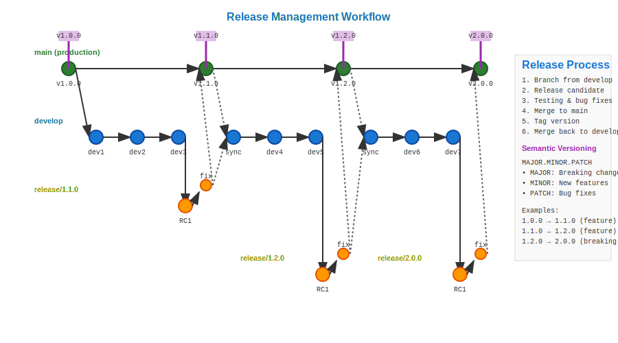

# Release Management Workflow



## Scenario Overview

**Organization**: Software startup with rapid growth  
**Product**: SaaS platform with monthly releases  
**Team**: 12 developers, 3 QA engineers, 1 release manager  
**Context**: Coordinating feature releases with stability requirements  
**Timeline**: Monthly major releases with weekly patch releases

## The Challenge

Release management requires:
- Coordinating features across multiple development streams
- Ensuring quality and stability for production deployment
- Managing semantic versioning and backward compatibility
- Creating reproducible release artifacts
- Maintaining release notes and changelog accuracy
- Supporting multiple release branches simultaneously

## Git Workflow Solution

### Mathematical Foundation

Release management creates a versioned DAG with stable reference points:

```
Release Branch Strategy:
A → B → C → D → E → F (main)
     \       \       \
      \       → G → H (release/v1.2)
       \             
        → I → J → K (release/v1.1)

Semantic Versioning Lattice:
v1.0.0 → v1.0.1 → v1.0.2 (patches)
  ↓
v1.1.0 → v1.1.1 (minor + patches)  
  ↓
v1.2.0 (major release)
```

Mathematical versioning creates a partial order where each version has well-defined relationships to predecessors.

## Step-by-Step Workflow

### Phase 1: Release Planning and Branch Creation

```bash
# Release manager creates release branch from stable main
release-mgr@startup:~/platform$ git checkout main
release-mgr@startup:~/platform$ git pull origin main
release-mgr@startup:~/platform$ git checkout -b release/v1.3.0

# Lock in features for this release
release-mgr@startup:~/platform$ git merge feature/user-dashboard
release-mgr@startup:~/platform$ git merge feature/api-v2
release-mgr@startup:~/platform$ git merge feature/performance-improvements

# Update version metadata
release-mgr@startup:~/platform$ echo "1.3.0" > VERSION
release-mgr@startup:~/platform$ git add VERSION
release-mgr@startup:~/platform$ git commit -m "bump: version to 1.3.0"
```

**Mathematical Insight**: Release branches create immutable snapshots in the DAG, enabling parallel development of future versions while stabilizing current releases.

### Phase 2: Release Candidate Testing

```bash
# Create first release candidate
release-mgr@startup:~/platform$ git tag -a v1.3.0-rc1 -m "Release candidate 1.3.0-rc1"
release-mgr@startup:~/platform$ git push origin v1.3.0-rc1

# Automated CI builds release artifacts
ci@startup:~/platform$ git checkout v1.3.0-rc1
ci@startup:~/platform$ docker build -t platform:1.3.0-rc1 .
ci@startup:~/platform$ npm run build:production
ci@startup:~/platform$ npm run test:e2e

# Deploy to staging environment
devops@startup:~/platform$ kubectl set image deployment/platform platform=platform:1.3.0-rc1
devops@startup:~/platform$ kubectl rollout status deployment/platform
```

**Quality Mathematics**: Release candidates provide deterministic testing points, with each RC representing a specific state in the DAG that can be reproduced exactly.

### Phase 3: Bug Fixes and Iteration

```bash
# Bug found during testing - apply fix to release branch
dev@startup:~/platform$ git checkout release/v1.3.0
dev@startup:~/platform$ echo "# Critical bug fix" >> src/api/auth.js
dev@startup:~/platform$ git add src/api/auth.js
dev@startup:~/platform$ git commit -m "fix: resolve authentication timeout issue

- Increase timeout from 5s to 30s for slow networks
- Add retry logic for failed authentication attempts
- Update error messaging for clarity

Fixes: #1234"

# Cherry-pick fix to main branch
dev@startup:~/platform$ git checkout main
dev@startup:~/platform$ git cherry-pick release/v1.3.0
dev@startup:~/platform$ git push origin main

# Create new release candidate
dev@startup:~/platform$ git checkout release/v1.3.0
dev@startup:~/platform$ git tag -a v1.3.0-rc2 -m "Release candidate 1.3.0-rc2"
```

**DAG Properties**: Cherry-picking maintains fix propagation between release and development branches while preserving commit relationships.

### Phase 4: Release Finalization

```bash
# Final testing passes - create official release
release-mgr@startup:~/platform$ git checkout release/v1.3.0
release-mgr@startup:~/platform$ git tag -a v1.3.0 -m "Release v1.3.0

Major Features:
- New user dashboard with analytics
- API v2 with improved performance
- 40% faster page load times

Bug Fixes:
- Authentication timeout resolution
- Mobile responsive layout fixes
- Database connection pool optimization

Breaking Changes:
- API v1 deprecated (sunset in v1.5.0)
- Configuration format updated

Statistics:
- 127 commits from 8 contributors
- 15,432 lines added, 8,901 lines removed
- 92% test coverage maintained"

release-mgr@startup:~/platform$ git push origin v1.3.0
```

**Release Mathematics**: Semantic versioning follows mathematical rules: MAJOR.MINOR.PATCH where each component represents different types of changes with defined compatibility guarantees.

### Phase 5: Deployment and Distribution

```bash
# Automated deployment pipeline
ci@startup:~/platform$ git checkout v1.3.0
ci@startup:~/platform$ docker build -t platform:1.3.0 .
ci@startup:~/platform$ docker tag platform:1.3.0 platform:latest
ci@startup:~/platform$ docker push platform:1.3.0
ci@startup:~/platform$ docker push platform:latest

# Blue-green deployment
devops@startup:~/platform$ kubectl apply -f k8s/deployment-v1.3.0.yaml
devops@startup:~/platform$ kubectl patch service platform -p '{"spec":{"selector":{"version":"v1.3.0"}}}'
devops@startup:~/platform$ kubectl delete deployment platform-v1.2.0
```

**Deployment Mathematics**: Blue-green deployments provide atomic switches between versions, ensuring O(1) rollback capability.

### Phase 6: Post-Release Monitoring and Hotfixes

```bash
# Monitor production metrics
monitoring@startup:~/platform$ kubectl logs -f deployment/platform | grep ERROR
monitoring@startup:~/platform$ curl -s https://api.platform.com/health | jq .

# Critical issue discovered - prepare hotfix
dev@startup:~/platform$ git checkout release/v1.3.0
dev@startup:~/platform$ git checkout -b hotfix/v1.3.1
dev@startup:~/platform$ echo "# Hotfix for memory leak" >> src/services/cache.js
dev@startup:~/platform$ git add src/services/cache.js
dev@startup:~/platform$ git commit -m "fix: resolve memory leak in cache service

- Clear unused cache entries every 5 minutes
- Reduce memory footprint by 60%
- Add monitoring for cache hit rates

Fixes: #1267"

# Release hotfix
dev@startup:~/platform$ git tag -a v1.3.1 -m "Hotfix v1.3.1 - Critical memory leak fix"
dev@startup:~/platform$ git push origin v1.3.1
dev@startup:~/platform$ git checkout release/v1.3.0
dev@startup:~/platform$ git merge hotfix/v1.3.1
```

**Hotfix Mathematics**: Patch versions create leaf nodes in the version DAG, providing minimal-risk fixes that maintain API compatibility.

## Mathematical Analysis

### Version Lattice Properties

Semantic versioning creates a mathematical lattice:
- **Partial Order**: v1.2.0 < v1.2.1 < v1.3.0
- **Compatibility Classes**: Major versions define API compatibility boundaries
- **Precedence Rules**: Pre-release versions (rc, alpha, beta) have defined ordering

### Release Quality Metrics

| Metric | Formula | Optimization Target |
|--------|---------|-------------------|
| Release Stability | defects_per_kloc | Minimize through testing |
| Time to Market | features_delivered / time | Balance speed with quality |
| Rollback Safety | deployment_success_rate | Maximize through automation |
| Customer Impact | downtime_per_release | Minimize through staged rollouts |

### Deployment Risk Analysis

Mathematical models for release risk:
- **Change Impact**: Lines changed × complexity factor
- **Test Coverage**: (tested_paths / total_paths) × 100
- **Rollback Capability**: Time to restore previous version
- **Blast Radius**: Users affected by potential failures

## Practical Benefits for Release Management

### Predictable Delivery
- **Regular Cadence**: Mathematical predictability in release scheduling
- **Quality Gates**: Systematic validation at each stage
- **Risk Mitigation**: Controlled introduction of changes

### Operational Excellence
- **Reproducible Builds**: Identical artifacts from identical source states
- **Rollback Capability**: Mathematical guarantee of version restoration
- **Monitoring Integration**: Quantitative assessment of release success

### Customer Communication
- **Clear Versioning**: Semantic meaning in version numbers
- **Feature Tracking**: Complete changelog from Git history
- **Compatibility Guidance**: Mathematical rules for upgrade paths

## Advanced Release Techniques

### Canary Releases with Git Integration

```bash
# Deploy to subset of users first
devops@startup:~/platform$ git checkout v1.3.0
devops@startup:~/platform$ kubectl apply -f k8s/canary-v1.3.0.yaml
devops@startup:~/platform$ kubectl patch ingress platform -p '{"spec":{"rules":[{"host":"canary.platform.com","http":{"paths":[{"path":"/","backend":{"serviceName":"platform-v1.3.0","servicePort":80}}]}}]}}'
```

**Mathematical Validation**: Canary deployments provide statistical validation of release quality through controlled exposure.

### Feature Flags and Gradual Rollout

```javascript
// Git commit hash used for feature flag consistency
const FEATURE_TOGGLE_VERSION = process.env.GIT_COMMIT_SHA;

function shouldEnableFeature(userId, featureName) {
    // Deterministic feature enabling based on commit hash
    return hash(userId + featureName + FEATURE_TOGGLE_VERSION) % 100 < rolloutPercentage;
}
```

**Deterministic Rollouts**: Git commit hashes provide cryptographic randomness for consistent feature flag behavior.

## Learning Outcomes

This workflow demonstrates:

1. **Systematic Quality**: Mathematical approaches to release validation
2. **Version Management**: Semantic versioning as mathematical structure
3. **Risk Mitigation**: Quantitative assessment of release impact
4. **Operational Discipline**: Reproducible processes for reliable delivery
5. **Customer Focus**: Predictable delivery with clear communication

**Next Steps**: Explore [Hotfix and Emergency Patches](../15-hotfixes/README.md) to see how urgent fixes integrate with systematic release processes.

---

**Files in this directory**:
- `workflow.svg` - Visual representation of release branch DAG evolution
- `commands.md` - Complete command reference for release management
- `analysis.md` - Detailed mathematical analysis of versioning and quality metrics
