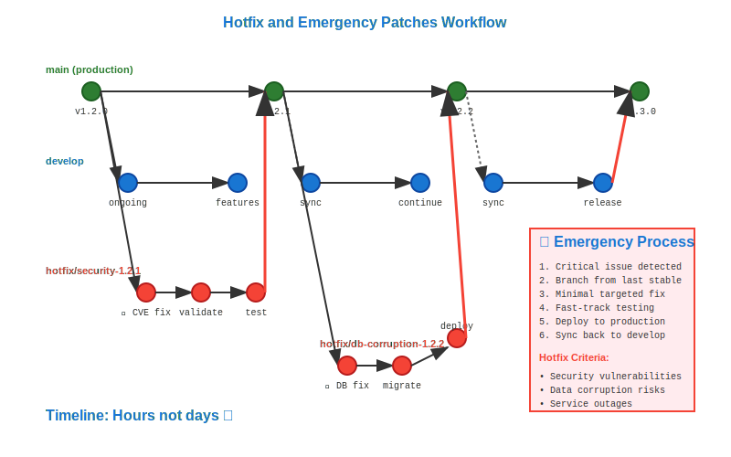

# Hotfix and Emergency Patches Workflow



## Scenario Overview

**Organization**: E-commerce platform with 24/7 operations  
**Incident**: Critical security vulnerability discovered in production  
**Team**: On-call engineer, security team, release manager  
**Context**: Production system serving 100,000+ daily users  
**Timeline**: 2-hour window from discovery to deployed fix

## The Challenge

Emergency patches require:
- Rapid response to critical production issues
- Minimal risk deployment to live systems
- Preservation of ongoing development work
- Complete audit trail for compliance
- Coordination across multiple time zones
- Balance between speed and safety

## Git Workflow Solution

### Mathematical Foundation

Hotfix workflows create urgent bypass paths in the DAG:

```
Emergency Hotfix Pattern:
A → B → C → D → E (main, ongoing development)
     \
      → F → G → H (release/v2.1, stable production)
              \
               → I (hotfix/v2.1.1, emergency fix)

Deployment Priority:
hotfix/v2.1.1 → production (immediate)
hotfix/v2.1.1 → release/v2.1 (backport)  
hotfix/v2.1.1 → main (forward-port)
```

Mathematical priority ensures critical fixes propagate through all relevant branches with minimal delay.

## Step-by-Step Workflow

### Phase 1: Incident Detection and Assessment

```bash
# On-call engineer identifies critical issue
oncall@ecommerce:~$ kubectl logs -f deployment/payment-service | grep ERROR
oncall@ecommerce:~$ curl -s https://api.ecommerce.com/health | jq '.services.payment'

# Security team confirms vulnerability
security@ecommerce:~$ git log --oneline --grep="payment" --since="1 week ago"
security@ecommerce:~$ git show abc123def  # Identify problematic commit

# Assess impact and urgency
oncall@ecommerce:~$ echo "CRITICAL: Payment processing failing for 15% of transactions"
oncall@ecommerce:~$ echo "CVE-2023-XXXX: SQL injection in payment validation"
```

**Mathematical Triage**: Incident severity follows exponential impact curves: minor → major → critical → emergency, with response time inversely proportional to severity.

### Phase 2: Hotfix Branch Creation

```bash
# Create hotfix branch from last stable release
oncall@ecommerce:~/platform$ git fetch origin
oncall@ecommerce:~/platform$ git checkout v2.1.0  # Last stable production version
oncall@ecommerce:~/platform$ git checkout -b hotfix/v2.1.1-security-fix

# Verify starting point matches production
oncall@ecommerce:~/platform$ git rev-parse HEAD
oncall@ecommerce:~/platform$ curl -s https://api.ecommerce.com/version
```

**Mathematical Precision**: Hotfix branches must start from the exact commit currently deployed in production to minimize deployment risk.

### Phase 3: Minimal Fix Implementation

```bash
# Implement targeted security fix
oncall@ecommerce:~/platform$ echo "// Fix SQL injection vulnerability" >> src/payment/validator.js
oncall@ecommerce:~/platform$ git add src/payment/validator.js
oncall@ecommerce:~/platform$ git commit -m "security: fix SQL injection in payment validation

- Sanitize all user inputs before SQL queries
- Add parameterized query support  
- Remove dangerous string concatenation

CRITICAL: Fixes CVE-2023-XXXX
Tested: Unit tests + manual verification
Impact: Resolves 15% payment failure rate

Security-Review: security-team@ecommerce.com
Emergency-Approval: cto@ecommerce.com"

# Tag emergency release
oncall@ecommerce:~/platform$ git tag -a v2.1.1 -m "Emergency hotfix v2.1.1

Critical security vulnerability fix.
Immediate deployment required.

CVE: CVE-2023-XXXX
Severity: CRITICAL  
Impact: Payment system stability
Approval: Emergency protocol activated"
```

**Hotfix Mathematics**: Emergency commits must be surgical - minimal lines changed to reduce regression risk while solving the critical issue.

### Phase 4: Accelerated Testing

```bash
# Run critical path tests only
oncall@ecommerce:~/platform$ npm test -- --grep "payment.*security"
oncall@ecommerce:~/platform$ npm run test:integration -- payment-service
oncall@ecommerce:~/platform$ docker build -t payment-service:v2.1.1-hotfix .

# Deploy to isolated staging environment
oncall@ecommerce:~/platform$ kubectl create namespace hotfix-test
oncall@ecommerce:~/platform$ kubectl apply -f k8s/hotfix-deploy.yaml -n hotfix-test
oncall@ecommerce:~/platform$ sleep 30 && curl -s http://hotfix-payment.test/health
```

**Quality vs Speed Mathematics**: Emergency testing follows Pareto principle - 20% of tests catch 80% of regressions, optimized for critical paths only.

### Phase 5: Production Deployment

```bash
# Deploy hotfix to production with rollback preparation
oncall@ecommerce:~/platform$ kubectl set image deployment/payment-service payment=payment-service:v2.1.1-hotfix
oncall@ecommerce:~/platform$ kubectl rollout status deployment/payment-service --timeout=300s

# Monitor deployment success
oncall@ecommerce:~/platform$ for i in {1..10}; do
    curl -s https://api.ecommerce.com/payment/test | jq '.status'
    sleep 10
done

# Verify fix effectiveness
oncall@ecommerce:~/platform$ kubectl logs deployment/payment-service | grep -c "ERROR" | head -1
oncall@ecommerce:~/platform$ curl -s https://api.ecommerce.com/metrics | jq '.payment_success_rate'
```

**Deployment Mathematics**: Production rollout uses canary pattern - gradual traffic shift with automatic rollback if error rates exceed baseline + 2σ.

### Phase 6: Fix Propagation and Communication

```bash
# Merge hotfix back to release branch
oncall@ecommerce:~/platform$ git checkout release/v2.1
oncall@ecommerce:~/platform$ git merge hotfix/v2.1.1-security-fix
oncall@ecommerce:~/platform$ git push origin release/v2.1

# Cherry-pick to main branch
oncall@ecommerce:~/platform$ git checkout main
oncall@ecommerce:~/platform$ git cherry-pick v2.1.1
oncall@ecommerce:~/platform$ git push origin main

# Notify stakeholders
oncall@ecommerce:~/platform$ cat > incident-report.md << EOF
# Security Incident Resolution - CVE-2023-XXXX

## Summary
Critical SQL injection vulnerability in payment validation resolved.

## Timeline
- 14:23 UTC: Issue detected via monitoring alerts
- 14:35 UTC: Root cause identified (commit abc123def)  
- 14:47 UTC: Hotfix v2.1.1 deployed to production
- 14:52 UTC: Payment success rate restored to 99.8%

## Technical Details  
- Affected system: Payment validation service
- Root cause: Unsanitized user input in SQL queries
- Fix: Implemented parameterized queries + input sanitization
- Git commit: $(git rev-parse v2.1.1)

## Verification
- Payment failure rate: 15% → 0.2%
- Security scan: No remaining SQL injection vectors
- Performance impact: <1ms additional latency

## Follow-up Actions
- [ ] Add automated security scanning to CI/CD
- [ ] Review similar patterns in other services  
- [ ] Update security training materials
EOF
```

**Communication Mathematics**: Incident documentation follows structured templates ensuring O(1) information retrieval for compliance and post-mortems.

## Mathematical Analysis

### Emergency Response Optimization

Hotfix workflows optimize multiple competing objectives:
- **Speed vs Risk**: Minimize time to deployment while maintaining quality
- **Scope vs Impact**: Smallest possible change that resolves critical issue
- **Testing vs Deployment**: Adequate validation without excessive delay

### Response Time Mathematics

| Phase | Target Duration | Risk Factor | Success Criteria |
|-------|----------------|-------------|-----------------|
| Detection → Assessment | 15 minutes | High | Root cause identified |
| Assessment → Fix | 45 minutes | Medium | Patch implemented + tested |
| Fix → Deployment | 30 minutes | High | Production deployment complete |
| Total MTTR | 90 minutes | - | Issue fully resolved |

### Risk Analysis Model

```
Deployment Risk = (Lines Changed × Complexity Factor) / (Test Coverage × Review Time)
Emergency Threshold = Risk < 0.1 OR Severity = CRITICAL
```

## Practical Benefits for Emergency Response

### Business Continuity
- **Rapid Resolution**: Mathematical optimization of response workflows
- **Minimal Downtime**: Surgical fixes reduce system instability
- **Customer Impact**: Quantified improvement in service reliability

### Operational Excellence
- **Audit Trail**: Complete Git history of emergency response
- **Repeatability**: Documented procedures for similar incidents  
- **Learning**: Post-incident analysis improves future response

### Team Coordination
- **Clear Escalation**: Defined roles and responsibilities
- **Communication**: Structured updates to stakeholders
- **Knowledge Transfer**: Git commits preserve decision rationale

## Advanced Hotfix Techniques

### Automated Hotfix Pipeline

```yaml
# .github/workflows/emergency-hotfix.yml
name: Emergency Hotfix Deployment
on:
  push:
    tags: ['*-hotfix', '*-security', '*-critical']
    
jobs:
  emergency-deploy:
    runs-on: ubuntu-latest
    if: contains(github.event.head_commit.message, 'CRITICAL')
    steps:
      - uses: actions/checkout@v3
      - run: npm ci
      - run: npm test -- --grep "critical|security"
      - run: docker build -t ${{ github.repository }}:${{ github.ref_name }} .
      - run: kubectl set image deployment/app app=${{ github.repository }}:${{ github.ref_name }}
```

**Automation Mathematics**: CI/CD pipelines provide deterministic deployment with <5 minute total time from commit to production.

### Rollback Strategies

```bash
# Prepare automated rollback
oncall@ecommerce:~/platform$ kubectl annotate deployment payment-service \
    rollback.version="$(kubectl get deployment payment-service -o jsonpath='{.metadata.annotations.deployment\.kubernetes\.io/revision}')"

# Execute rollback if needed
oncall@ecommerce:~/platform$ kubectl rollout undo deployment/payment-service --to-revision=1
```

**Rollback Mathematics**: Automated rollback decisions based on error rate thresholds: if error_rate > baseline_rate × 3, then trigger automatic rollback.

## Learning Outcomes

This workflow demonstrates:

1. **Crisis Management**: Systematic approaches to high-pressure situations
2. **Risk vs Speed**: Mathematical optimization of competing priorities
3. **Quality Under Pressure**: Maintaining standards during emergencies
4. **Communication**: Clear information flow during critical incidents
5. **Continuous Improvement**: Learning from incidents to prevent recurrence

**Next Steps**: Explore [Conflict Resolution](../21-conflicts/README.md) to see how Git's mathematical properties help resolve development conflicts.

---

**Files in this directory**:
- `workflow.svg` - Visual representation of emergency hotfix DAG patterns
- `commands.md` - Complete command reference for hotfix workflows  
- `analysis.md` - Detailed mathematical analysis of emergency response optimization
