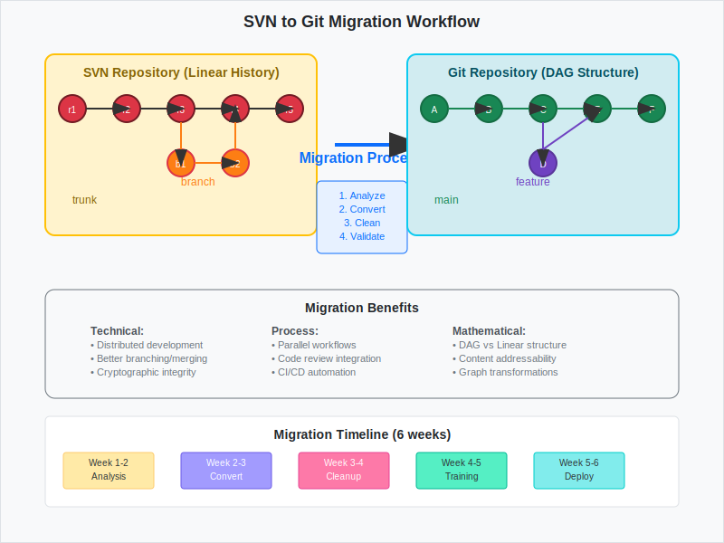

# Code Migration and Legacy Systems

## Scenario Overview

**Organization**: DataFlow Corp migrating from Subversion to Git  
**Project**: Legacy ERP system with 10 years of development history  
**Team Members**:
- **Sarah Chen** (DevOps Lead) - Migration planning and execution
- **Mike Rodriguez** (Senior Developer) - History analysis and cleanup
- **Elena Petrov** (Team Lead) - Training and process transition
- **James Wilson** (Infrastructure) - Repository setup and access control

**Timeline**: 6-week migration project with parallel system operation

## The Challenge

The team needs to:
- Preserve 10 years of development history from Subversion
- Convert branching patterns to Git-native workflows
- Maintain traceability for compliance and audit requirements
- Train 25 developers on Git workflows
- Ensure zero downtime during migration
- Handle binary files and large assets appropriately

## Mathematical Foundation

Migration involves **graph transformation** from SVN's linear structure to Git's DAG:

```
SVN Linear History:
r1 → r2 → r3 → r4 → r5 → r6
 |    |    |    |    |    |
trunk trunk branch branch merge trunk

Git DAG Equivalent:
A → B → C ← E ← F (main)
     \       ↗
      → D ← 
      (feature)
```

**Key Mathematical Properties**:
- **History Preservation**: Each SVN revision maps to Git commit with preserved metadata
- **Graph Reconstruction**: SVN branches become Git branches with proper ancestry
- **Content Addressing**: Files maintain integrity through SHA-1 transformation

## Step-by-Step Workflow

### Phase 1: Migration Planning and Analysis

```bash
# Sarah analyzes SVN repository structure
sarah@migration:~$ svn log --xml https://svn.dataflow.com/erp > svn-history.xml
sarah@migration:~$ git svn clone --stdlayout https://svn.dataflow.com/erp erp-git-migration
sarah@migration:~$ cd erp-git-migration
```

**Mathematical Insight**: SVN's revision numbers create a **total ordering**, while Git's DAG allows **partial ordering** with better parallelization.

### Phase 2: History Cleanup and Optimization

```bash
# Mike cleans up the converted history
mike@migration:~/erp-git-migration$ git filter-branch --env-filter '
if [ "$GIT_AUTHOR_EMAIL" = "old-email@company.com" ]; then
    export GIT_AUTHOR_EMAIL="new-email@dataflow.com"
fi' -- --all

# Remove large binary files that should use Git LFS
mike@migration:~/erp-git-migration$ git filter-branch --tree-filter '
find . -name "*.jar" -size +10M -delete
find . -name "*.war" -size +10M -delete
' -- --all
```

**Mathematical Insight**: Filter-branch operations are **DAG transformations** that preserve reachability while modifying content.

### Phase 3: Repository Setup and Configuration

```bash
# James sets up the new Git repository
james@server:~$ git init --bare /opt/git/erp.git
james@server:~$ git config -f /opt/git/erp.git/config receive.denyNonFastForwards true
james@server:~$ git config -f /opt/git/erp.git/config receive.denyDeletes true

# Configure branch protection
james@server:~$ echo "ref: refs/heads/main" > /opt/git/erp.git/HEAD
```

### Phase 4: Migration Execution

```bash
# Sarah pushes the converted repository
sarah@migration:~/erp-git-migration$ git remote add origin git@server:/opt/git/erp.git
sarah@migration:~/erp-git-migration$ git push origin --all
sarah@migration:~/erp-git-migration$ git push origin --tags

# Verify integrity
sarah@migration:~/erp-git-migration$ git fsck --full
sarah@migration:~/erp-git-migration$ git count-objects -v
```

### Phase 5: Team Training and Transition

```bash
# Elena sets up training repositories for developers
elena@training:~$ git clone git@server:/opt/git/erp.git erp-training
elena@training:~/erp-training$ git checkout -b training/git-basics

# Create training materials
elena@training:~/erp-training$ echo "# Git Training Materials" > TRAINING.md
elena@training:~/erp-training$ git add TRAINING.md
elena@training:~/erp-training$ git commit -m "Add training materials for SVN to Git migration"
```

### Phase 6: Parallel Operation and Validation

```bash
# Maintain SVN mirror during transition period
sarah@migration:~$ git svn rebase  # Keep Git repo synchronized with SVN
sarah@migration:~$ git push origin main

# Validate data integrity
sarah@migration:~$ git log --oneline | wc -l  # Count commits
sarah@migration:~$ svn log -q | grep "^r" | wc -l  # Compare with SVN
```

## Advanced Scenarios

### Handling Complex Branch Structures

```bash
# Map SVN branches to Git branches
mike@migration:~/erp-git-migration$ git branch -a | grep remotes/origin/
mike@migration:~/erp-git-migration$ for branch in $(git branch -r | grep -v HEAD); do
    git checkout -b ${branch#origin/} $branch
done
```

### Large File Migration to Git LFS

```bash
# Install and configure Git LFS
sarah@migration:~/erp-git-migration$ git lfs install
sarah@migration:~/erp-git-migration$ git lfs track "*.jar"
sarah@migration:~/erp-git-migration$ git lfs track "*.war"
sarah@migration:~/erp-git-migration$ git lfs track "*.zip"

# Migrate existing large files
sarah@migration:~/erp-git-migration$ git lfs migrate import --include="*.jar,*.war,*.zip"
```

### Author Mapping and Metadata Preservation

```bash
# Create author mapping file
mike@migration:~$ cat > authors.txt << 'EOF'
jsmith = John Smith <john.smith@dataflow.com>
mjohnson = Mary Johnson <mary.johnson@dataflow.com>
bwilliams = Bob Williams <bob.williams@dataflow.com>
EOF

# Apply author mapping during migration
mike@migration:~$ git svn clone --authors-file=authors.txt \
    --stdlayout https://svn.dataflow.com/erp erp-clean
```

## Quality Assurance and Verification

### Data Integrity Verification

```bash
# Compare file counts and content
sarah@migration:~$ find svn-checkout -type f | wc -l
sarah@migration:~$ find git-repo -type f | wc -l

# Verify specific file content
sarah@migration:~$ diff -r svn-checkout/trunk git-repo/
```

### Performance Analysis

```bash
# Analyze repository size and performance
james@server:~$ git count-objects -vH
james@server:~$ git gc --aggressive --prune=now
james@server:~$ du -sh /opt/git/erp.git
```

## Troubleshooting Common Issues

### Handling SVN Externals

```bash
# Convert SVN externals to Git submodules
sarah@migration:~$ git submodule add https://github.com/external/library.git lib/external
sarah@migration:~$ git commit -m "Convert SVN external to Git submodule"
```

### Fixing Broken Commits

```bash
# Handle commits with invalid timestamps or authors
mike@migration:~/erp-git-migration$ git filter-branch --env-filter '
if [ "$GIT_AUTHOR_DATE" = "" ]; then
    export GIT_AUTHOR_DATE="2020-01-01T00:00:00+00:00"
    export GIT_COMMITTER_DATE="2020-01-01T00:00:00+00:00"
fi' -- --all
```

## Mathematical Analysis

### Migration Complexity

The complexity of SVN to Git migration is **O(n × m)** where:
- n = number of SVN revisions
- m = average number of files per revision

### Graph Transformation Properties

**SVN Linear Model**:
```
Revision: r1 → r2 → r3 → r4
Files: F(r1) ⊆ F(r2) ⊆ F(r3) ⊆ F(r4)
```

**Git DAG Model**:
```
Commit: A → B → C ← E
         \     ↗
          → D ←
Content: SHA1(content) provides immutable addressing
```

### Performance Optimization

**Repository Size Optimization**:
- Pack files compress similar content with **delta compression**
- Garbage collection removes unreachable objects
- LFS moves large files to separate storage with **pointer files**

## Best Practices

### Pre-Migration Checklist

1. **Analyze Repository Structure**: Understand SVN layout and conventions
2. **Plan Branch Mapping**: Decide how SVN branches map to Git branches
3. **Identify Large Files**: Plan Git LFS integration for assets > 100MB
4. **Create Author Mapping**: Ensure proper email attribution
5. **Test Migration**: Run migration on copy before production

### Post-Migration Actions

1. **Verify Data Integrity**: Compare file counts and checksums
2. **Configure Repository**: Set up branch protection and access controls
3. **Train Team Members**: Provide Git training and documentation
4. **Monitor Performance**: Track repository size and clone times
5. **Document Process**: Record lessons learned for future migrations

## Integration with CI/CD

### Jenkins Integration

```bash
# Update Jenkins jobs for Git
pipeline {
    agent any
    stages {
        stage('Checkout') {
            steps {
                git branch: 'main',
                    url: 'git@server:/opt/git/erp.git'
            }
        }
        stage('Build') {
            steps {
                sh './build.sh'
            }
        }
    }
}
```

### Continuous Integration Setup

```bash
# Configure Git hooks for automated testing
james@server:~$ cat > /opt/git/erp.git/hooks/pre-receive << 'EOF'
#!/bin/bash
while read oldrev newrev refname; do
    if [ "$oldrev" != "0000000000000000000000000000000000000000" ]; then
        # Run tests on new commits
        git --git-dir=/opt/git/erp.git --work-tree=/tmp/test-checkout checkout $newrev
        cd /tmp/test-checkout && ./run-tests.sh
    fi
done
EOF
james@server:~$ chmod +x /opt/git/erp.git/hooks/pre-receive
```

## Workflow Diagram



*The workflow diagram illustrates the SVN to Git migration process, showing the transformation from linear SVN history to Git's DAG structure with proper branch mapping and content preservation.*

## Success Metrics

### Migration Success Indicators

1. **Data Integrity**: 100% of files and history preserved
2. **Performance**: Clone times < 2 minutes for full repository
3. **Team Adoption**: All developers successfully using Git workflows
4. **Process Integration**: CI/CD pipelines fully operational
5. **Compliance**: Audit trails and traceability maintained

### Long-term Benefits

1. **Distributed Development**: Teams can work offline and independently
2. **Branching Efficiency**: Feature branches enable parallel development
3. **Merge Performance**: Three-way merges reduce conflict resolution time
4. **Storage Optimization**: Pack files and compression reduce storage needs
5. **Integration Capabilities**: Better tooling and platform integration

This migration workflow demonstrates how mathematical principles of graph theory and cryptographic integrity enable reliable transformation from legacy version control systems to modern Git-based workflows, ensuring data preservation while unlocking advanced collaboration capabilities.