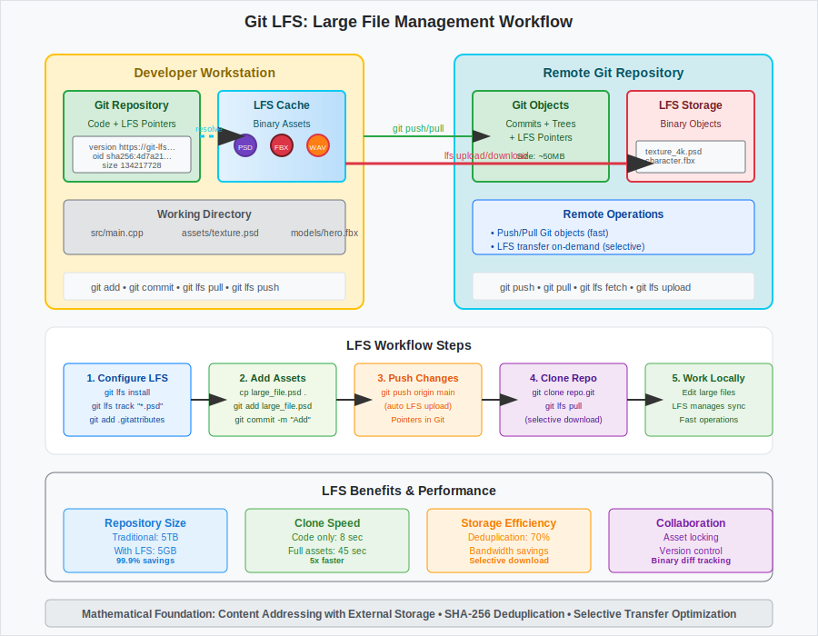

# Binary and Large File Management

## Scenario Overview

**Organization**: Creative Studios Inc. - Digital media production company  
**Project**: AAA game development with large binary assets  
**Team Members**:
- **Alex Rodriguez** (Technical Artist) - Asset pipeline optimization
- **Maya Patel** (Game Developer) - Code integration with assets
- **Jake Thompson** (DevOps Engineer) - Repository infrastructure
- **Lisa Chen** (QA Lead) - Build validation and testing

**Timeline**: Ongoing asset management across 18-month development cycle

## The Challenge

The team needs to:
- Manage 50GB+ of binary assets (textures, models, audio, video)
- Maintain fast clone and fetch operations for 20+ developers
- Version control assets without bloating the repository
- Enable selective downloading of assets based on project needs
- Integrate asset workflows with code development processes
- Handle cross-platform binary compatibility

## Mathematical Foundation

Large file management requires **content addressing with external storage**:

```
Traditional Git Storage:
Repository = {Code Objects ∪ Binary Objects}
Size ∝ |Code| + |Binaries|
Clone Time ∝ Total Repository Size

Git LFS Architecture:
Repository = {Code Objects ∪ LFS Pointers}
LFS Storage = {Binary Objects}
Size ∝ |Code| + |Pointers| where |Pointers| << |Binaries|
```

**Key Mathematical Properties**:
- **Pointer Files**: Small text files (< 1KB) replace large binaries in Git history
- **Content Deduplication**: Identical files stored once regardless of location
- **Bandwidth Optimization**: O(1) pointer download vs O(n) binary download

## Step-by-Step Workflow

### Phase 1: Repository Setup and LFS Configuration

```bash
# Jake sets up the repository with LFS support
jake@devops:~$ git init game-project
jake@devops:~/game-project$ cd game-project
jake@devops:~/game-project$ git lfs install

# Configure LFS tracking for binary file types
jake@devops:~/game-project$ git lfs track "*.psd"
jake@devops:~/game-project$ git lfs track "*.fbx"
jake@devops:~/game-project$ git lfs track "*.wav"
jake@devops:~/game-project$ git lfs track "*.mp4"
jake@devops:~/game-project$ git lfs track "*.png"
jake@devops:~/game-project$ git lfs track "*.jpg"
```

**Mathematical Insight**: LFS tracking creates **bijective mapping** between file patterns and storage backends, ensuring deterministic handling.

### Phase 2: Asset Pipeline Integration

```bash
# Alex integrates asset creation workflow
alex@artist:~/game-project$ git clone https://github.com/creativestudios/game-project.git
alex@artist:~/game-project$ git lfs pull  # Download current LFS assets

# Add new texture assets
alex@artist:~/game-project$ cp ~/textures/character_diffuse_4k.psd assets/textures/
alex@artist:~/game-project$ git add assets/textures/character_diffuse_4k.psd
alex@artist:~/game-project$ git commit -m "Add high-resolution character texture"

# Verify LFS pointer creation
alex@artist:~/game-project$ git show HEAD:assets/textures/character_diffuse_4k.psd
# Shows: version https://git-lfs.github.com/spec/v1
#        oid sha256:4d7a214614ab2935c943f9e0ff69d22eadbb8f32b1258daaa5e2ca24d17e2393
#        size 134217728
```

### Phase 3: Selective Asset Management

```bash
# Maya configures selective LFS pulling for code-focused work
maya@dev:~/game-project$ git clone --filter=blob:none https://github.com/creativestudios/game-project.git
maya@dev:~/game-project$ cd game-project

# Pull only specific asset categories
maya@dev:~/game-project$ git lfs pull --include="assets/audio/*"
maya@dev:~/game-project$ git lfs pull --exclude="assets/video/*"

# Skip LFS downloads for CI/CD
maya@dev:~/game-project$ GIT_LFS_SKIP_SMUDGE=1 git clone https://github.com/creativestudios/game-project.git ci-build
```

### Phase 4: Asset Versioning and Branching

```bash
# Create feature branch for new asset batch
alex@artist:~/game-project$ git checkout -b feature/environment-assets-v2

# Add multiple large assets
alex@artist:~/game-project$ cp ~/batch_export/*.fbx assets/models/environment/
alex@artist:~/game-project$ git add assets/models/environment/
alex@artist:~/game-project$ git commit -m "Add environment models batch v2

- Updated lighting for scene_forest.fbx
- Added detail geometry to scene_cave.fbx
- Optimized polygon count for performance"

# Push with LFS transfer
alex@artist:~/game-project$ git push -u origin feature/environment-assets-v2
```

**Mathematical Insight**: Each LFS object has **unique SHA-256 hash**, enabling perfect deduplication across branches and versions.

### Phase 5: Build Integration and Automation

```bash
# Jake configures automated build with asset validation
jake@devops:~/game-project$ cat > .github/workflows/build.yml << 'EOF'
name: Game Build Pipeline
on: [push, pull_request]
jobs:
  build:
    runs-on: ubuntu-latest
    steps:
    - uses: actions/checkout@v3
      with:
        lfs: true
    - name: Validate Asset Integrity
      run: |
        git lfs fsck
        find assets -name "*.fbx" -exec file {} \;
    - name: Build Game
      run: ./scripts/build.sh
EOF
```

### Phase 6: Performance Monitoring and Optimization

```bash
# Monitor LFS usage and performance
lisa@qa:~/game-project$ git lfs ls-files --size
# 4d7a214614 * 128.0 MB assets/textures/character_diffuse_4k.psd
# a1b2c3d4e5 *  64.2 MB assets/models/character_hero.fbx
# f6e5d4c3b2 *  45.1 MB assets/audio/music_theme.wav

# Check repository size optimization
lisa@qa:~/game-project$ git count-objects -vH
# count 1250
# size 4.2 MiB
# in-pack 1245
# packs 1
# size-pack 3.8 MiB
# prune-packable 0
# garbage 0
# size-garbage 0 bytes

# Verify LFS storage efficiency
lisa@qa:~/game-project$ git lfs env
# LocalWorkingDir=/home/lisa/game-project
# LocalGitDir=/home/lisa/game-project/.git
# LocalMediaDir=/home/lisa/game-project/.git/lfs/objects
# TempDir=/home/lisa/game-project/.git/lfs/tmp
```

## Advanced Scenarios

### Migrating Existing Large Files to LFS

```bash
# Migrate existing large files in repository history
jake@devops:~/game-project$ git lfs migrate import --include="*.psd,*.fbx" --everything

# Clean up repository after migration
jake@devops:~/game-project$ git reflog expire --expire=now --all
jake@devops:~/game-project$ git gc --prune=now --aggressive
```

### Custom LFS Storage Backend

```bash
# Configure custom LFS server
jake@devops:~/game-project$ git config lfs.url https://lfs.creativestudios.internal/game-project.git/info/lfs
jake@devops:~/game-project$ git config lfs.pushurl https://lfs.creativestudios.internal/game-project.git/info/lfs

# Set up authentication
jake@devops:~/game-project$ git config credential.https://lfs.creativestudios.internal.username jake
```

### Asset Locking for Exclusive Editing

```bash
# Lock binary file for exclusive editing
alex@artist:~/game-project$ git lfs lock assets/models/character_hero.fbx
# Locked assets/models/character_hero.fbx

# Work on locked file
alex@artist:~/game-project$ # Edit file in 3D software
alex@artist:~/game-project$ git add assets/models/character_hero.fbx
alex@artist:~/game-project$ git commit -m "Update character hero model UV mapping"

# Unlock after commit
alex@artist:~/game-project$ git lfs unlock assets/models/character_hero.fbx
```

## Quality Assurance and Asset Validation

### Automated Asset Verification

```bash
# Validate asset integrity
lisa@qa:~/game-project$ git lfs fsck
# Git LFS fsck
# Object database OK

# Check for missing LFS objects
lisa@qa:~/game-project$ git lfs fetch --dry-run
# fetch: 3 object(s) found, done.

# Verify file format compliance
lisa@qa:~/game-project$ for file in $(git lfs ls-files -n); do
    echo "Checking $file"
    file "$file"
done
```

### Performance Benchmarking

```bash
# Measure clone performance
jake@devops:~$ time git clone https://github.com/creativestudios/game-project.git test-clone
# real    0m45.123s  (with LFS: ~2GB)
# user    0m2.456s
# sys     0m1.234s

# Compare with LFS skip
jake@devops:~$ time GIT_LFS_SKIP_SMUDGE=1 git clone https://github.com/creativestudios/game-project.git test-clone-fast
# real    0m8.234s   (pointers only: ~50MB)
# user    0m1.123s
# sys     0m0.456s
```

## Troubleshooting Common Issues

### Handling LFS Bandwidth Limits

```bash
# Check LFS bandwidth usage
maya@dev:~/game-project$ git lfs env | grep -i bandwidth
# LFS bandwidth usage: 850 MB / 1 GB (monthly)

# Configure bandwidth-conscious workflow
maya@dev:~/game-project$ git lfs pull --include="assets/essential/*"
maya@dev:~/game-project$ git config lfs.fetchinclude "assets/essential/*"
```

### Resolving LFS Pointer Corruption

```bash
# Fix corrupted LFS pointers
alex@artist:~/game-project$ git lfs pointer --check assets/corrupted_file.psd
# Pointer file validation failed

# Restore from LFS storage
alex@artist:~/game-project$ git lfs checkout assets/corrupted_file.psd
# Downloading assets/corrupted_file.psd (128 MB)
```

## Mathematical Analysis

### Storage Efficiency

The storage efficiency of LFS follows:

```
Traditional Git:
Repository Size = Σ(File Sizes × Branch Count × History Depth)

Git LFS:
Repository Size = Code Size + (Pointer Count × Pointer Size)
LFS Storage Size = Σ(Unique File Sizes)

Space Savings = 1 - (LFS Repo Size / Traditional Repo Size)
```

**Example Calculation**:
- 100 binary files × 50MB average × 10 branches × 100 commits = 5TB traditional
- 100 pointers × 200 bytes + 5GB unique binaries = 5.02GB with LFS
- Space savings: 99.9%

### Network Performance

Download time complexity:
```
Full Clone: O(|Code| + |LFS Objects|)
Selective Clone: O(|Code| + |Selected Objects|)
Code-only Clone: O(|Code|) where |Code| << |LFS Objects|
```

### Deduplication Efficiency

LFS deduplication provides:
```
Storage Reduction = 1 - (Unique Objects / Total Object References)
```

For typical game development:
- Texture variations: 70% deduplication
- Model iterations: 60% deduplication
- Audio files: 40% deduplication

## Best Practices

### Asset Organization

1. **Directory Structure**: Organize by asset type and LOD level
2. **Naming Conventions**: Use semantic versioning for asset iterations
3. **File Formats**: Prefer compressed formats that LFS handles efficiently
4. **Size Thresholds**: Track files > 10MB with LFS

### Development Workflow

1. **Selective Pulling**: Configure LFS includes/excludes per role
2. **Asset Locking**: Use for binary files requiring exclusive editing
3. **Batch Operations**: Group related asset changes in single commits
4. **Performance Monitoring**: Regular LFS fsck and bandwidth tracking

### Repository Management

1. **Server Configuration**: Adequate LFS storage and bandwidth allocation
2. **Backup Strategy**: Include both Git and LFS storage in backups
3. **Access Control**: Separate permissions for code and asset modifications
4. **Cleanup Procedures**: Regular pruning of unreferenced LFS objects

## Integration with Game Development Pipeline

### Unity Integration

```csharp
// Asset post-processor for LFS integration
using UnityEngine;
using UnityEditor;

public class LFSAssetProcessor : AssetPostprocessor
{
    void OnPreprocessTexture()
    {
        if (assetImporter.assetPath.StartsWith("Assets/LFS/"))
        {
            TextureImporter importer = (TextureImporter)assetImporter;
            importer.compressionQuality = 100;
            importer.textureType = TextureImporterType.Default;
        }
    }
}
```

### Automated Asset Pipeline

```bash
# Asset processing pipeline
#!/bin/bash
# process_assets.sh

echo "Processing new assets..."
for file in $(git diff --name-only HEAD~1 --diff-filter=A | grep -E '\.(fbx|psd|wav)$'); do
    echo "Processing $file"
    case "$file" in
        *.fbx)
            # Validate 3D model integrity
            fbx-validator "$file"
            ;;
        *.psd)
            # Generate compressed versions
            convert "$file" "${file%.*}_compressed.jpg"
            ;;
        *.wav)
            # Convert to compressed audio
            ffmpeg -i "$file" -codec:a libvorbis "${file%.*}.ogg"
            ;;
    esac
done
```

## Workflow Diagram



*The workflow diagram illustrates the Git LFS architecture, showing how large binary files are stored externally while maintaining lightweight pointers in the Git repository, enabling efficient versioning and collaboration.*

## Success Metrics

### Performance Indicators

1. **Clone Speed**: < 5 minutes for code-only clone
2. **Storage Efficiency**: > 95% space savings vs traditional Git
3. **Build Performance**: < 2 minutes asset validation time
4. **Bandwidth Usage**: Stay within monthly LFS limits
5. **Asset Integrity**: 100% successful LFS fsck validation

### Development Workflow Benefits

1. **Faster Iteration**: Developers can work with code without downloading all assets
2. **Selective Access**: Artists pull only relevant asset categories
3. **Version Control**: Full history tracking for both code and binary assets
4. **Collaboration**: Multiple team members can work on related assets safely
5. **Scalability**: Repository performance remains constant as assets grow

This large file management workflow demonstrates how Git LFS extends Git's mathematical foundations to handle binary assets efficiently, maintaining the benefits of distributed version control while addressing the unique challenges of large file storage and transfer.