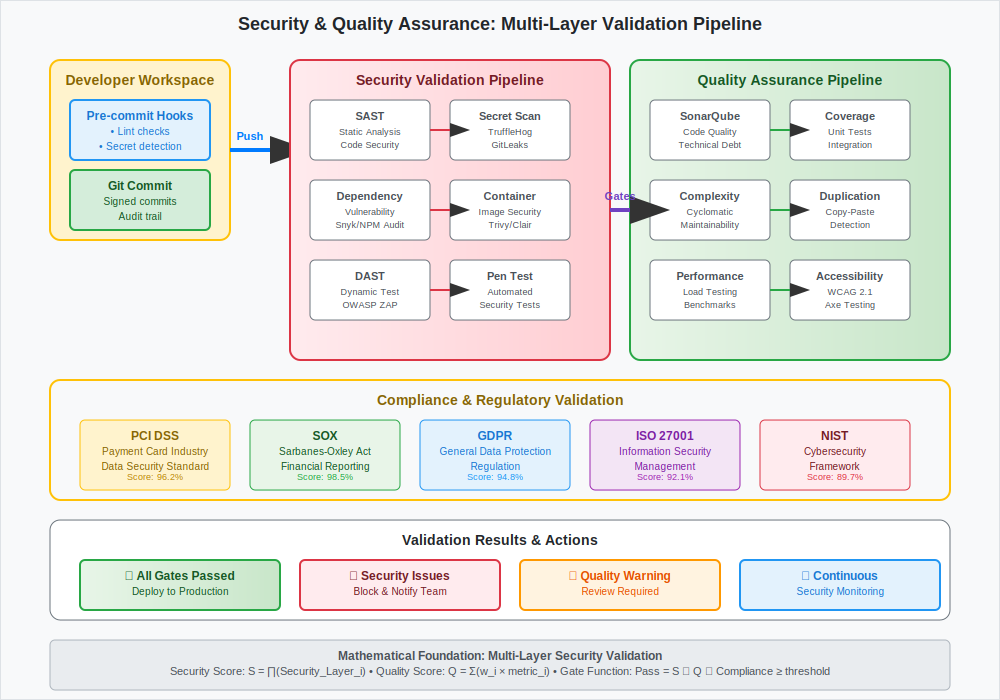

# Code Quality and Security

## Scenario Overview

**Organization**: SecureCode Financial Services - Banking software development  
**Project**: Payment processing system with strict security and compliance requirements  
**Team Members**:
- **Elena Vasquez** (Security Engineer) - Security policies and vulnerability assessment
- **Michael Chang** (DevOps Lead) - Automated quality gates and compliance integration
- **Priya Sharma** (Senior Developer) - Code quality standards and peer reviews
- **Alex Johnson** (Compliance Officer) - Regulatory requirements and audit trails

**Timeline**: Continuous security and quality monitoring with quarterly compliance audits

## The Challenge

The team needs to:
- Implement comprehensive security scanning throughout the development lifecycle
- Enforce code quality standards through automated analysis
- Ensure compliance with financial regulations (PCI DSS, SOX, PSD2)
- Maintain detailed audit trails for all code changes
- Prevent vulnerable code from reaching production
- Balance security requirements with development velocity

## Mathematical Foundation

Quality and security systems implement **multi-layered validation** with mathematical rigor:

```
Security Validation Model:
S(code) = ∏(Security_Layer_i(code)) for i ∈ [1,n]

Quality Score Calculation:
Q(code) = Σ(w_i × metric_i) where Σw_i = 1

Combined Gate Function:
Gate(code) = S(code) ∧ Q(code) ∧ Compliance(code)
```

**Key Mathematical Properties**:
- **Security Scoring**: Probabilistic risk assessment across multiple dimensions
- **Quality Metrics**: Weighted combination of measurable code attributes
- **Threshold Functions**: Binary gates based on continuous metrics

## Step-by-Step Workflow

### Phase 1: Security Policy Configuration

```bash
# Elena configures comprehensive security scanning
elena@security:~/banking-app$ cat .github/workflows/security.yml
```

```yaml
name: Security Scanning Pipeline
on:
  push:
    branches: [main, develop, 'feature/*']
  pull_request:
    branches: [main, develop]
  schedule:
    - cron: '0 2 * * *'  # Nightly comprehensive scan

jobs:
  security-scan:
    runs-on: ubuntu-latest
    steps:
      - name: Checkout code
        uses: actions/checkout@v4
        with:
          fetch-depth: 0  # Full history for better analysis
      
      - name: Setup security tools
        run: |
          # Install security scanning tools
          npm install -g snyk semgrep @microsoft/eslint-plugin-sdl
          pip install bandit safety
          wget -O - https://github.com/returntocorp/semgrep/releases/latest/download/semgrep-linux-x86_64.tgz | tar -xz
      
      - name: SAST (Static Application Security Testing)
        run: |
          # Multiple SAST tools for comprehensive coverage
          semgrep --config=auto --error --verbose .
          snyk code test --severity-threshold=medium
          eslint --ext .js,.ts,.jsx,.tsx --config .eslintrc.security.js src/
        continue-on-error: false
      
      - name: Dependency vulnerability scan
        run: |
          npm audit --audit-level moderate
          snyk test --severity-threshold=high
          safety check --json --output vulns.json || true
        env:
          SNYK_TOKEN: ${{ secrets.SNYK_TOKEN }}
      
      - name: Secret detection
        uses: trufflesecurity/trufflehog@main
        with:
          path: ./
          base: main
          head: HEAD
```

**Mathematical Insight**: SAST tools use **control flow analysis** and **taint analysis** to model data flow through program execution paths.

### Phase 2: Code Quality Analysis

```bash
# Michael implements comprehensive quality gates
michael@devops:~/banking-app$ cat sonar-project.properties
sonar.projectKey=banking-app
sonar.organization=securecode
sonar.sources=src
sonar.tests=tests
sonar.javascript.lcov.reportPaths=coverage/lcov.info
sonar.coverage.exclusions=**/*.test.js,**/*.spec.ts
sonar.cpd.exclusions=**/*.test.js

# Quality gates configuration
sonar.qualitygate.wait=true
sonar.qualitygate.timeout=300
```

```yaml
  code-quality:
    runs-on: ubuntu-latest
    steps:
      - name: Checkout code
        uses: actions/checkout@v4
        with:
          fetch-depth: 0
      
      - name: SonarCloud analysis
        uses: SonarSource/sonarcloud-github-action@master
        env:
          GITHUB_TOKEN: ${{ secrets.GITHUB_TOKEN }}
          SONAR_TOKEN: ${{ secrets.SONAR_TOKEN }}
      
      - name: Code complexity analysis
        run: |
          npx complexity-report --output complexity.json src/
          npx jscpd --reporters json --output cpd.json src/
      
      - name: Technical debt calculation
        run: |
          # Calculate technical debt metrics
          DEBT_RATIO=$(jq '.summary.duplication.percentage' cpd.json)
          COMPLEXITY=$(jq '.reports[0].complexity.aggregate.cyclomatic' complexity.json)
          
          echo "Technical Debt Ratio: $DEBT_RATIO%"
          echo "Cyclomatic Complexity: $COMPLEXITY"
          
          # Fail if thresholds exceeded
          if (( $(echo "$DEBT_RATIO > 3.0" | bc -l) )); then
            echo "Technical debt ratio too high: $DEBT_RATIO%"
            exit 1
          fi
```

### Phase 3: Compliance Validation

```bash
# Alex implements compliance checking
alex@compliance:~/banking-app$ cat scripts/compliance-check.sh
#!/bin/bash
# PCI DSS and SOX compliance validation

set -e

echo "=== Banking Compliance Validation ==="

# Check for PCI DSS requirements
echo "Checking PCI DSS compliance..."

# Validate encryption usage
if ! grep -r "AES\|RSA\|ECC" src/ --include="*.js" --include="*.ts"; then
    echo "❌ No encryption algorithms found - PCI DSS violation"
    exit 1
fi

# Check for secure random number generation
if grep -r "Math.random" src/ --include="*.js" --include="*.ts"; then
    echo "❌ Insecure random number generation detected"
    exit 1
fi

# Validate logging practices
if ! grep -r "audit\|log" src/ --include="*.js" --include="*.ts"; then
    echo "❌ Insufficient logging for audit trails"
    exit 1
fi

# SOX compliance - data integrity checks
echo "Validating SOX compliance..."
if ! grep -r "checksum\|hash\|integrity" src/ --include="*.js" --include="*.ts"; then
    echo "❌ No data integrity verification found"
    exit 1
fi

echo "✅ Compliance checks passed"
```

### Phase 4: Pre-commit Hooks Implementation

```bash
# Priya sets up pre-commit quality checks
priya@dev:~/banking-app$ cat .pre-commit-config.yaml
repos:
  - repo: https://github.com/pre-commit/pre-commit-hooks
    rev: v4.4.0
    hooks:
      - id: trailing-whitespace
      - id: end-of-file-fixer
      - id: check-json
      - id: check-yaml
      - id: detect-private-key
      - id: check-added-large-files
        args: ['--maxkb=500']
  
  - repo: https://github.com/psf/black
    rev: 22.10.0
    hooks:
      - id: black
        language_version: python3
  
  - repo: https://github.com/PyCQA/bandit
    rev: 1.7.4
    hooks:
      - id: bandit
        args: ['-r', '.', '-f', 'json', '-o', 'bandit-report.json']
  
  - repo: https://github.com/returntocorp/semgrep
    rev: v1.0.0
    hooks:
      - id: semgrep
        args: ['--config=auto', '--error']
```

```bash
# Install and configure pre-commit hooks
priya@dev:~/banking-app$ pre-commit install
priya@dev:~/banking-app$ pre-commit install --hook-type commit-msg
priya@dev:~/banking-app$ git config commit.template .gitmessage
```

### Phase 5: Security Dashboard and Monitoring

```python
# Elena implements security metrics dashboard
# security_dashboard.py
import json
import requests
from datetime import datetime, timedelta

class SecurityDashboard:
    def __init__(self):
        self.metrics = {
            'vulnerability_count': 0,
            'critical_issues': 0,
            'security_debt': 0.0,
            'compliance_score': 0.0
        }
    
    def collect_sonar_metrics(self):
        """Collect security metrics from SonarQube"""
        url = f"{SONAR_URL}/api/measures/component"
        params = {
            'component': 'banking-app',
            'metricKeys': 'vulnerabilities,security_hotspots,security_rating'
        }
        
        response = requests.get(url, auth=(SONAR_TOKEN, ''), params=params)
        data = response.json()
        
        for measure in data['component']['measures']:
            if measure['metric'] == 'vulnerabilities':
                self.metrics['vulnerability_count'] = int(measure['value'])
            elif measure['metric'] == 'security_rating':
                self.metrics['security_rating'] = measure['value']
    
    def calculate_security_score(self):
        """Calculate overall security score"""
        # Weighted security score calculation
        weights = {
            'vulnerability_severity': 0.4,
            'code_coverage': 0.2,
            'dependency_freshness': 0.2,
            'compliance_adherence': 0.2
        }
        
        score = 0
        for metric, weight in weights.items():
            score += self.get_metric_score(metric) * weight
        
        return min(100, max(0, score))
    
    def generate_report(self):
        """Generate security report"""
        report = {
            'timestamp': datetime.now().isoformat(),
            'overall_score': self.calculate_security_score(),
            'metrics': self.metrics,
            'recommendations': self.get_recommendations()
        }
        
        return json.dumps(report, indent=2)
```

### Phase 6: Automated Penetration Testing

```yaml
  penetration-testing:
    if: github.ref == 'refs/heads/main'
    runs-on: ubuntu-latest
    environment: security-testing
    steps:
      - name: Deploy to security test environment
        run: |
          # Deploy application to isolated security testing environment
          kubectl apply -f k8s/security-test/ -n security-test
          kubectl wait --for=condition=ready pod -l app=banking-app -n security-test --timeout=300s
      
      - name: OWASP ZAP baseline scan
        uses: zaproxy/action-baseline@v0.7.0
        with:
          target: 'https://security-test.banking-app.internal'
          rules_file_name: '.zap/rules.tsv'
          cmd_options: '-a'
      
      - name: Dynamic security testing
        run: |
          # SQL injection testing
          sqlmap -u "https://security-test.banking-app.internal/api/user?id=1" --batch --risk=3
          
          # XSS testing
          python3 xss_scanner.py --url "https://security-test.banking-app.internal"
          
          # Authentication bypass testing
          python3 auth_bypass_test.py --target "https://security-test.banking-app.internal"
      
      - name: API security testing
        run: |
          # Test API security with custom scripts
          python3 api_security_test.py --spec openapi.json --target https://security-test.banking-app.internal/api
```

## Advanced Scenarios

### Runtime Application Self-Protection (RASP)

```javascript
// RASP integration for runtime security
const rasp = require('./security/rasp');

app.use(rasp.middleware({
  rules: [
    {
      type: 'sql_injection',
      action: 'block',
      sensitivity: 'high'
    },
    {
      type: 'xss',
      action: 'sanitize',
      sensitivity: 'medium'
    },
    {
      type: 'command_injection',
      action: 'block',
      sensitivity: 'high'
    }
  ],
  monitoring: {
    endpoint: 'https://security.banking-app.internal/alerts',
    realtime: true
  }
}));
```

### Supply Chain Security

```yaml
  supply-chain-security:
    runs-on: ubuntu-latest
    steps:
      - name: Verify package signatures
        run: |
          # Verify npm package signatures
          npm install --package-lock-only
          npx audit-ci --moderate
          
          # Check for suspicious packages
          npx @lavamoat/allow-scripts check
      
      - name: Container image security
        run: |
          # Build and scan container
          docker build -t banking-app:$GITHUB_SHA .
          
          # Trivy vulnerability scanning
          trivy image --exit-code 1 --severity HIGH,CRITICAL banking-app:$GITHUB_SHA
          
          # Cosign signature verification
          cosign verify --key cosign.pub banking-app:$GITHUB_SHA
      
      - name: SBOM generation
        run: |
          # Generate Software Bill of Materials
          syft packages banking-app:$GITHUB_SHA -o spdx-json > sbom.json
          grype sbom:sbom.json --fail-on high
```

## Quality Assurance Integration

### Automated Code Review

```bash
# AI-powered code review integration
michael@devops:~/banking-app$ cat .github/workflows/code-review.yml
```

```yaml
name: Automated Code Review
on:
  pull_request:
    types: [opened, synchronize, reopened]

jobs:
  ai-review:
    runs-on: ubuntu-latest
    steps:
      - uses: actions/checkout@v4
        with:
          fetch-depth: 0
      
      - name: AI Code Review
        uses: openai/gpt-code-reviewer@v1
        with:
          openai_api_key: ${{ secrets.OPENAI_API_KEY }}
          github_token: ${{ secrets.GITHUB_TOKEN }}
          review_comment_lgtm: false
          review_rules: |
            - Check for security vulnerabilities
            - Validate input sanitization
            - Ensure proper error handling
            - Verify logging practices
            - Check for hardcoded secrets
```

### Performance Security Testing

```bash
# Security-focused performance testing
elena@security:~/banking-app$ cat security-load-test.js
import http from 'k6/http';
import { check, sleep } from 'k6';

export let options = {
  stages: [
    { duration: '2m', target: 100 },
    { duration: '5m', target: 100 },
    { duration: '2m', target: 200 },
    { duration: '5m', target: 200 },
    { duration: '2m', target: 0 },
  ],
  thresholds: {
    http_req_duration: ['p(95)<500'],
    'http_req_duration{name:auth}': ['p(95)<100'],
    'checks{type:security}': ['rate>0.95'],
  },
};

export default function() {
  // Test authentication endpoint under load
  let authResponse = http.post('https://api.banking-app.com/auth', {
    username: 'test@example.com',
    password: 'SecurePassword123!'
  });
  
  check(authResponse, {
    'auth status is 200': (r) => r.status === 200,
    'no sensitive data in response': (r) => !r.body.includes('password'),
    'proper security headers': (r) => 
      r.headers['X-Frame-Options'] && 
      r.headers['X-Content-Type-Options'],
  }, { type: 'security' });
  
  if (authResponse.status === 200) {
    let token = JSON.parse(authResponse.body).token;
    
    // Test protected endpoints
    let protectedResponse = http.get('https://api.banking-app.com/account', {
      headers: { 'Authorization': `Bearer ${token}` }
    });
    
    check(protectedResponse, {
      'protected endpoint auth': (r) => r.status === 200,
      'no data leakage': (r) => !r.body.includes('ssn'),
    }, { type: 'security' });
  }
  
  sleep(1);
}
```

## Mathematical Analysis

### Security Risk Scoring

```
Risk Score Calculation:
R(vulnerability) = (Impact × Likelihood × Exploitability) / Mitigation_Factor

Where:
- Impact ∈ [1,10] (business impact scale)
- Likelihood ∈ [0,1] (probability of exploitation)
- Exploitability ∈ [1,5] (ease of exploitation)
- Mitigation_Factor ∈ [1,3] (existing controls effectiveness)

Overall Security Posture:
S = 100 - Σ(R_i × w_i) for all vulnerabilities i
```

### Quality Metrics Mathematical Model

```
Code Quality Score:
Q = Σ(w_i × normalize(m_i)) where Σw_i = 1

Metrics (m_i):
- Cyclomatic Complexity: CC
- Code Coverage: COV
- Duplication Rate: DUP
- Maintainability Index: MI
- Technical Debt Ratio: TDR

Weights (w_i):
- w_cc = 0.25, w_cov = 0.30, w_dup = 0.20, w_mi = 0.15, w_tdr = 0.10

Normalization:
normalize(x) = (max_value - x) / (max_value - min_value)
```

### Compliance Scoring Algorithm

```
Compliance Score:
C = Σ(R_i × C_i) / Σ(R_i)

Where:
- R_i = Requirement importance weight
- C_i = Requirement compliance level [0,1]

For PCI DSS:
- Data encryption: R=10, target C=1.0
- Access controls: R=9, target C=1.0
- Audit logging: R=8, target C=1.0
- Network security: R=7, target C=1.0
```

## Best Practices

### Security-First Development

1. **Shift-Left Security**: Integrate security from the earliest development stages
2. **Defense in Depth**: Multiple security layers with different detection methods
3. **Zero Trust Architecture**: Verify every request and user continuously
4. **Principle of Least Privilege**: Minimal necessary access rights
5. **Security by Design**: Build security into architecture decisions

### Quality Assurance Framework

1. **Automated Testing Pyramid**: Unit tests (70%), Integration tests (20%), E2E tests (10%)
2. **Code Review Standards**: Mandatory peer review with security checklist
3. **Continuous Monitoring**: Real-time quality metrics tracking
4. **Technical Debt Management**: Regular refactoring sprints
5. **Documentation Standards**: Comprehensive security and quality documentation

### Compliance Management

1. **Regulatory Mapping**: Clear traceability from code to compliance requirements
2. **Audit Trail Completeness**: Every change tracked with business justification
3. **Periodic Assessments**: Quarterly compliance validation and gap analysis
4. **Evidence Collection**: Automated compliance artifact generation
5. **Risk Management**: Continuous risk assessment and mitigation planning

## Workflow Diagram



*The workflow diagram illustrates the comprehensive security and quality assurance process, showing multiple validation layers from pre-commit hooks through production monitoring with continuous compliance verification.*

## Success Metrics

### Security Indicators

1. **Vulnerability Discovery Rate**: < 1 critical vulnerability per sprint
2. **Mean Time to Remediation**: < 24 hours for critical security issues
3. **Security Test Coverage**: 100% of critical paths covered by security tests
4. **Compliance Score**: > 95% adherence to regulatory requirements
5. **False Positive Rate**: < 10% for automated security scans

### Quality Metrics

1. **Code Quality Gate Pass Rate**: > 98% of commits pass quality gates
2. **Technical Debt Ratio**: < 3% of total codebase
3. **Code Coverage**: > 85% line coverage, > 90% branch coverage
4. **Cyclomatic Complexity**: Average < 10, maximum < 15 per function
5. **Maintainability Index**: > 80 for all modules

This comprehensive quality and security workflow demonstrates how mathematical rigor can be applied to ensure both code excellence and security compliance, creating a robust foundation for financial software development with automated validation and continuous monitoring.