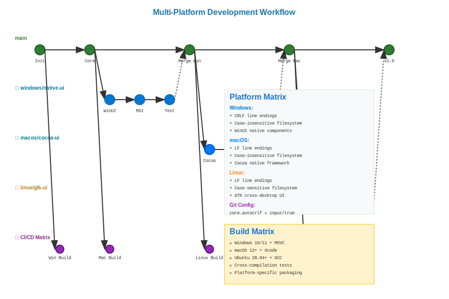

# Multi-Platform Development Workflow



## Scenario Overview

**Organization**: GlobalTech Solutions - Cross-platform software development  
**Project**: Desktop application for Windows, macOS, and Linux  
**Team Members**:
- **Alex Chen** (Windows Developer) - Native Windows development and testing
- **Maria Santos** (macOS Developer) - macOS-specific features and UI
- **David Kumar** (Linux Developer) - Linux compatibility and packaging
- **Jennifer Liu** (DevOps Engineer) - Cross-platform CI/CD and deployment

**Timeline**: 6-month development cycle with platform-specific releases

## The Challenge

The team needs to:
- Handle platform-specific code differences while maintaining shared codebase
- Manage different line ending conventions (CRLF vs LF)
- Deal with case-sensitive vs case-insensitive filesystems
- Coordinate development across different operating systems
- Ensure consistent behavior across platforms
- Handle platform-specific build processes and dependencies

## Mathematical Foundation

Multi-platform development creates **platform-specific branches** in the Git DAG:

```
Cross-Platform DAG Structure:
     main ← A ← B ← C ← D
      ↓     ↓   ↓   ↓   ↓
   windows  │   │   │   │
   feature  │   │   │   │
     ↓      │   │   │   │
   macos    │   │   │   │
   feature  │   │   │   │
     ↓      │   │   │   │
   linux    │   │   │   │
   feature  └───┴───┴───┘
```

**Key Mathematical Properties**:
- **Platform Convergence**: All platform branches eventually merge back to main
- **Diff Analysis**: Platform-specific changes isolated through branching
- **Hash Consistency**: Same content produces same hashes across platforms

## Step-by-Step Workflow

### Phase 1: Repository Setup and Configuration

```bash
# Alex sets up the repository on Windows
alex@windows:~$ git init cross-platform-app
alex@windows:~$ cd cross-platform-app

# Configure line endings for cross-platform compatibility
alex@windows:~/cross-platform-app$ git config core.autocrlf input
alex@windows:~/cross-platform-app$ echo "* text=auto" > .gitattributes
alex@windows:~/cross-platform-app$ echo "*.bat text eol=crlf" >> .gitattributes
alex@windows:~/cross-platform-app$ echo "*.sh text eol=lf" >> .gitattributes

# Initial project structure
alex@windows:~/cross-platform-app$ mkdir -p src/{common,windows,macos,linux}
alex@windows:~/cross-platform-app$ echo "// Cross-platform core" > src/common/core.cpp
alex@windows:~/cross-platform-app$ git add .
alex@windows:~/cross-platform-app$ git commit -m "Initial cross-platform project structure"
```

**Mathematical Insight**: Line ending normalization ensures that `SHA1(content)` remains consistent across platforms by standardizing internal representation.

### Phase 2: Platform-Specific Development

```bash
# Maria clones on macOS
maria@macos:~$ git clone https://github.com/company/cross-platform-app.git
maria@macos:~$ cd cross-platform-app

# Create platform-specific branch
maria@macos:~/cross-platform-app$ git checkout -b feature/macos-ui
maria@macos:~/cross-platform-app$ echo "// macOS native UI" > src/macos/ui.mm
maria@macos:~/cross-platform-app$ echo "target 'macOS' do" > Podfile
maria@macos:~/cross-platform-app$ git add .
maria@macos:~/cross-platform-app$ git commit -m "Add macOS-specific UI components"

# David works on Linux
david@linux:~$ git clone https://github.com/company/cross-platform-app.git
david@linux:~/cross-platform-app$ git checkout -b feature/linux-packaging
david@linux:~/cross-platform-app$ echo "#!/bin/bash" > scripts/build-linux.sh
david@linux:~/cross-platform-app$ echo "Package: cross-platform-app" > debian/control
david@linux:~/cross-platform-app$ git add .
david@linux:~/cross-platform-app$ git commit -m "Add Linux packaging and build scripts"
```

**DAG Analysis**: Platform branches diverge from main, allowing parallel development while maintaining history lineage.

### Phase 3: Cross-Platform Integration Testing

```bash
# Jennifer sets up CI/CD for all platforms
jennifer@devops:~/cross-platform-app$ git checkout main
jennifer@devops:~/cross-platform-app$ mkdir .github/workflows

# Multi-platform CI configuration
cat << 'EOF' > .github/workflows/cross-platform.yml
name: Cross-Platform Build
on: [push, pull_request]
jobs:
  build:
    strategy:
      matrix:
        os: [ubuntu-latest, windows-latest, macos-latest]
    runs-on: ${{ matrix.os }}
    steps:
      - uses: actions/checkout@v3
      - name: Platform-specific build
        run: |
          if [[ "$RUNNER_OS" == "Windows" ]]; then
            ./scripts/build-windows.bat
          elif [[ "$RUNNER_OS" == "macOS" ]]; then
            ./scripts/build-macos.sh
          else
            ./scripts/build-linux.sh
          fi
EOF

jennifer@devops:~/cross-platform-app$ git add .
jennifer@devops:~/cross-platform-app$ git commit -m "Add cross-platform CI/CD pipeline"
```

### Phase 4: Platform-Specific Merge Strategy

```bash
# Alex merges Windows-specific changes
alex@windows:~/cross-platform-app$ git checkout main
alex@windows:~/cross-platform-app$ git pull origin main
alex@windows:~/cross-platform-app$ git merge feature/windows-native
# Resolve any platform conflicts

# Maria merges macOS changes
maria@macos:~/cross-platform-app$ git checkout main
maria@macos:~/cross-platform-app$ git pull origin main
maria@macos:~/cross-platform-app$ git merge feature/macos-ui
# Handle case sensitivity conflicts if any

# David merges Linux changes
david@linux:~/cross-platform-app$ git checkout main
david@linux:~/cross-platform-app$ git pull origin main
david@linux:~/cross-platform-app$ git merge feature/linux-packaging
```

**Merge Mathematics**: Three-way merge algorithm handles platform-specific conflicts by identifying common ancestors and applying platform-specific changes.

### Phase 5: Platform Validation and Release

```bash
# Cross-platform validation
jennifer@devops:~/cross-platform-app$ git checkout main
jennifer@devops:~/cross-platform-app$ git tag -a v1.0-windows -m "Windows release v1.0"
jennifer@devops:~/cross-platform-app$ git tag -a v1.0-macos -m "macOS release v1.0"
jennifer@devops:~/cross-platform-app$ git tag -a v1.0-linux -m "Linux release v1.0"

# Platform-specific release branches
jennifer@devops:~/cross-platform-app$ git checkout -b release/windows-v1.0
jennifer@devops:~/cross-platform-app$ echo "Windows-specific release notes" > RELEASE-WINDOWS.md
jennifer@devops:~/cross-platform-app$ git add .
jennifer@devops:~/cross-platform-app$ git commit -m "Windows v1.0 release preparation"
```

## Mathematical Analysis

### Platform Normalization

**Line Ending Transformation**:
```
Windows (CRLF): \r\n → normalized → \n (internal)
Unix/Linux (LF): \n → normalized → \n (internal)
macOS (LF): \n → normalized → \n (internal)
```

**Hash Consistency**: `SHA1(normalized_content)` ensures identical content hashes across platforms.

### Filesystem Compatibility

**Case Sensitivity Matrix**:
```
Platform    | Case Sensitive | Git Handling
------------|----------------|-------------
Linux       | Yes           | Native
macOS       | No (default)  | core.ignorecase=true
Windows     | No            | core.ignorecase=true
```

**Path Normalization**: Git normalizes path separators internally: `src\windows\ui.cpp` ↔ `src/windows/ui.cpp`

### Merge Conflict Resolution

**Three-Way Platform Merge**:
```
Common Ancestor (O): shared_function() { /* common */ }
Platform A (Windows): shared_function() { #ifdef WIN32 ... }
Platform B (macOS):   shared_function() { #ifdef APPLE ... }

Merged Result: shared_function() { 
  #ifdef WIN32 
    // Windows code 
  #elif APPLE 
    // macOS code 
  #endif 
}
```

## Performance Characteristics

- **Branch Creation**: O(1) - platform branches are lightweight pointers
- **Cross-Platform Diff**: O(n) where n = changed files across platforms
- **Merge Resolution**: O(k) where k = number of conflicting hunks
- **CI Pipeline**: O(p) where p = number of platforms × build time

## Best Practices

1. **Consistent Line Endings**: Use `.gitattributes` for normalization
2. **Platform Isolation**: Keep platform-specific code in dedicated directories
3. **Automated Testing**: CI/CD across all target platforms
4. **Case Sensitivity**: Use consistent casing for all filenames
5. **Path Separators**: Let Git handle path normalization automatically

## Common Pitfalls and Solutions

### Line Ending Issues
```bash
# Problem: Mixed line endings causing false diffs
git config --global core.autocrlf input  # For Unix/Mac
git config --global core.autocrlf true   # For Windows
```

### Case Sensitivity Conflicts
```bash
# Problem: File.txt vs file.txt conflicts
git config core.ignorecase true  # For case-insensitive filesystems
```

### Platform-Specific Dependencies
```bash
# Solution: Use platform-specific .gitignore entries
echo "*.dll" >> .gitignore.windows
echo "*.so" >> .gitignore.linux  
echo "*.dylib" >> .gitignore.macos
```

## Integration with Development Tools

- **IDEs**: Platform-specific project files in separate directories
- **Build Systems**: CMake, Bazel for cross-platform builds  
- **Package Managers**: Platform-specific dependency management
- **Testing Frameworks**: Automated testing across all platforms

This workflow demonstrates how Git's mathematical foundation enables robust cross-platform development while maintaining code integrity and enabling efficient collaboration across different operating systems.