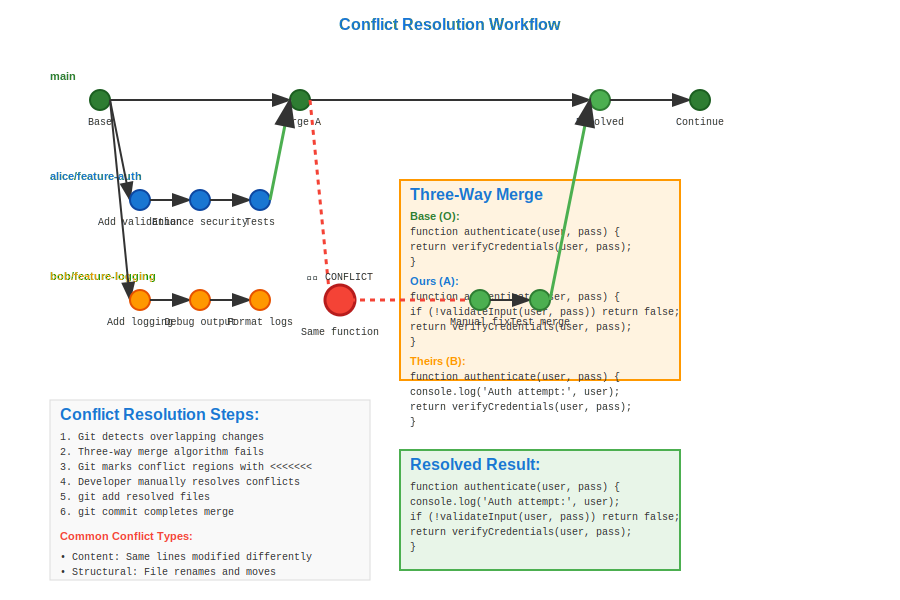

# Conflict Resolution Workflow



## Scenario Overview

**Organization**: CodeMerge Industries - Collaborative software development  
**Project**: E-commerce platform with high development velocity  
**Team Members**:
- **Emma Rodriguez** (Senior Developer) - Core platform features
- **Ryan Thompson** (Frontend Developer) - UI components and user experience
- **Lisa Chang** (Backend Developer) - API development and database design
- **Michael Foster** (Tech Lead) - Code review and conflict resolution

**Timeline**: Continuous development with multiple daily merges

## The Challenge

The team frequently encounters:
- **Merge conflicts** when multiple developers modify the same files
- **Semantic conflicts** that don't show up as textual conflicts
- **Complex three-way merges** involving multiple feature branches
- **Conflicting refactoring** changes across different modules
- **Database schema conflicts** in migration files
- **Configuration conflicts** in shared settings files

## Mathematical Foundation

Conflict resolution uses **three-way merge algorithms** based on DAG analysis:

```
Conflict Detection Model:
     O (common ancestor)
    / \
   A   B (conflicting changes)
    \ /
     M (merge result)

Where: A ∩ B ≠ ∅ (overlapping changes)
```

**Conflict Types**:
- **Content Conflict**: Same lines modified differently
- **Semantic Conflict**: Logically incompatible changes
- **Structural Conflict**: File/directory renames and moves
- **Type Conflict**: File vs directory conflicts

**Resolution Algorithm**: `merge(A, B, O) = R` where R resolves all conflicts

## Step-by-Step Workflow

### Phase 1: Setting Up Conflict Detection

```bash
# Michael configures the repository for better conflict handling
michael@lead:~/ecommerce$ git config merge.tool vimdiff
michael@lead:~/ecommerce$ git config merge.conflictstyle diff3

# Configure custom merge drivers for specific files
echo "*.sql merge=union" >> .gitattributes
echo "package-lock.json merge=union" >> .gitattributes
echo "*.generated merge=ours" >> .gitattributes

michael@lead:~/ecommerce$ git add .gitattributes
michael@lead:~/ecommerce$ git commit -m "Configure merge strategies for different file types"
```

**Mathematical Setup**: Merge attributes define custom resolution functions `f(A, B, O) → R` for different file types.

### Phase 2: Concurrent Development Leading to Conflicts

```bash
# Emma works on user authentication
emma@dev:~/ecommerce$ git checkout -b feature/auth-improvements
emma@dev:~/ecommerce$ cat > src/auth/login.js << 'EOF'
function authenticate(username, password) {
    // Enhanced security validation
    if (!validateInput(username, password)) {
        throw new Error('Invalid credentials format');
    }
    return verifyCredentials(username, password);
}
EOF

emma@dev:~/ecommerce$ git add src/auth/login.js
emma@dev:~/ecommerce$ git commit -m "Enhance authentication with input validation"

# Ryan works on the same file simultaneously
ryan@dev:~/ecommerce$ git checkout -b feature/login-ui
ryan@dev:~/ecommerce$ cat > src/auth/login.js << 'EOF'
function authenticate(username, password) {
    // Add logging for debugging
    console.log('Authentication attempt for user:', username);
    return verifyCredentials(username, password);
}
EOF

ryan@dev:~/ecommerce$ git add src/auth/login.js
ryan@dev:~/ecommerce$ git commit -m "Add authentication logging for debugging"
```

**Conflict Setup**: Both developers modified the same function, creating overlapping changes in the DAG.

### Phase 3: Conflict Detection and Analysis

```bash
# Emma merges first successfully
emma@dev:~/ecommerce$ git checkout main
emma@dev:~/ecommerce$ git merge feature/auth-improvements
# Fast-forward merge, no conflicts

# Ryan attempts to merge and encounters conflicts
ryan@dev:~/ecommerce$ git checkout main
ryan@dev:~/ecommerce$ git pull origin main
ryan@dev:~/ecommerce$ git merge feature/login-ui

# Git detects conflict:
Auto-merging src/auth/login.js
CONFLICT (content): Merge conflict in src/auth/login.js
Automatic merge failed; fix conflicts and then commit the result.
```

**Conflict Analysis**: Git's three-way merge algorithm identified overlapping modifications:
- **Base (O)**: Original `authenticate` function
- **Ours (A)**: Emma's validation changes
- **Theirs (B)**: Ryan's logging changes

### Phase 4: Manual Conflict Resolution

```bash
# Ryan examines the conflict
ryan@dev:~/ecommerce$ git status
# On branch main
# You have unmerged paths.
# Unmerged paths:
#   both modified:   src/auth/login.js

ryan@dev:~/ecommerce$ cat src/auth/login.js
function authenticate(username, password) {
<<<<<<< HEAD
    // Enhanced security validation
    if (!validateInput(username, password)) {
        throw new Error('Invalid credentials format');
    }
=======
    // Add logging for debugging
    console.log('Authentication attempt for user:', username);
>>>>>>> feature/login-ui
    return verifyCredentials(username, password);
}

# Ryan resolves by combining both changes
ryan@dev:~/ecommerce$ cat > src/auth/login.js << 'EOF'
function authenticate(username, password) {
    // Add logging for debugging
    console.log('Authentication attempt for user:', username);
    
    // Enhanced security validation
    if (!validateInput(username, password)) {
        throw new Error('Invalid credentials format');
    }
    
    return verifyCredentials(username, password);
}
EOF

ryan@dev:~/ecommerce$ git add src/auth/login.js
ryan@dev:~/ecommerce$ git commit -m "Merge: Combine authentication logging and validation

- Add debugging logs for authentication attempts
- Enhance input validation with format checking
- Resolve merge conflict by integrating both features"
```

**Resolution Mathematics**: Manual resolution creates `R = f(A, B, O)` where `f` is the human-defined merge function.

### Phase 5: Complex Multi-Way Conflicts

```bash
# Lisa creates database changes that conflict with both previous branches
lisa@dev:~/ecommerce$ git checkout -b feature/db-schema
lisa@dev:~/ecommerce$ cat > migrations/001_users.sql << 'EOF'
CREATE TABLE users (
    id SERIAL PRIMARY KEY,
    username VARCHAR(50) UNIQUE NOT NULL,
    email VARCHAR(255) UNIQUE NOT NULL,
    password_hash VARCHAR(255) NOT NULL,
    created_at TIMESTAMP DEFAULT NOW()
);
EOF

# Meanwhile, both Emma and Ryan have database-related changes
# This creates a complex merge scenario with multiple parents

# Michael handles the complex resolution
michael@lead:~/ecommerce$ git checkout main
michael@lead:~/ecommerce$ git pull origin main

# Merge all three branches sequentially
michael@lead:~/ecommerce$ git merge feature/auth-improvements
michael@lead:~/ecommerce$ git merge feature/login-ui
michael@lead:~/ecommerce$ git merge feature/db-schema
# Multiple conflicts require careful resolution
```

### Phase 6: Automated Conflict Prevention

```bash
# Set up pre-merge hooks to detect potential conflicts
cat > .git/hooks/pre-merge-commit << 'EOF'
#!/bin/bash
# Check for common conflict patterns
if git diff --cached --name-only | grep -q "package-lock.json"; then
    echo "Warning: package-lock.json changes detected"
    echo "Consider regenerating to avoid conflicts"
fi

# Run tests to catch semantic conflicts
npm test || {
    echo "Tests failed - potential semantic conflict"
    exit 1
}
EOF

chmod +x .git/hooks/pre-merge-commit

# Configure automatic conflict resolution for specific patterns
git config merge.npm.driver "npm install && git add package-lock.json"
```

## Mathematical Analysis

### Three-Way Merge Algorithm

**Input**: Three versions `(A, B, O)` where:
- `O` = common ancestor (base)
- `A` = "ours" (current branch)  
- `B` = "theirs" (merging branch)

**Process**:
1. **Diff Computation**: `Δ_A = diff(O, A)` and `Δ_B = diff(O, B)`
2. **Conflict Detection**: `Conflicts = {hunks | Δ_A ∩ Δ_B ≠ ∅}`
3. **Auto-Resolution**: Apply non-conflicting changes
4. **Manual Resolution**: Human intervention for conflicts

### Conflict Classification

**Textual Conflicts**:
```
Type 1: Overlapping edits
  O: line X
  A: line Y  
  B: line Z
  Resolution: Manual choice or combination

Type 2: Edit vs Delete
  O: line X
  A: modified line X'
  B: deleted line X
  Resolution: Keep modified or confirm delete
```

**Structural Conflicts**:
```
Type 3: Rename conflicts
  A: file.txt → new_name.txt
  B: file.txt → different_name.txt
  Resolution: Choose final name

Type 4: File/Directory conflicts
  A: creates file "config"
  B: creates directory "config/"
  Resolution: Rename one to avoid collision
```

### Performance Analysis

- **Conflict Detection**: O(n) where n = number of changed lines
- **Merge Base Computation**: O(log h) where h = repository height
- **Resolution Generation**: O(k) where k = number of conflicts
- **Post-merge Verification**: O(m) where m = number of files

## Advanced Conflict Resolution Strategies

### 1. Recursive Merge Strategy
```bash
# For complex histories with multiple merge bases
git merge -s recursive -X theirs feature-branch
git merge -s recursive -X ours feature-branch
git merge -s recursive -X patience feature-branch
```

### 2. Semantic Conflict Detection
```bash
# Use custom merge drivers for semantic validation
git config merge.semantic.driver "./scripts/semantic-merge %O %A %B %L"
echo "*.js merge=semantic" >> .gitattributes
```

### 3. Interactive Resolution
```bash
# Step-by-step conflict resolution
git mergetool --tool=vimdiff
git mergetool --tool=kdiff3
git mergetool --tool=code  # VS Code
```

## Best Practices for Conflict Prevention

1. **Frequent Integration**: Merge main into feature branches regularly
2. **Small Commits**: Smaller changes reduce conflict likelihood  
3. **Code Organization**: Minimize shared file modifications
4. **Communication**: Coordinate changes to high-conflict areas
5. **Automated Testing**: Catch semantic conflicts early

## Common Conflict Patterns and Solutions

### Configuration File Conflicts
```bash
# Use merge=union for append-only configs
echo "config/*.ini merge=union" >> .gitattributes
```

### Generated File Conflicts
```bash
# Ignore generated files, regenerate after merge
echo "dist/ merge=ours" >> .gitattributes
echo "*.generated merge=ours" >> .gitattributes
```

### Database Migration Conflicts
```bash
# Use timestamp-based naming to avoid conflicts
# migration_20231201_120000_add_users.sql
# migration_20231201_120001_add_orders.sql
```

## Integration with Development Workflow

- **CI/CD**: Automated merge conflict detection in pipelines
- **Code Review**: Pre-merge conflict analysis in pull requests
- **IDE Integration**: Real-time conflict highlighting and resolution
- **Team Communication**: Conflict notification systems

This workflow demonstrates how Git's three-way merge algorithm provides a mathematical foundation for systematic conflict resolution, enabling teams to handle complex collaborative development scenarios while maintaining code quality and project velocity.