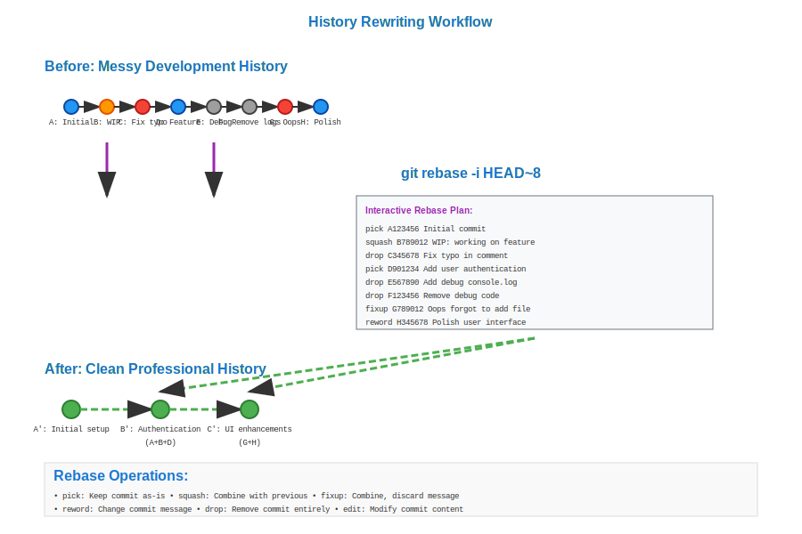

# History Rewriting Workflow



## Scenario Overview

**Organization**: CleanCode Dynamics - Software consulting and development  
**Project**: Client deliverable with clean, professional Git history  
**Team Members**:
- **Jordan Kim** (Senior Developer) - Feature implementation and history cleanup
- **Alex Rivera** (Code Reviewer) - Quality assurance and history validation
- **Sam Chen** (Project Lead) - Release preparation and client delivery
- **Taylor Johnson** (Junior Developer) - Learning proper Git practices

**Timeline**: 4-week development sprint with clean history delivery

## The Challenge

The team needs to:
- **Clean up messy commit history** before client delivery
- **Combine related commits** into logical units
- **Remove sensitive information** accidentally committed
- **Fix commit messages** that don't follow conventions
- **Reorder commits** into logical sequence
- **Remove debugging commits** and temporary changes
- **Create linear history** from complex branching

## Mathematical Foundation

History rewriting transforms the DAG structure through **topological reordering**:

```
Original Messy History:
A → B → C → D → E → F → G
    ↑   ↑       ↑   ↑   ↑
   WIP  fix    debug temp oops

Target Clean History:
A → B' → C' → D'
    ↑    ↑    ↑
feature1 feature2 bugfix

Where: B' = f(B,C), C' = g(D,E), D' = h(F,G)
```

**Rewriting Operations**:
- **Squash**: `squash(A, B) = C` where `C.changes = A.changes ∪ B.changes`
- **Reorder**: `reorder([A,B,C]) = [B,A,C]` preserving dependencies
- **Edit**: `edit(A) = A'` with modified message/content
- **Drop**: `drop(A) = ∅` removing commit entirely

**Mathematical Constraints**: Rewriting must preserve **DAG validity** and **dependency relationships**.

## Step-by-Step Workflow

### Phase 1: Analyzing Current History

```bash
# Jordan examines the messy development history
jordan@dev:~/client-project$ git log --oneline -10
a1b2c3d Fix typo in README
b2c3d4e WIP: still working on auth
c3d4e5f Add authentication module  
d4e5f6g Debug console.log statements
e5f6g7h Remove debug code
f6g7h8i Add user validation
g7h8i9j Oops, forgot to add file
h8i9j0k Add missing user.js file
i9j0k1l Fix linting errors
j0k1l2m Initial user management feature

# Visualize the branch structure
jordan@dev:~/client-project$ git log --graph --oneline --all
* a1b2c3d Fix typo in README
* b2c3d4e WIP: still working on auth
* c3d4e5f Add authentication module
* d4e5f6g Debug console.log statements  
* e5f6g7h Remove debug code
* f6g7h8i Add user validation
* g7h8i9j Oops, forgot to add file
* h8i9j0k Add missing user.js file
* i9j0k1l Fix linting errors
* j0k1l2m Initial user management feature
```

**History Analysis**: The commit graph shows typical development artifacts that need cleanup before client delivery.

### Phase 2: Interactive Rebase Setup

```bash
# Jordan starts interactive rebase from the base commit
jordan@dev:~/client-project$ git rebase -i HEAD~10

# Git opens editor with rebase plan:
pick j0k1l2m Initial user management feature
pick i9j0k1l Fix linting errors  
squash h8i9j0k Add missing user.js file
squash g7h8i9j Oops, forgot to add file
pick f6g7h8i Add user validation
drop d4e5f6g Debug console.log statements
drop e5f6g7h Remove debug code  
pick c3d4e5f Add authentication module
squash b2c3d4e WIP: still working on auth
reword a1b2c3d Fix typo in README
```

**Rebase Mathematics**: Each operation transforms the DAG: `T(DAG) = rebase_operations(original_DAG)`

### Phase 3: Squashing Related Commits

```bash
# Interactive rebase processes each operation:

# 1. Squashing file addition commits
# Git combines h8i9j0k and g7h8i9j into i9j0k1l:
# Result: Single commit with all file changes

# 2. Combining WIP commits  
# Git presents commit message editor:
# Initial user management feature
# 
# - Add core user management functionality
# - Include proper error handling
# - Add input validation and sanitization
# - Fix linting issues and code formatting

# 3. Squashing authentication development
# Combines c3d4e5f and b2c3d4e:
# Add authentication module
#
# - Implement JWT-based authentication
# - Add login/logout functionality  
# - Include session management
# - Add password hashing utilities
```

**Squash Algorithm**: `squash(A, B) = commit(A.tree ⊕ B.tree, combine(A.msg, B.msg))`

### Phase 4: Reordering for Logical Flow

```bash
# Sometimes commits need reordering for logical sequence
jordan@dev:~/client-project$ git rebase -i HEAD~5

# Reorder commits to follow logical development flow:
pick j0k1l2m Initial user management feature
pick f6g7h8i Add user validation  
pick c3d4e5f Add authentication module
pick x1y2z3a Add user authorization
pick a1b2c3d Update documentation

# Git automatically handles dependency conflicts
# If reordering creates conflicts, Git pauses for resolution
```

**Topological Constraints**: Reordering must respect file dependencies: if commit B modifies files created in commit A, then A must precede B.

### Phase 5: Removing Sensitive Information

```bash
# Accidentally committed sensitive data needs removal
jordan@dev:~/client-project$ git log --oneline | grep -i "password\|key\|secret"
b3c4d5e Add API keys for third-party service

# Use filter-branch to remove sensitive commits entirely
jordan@dev:~/client-project$ git filter-branch --force --index-filter \
    'git rm --cached --ignore-unmatch config/secrets.json' \
    --prune-empty --tag-name-filter cat -- --all

# Alternative: BFG Repo-Cleaner for large repositories
jordan@dev:~/client-project$ java -jar bfg.jar --delete-files secrets.json .git
jordan@dev:~/client-project$ git reflog expire --expire=now --all
jordan@dev:~/client-project$ git gc --prune=now --aggressive
```

**Security Mathematics**: Filter operations create `DAG' = filter(DAG, predicate)` where predicate removes sensitive content.

### Phase 6: Fixup and Autosquash

```bash
# For ongoing development with planned fixups
jordan@dev:~/client-project$ git commit -m "Add user profile feature"
# Later, find a bug in the profile feature
jordan@dev:~/client-project$ git add profile_fix.js
jordan@dev:~/client-project$ git commit --fixup HEAD~1

# When ready to clean up:
jordan@dev:~/client-project$ git rebase -i --autosquash HEAD~5
# Git automatically arranges fixup commits with their targets

# Using commit subject prefixes:
jordan@dev:~/client-project$ git commit -m "fixup! Add user profile feature"
jordan@dev:~/client-project$ git commit -m "squash! Add authentication module"
```

**Autosquash Algorithm**: Git parses commit messages to identify fixup targets and automatically arranges the rebase plan.

### Phase 7: Advanced History Surgery

```bash
# Splitting a large commit into smaller logical pieces  
jordan@dev:~/client-project$ git rebase -i HEAD~3
# Mark commit as 'edit' instead of 'pick'

# When rebase pauses at the target commit:
jordan@dev:~/client-project$ git reset HEAD~1  # Undo the commit, keep changes staged
jordan@dev:~/client-project$ git add user_model.js
jordan@dev:~/client-project$ git commit -m "Add user data model"
jordan@dev:~/client-project$ git add user_controller.js  
jordan@dev:~/client-project$ git commit -m "Add user API controller"
jordan@dev:~/client-project$ git add user_views.js
jordan@dev:~/client-project$ git commit -m "Add user interface views"
jordan@dev:~/client-project$ git rebase --continue

# Editing commit content mid-rebase
jordan@dev:~/client-project$ git rebase -i HEAD~5
# Mark commit as 'edit', then when paused:
jordan@dev:~/client-project$ git add forgotten_file.js
jordan@dev:~/client-project$ git commit --amend --no-edit
jordan@dev:~/client-project$ git rebase --continue
```

### Phase 8: Validation and Safety Checks

```bash
# Alex validates the rewritten history
alex@reviewer:~/client-project$ git pull --force-with-lease origin feature-clean

# Compare functionality before and after rewriting
alex@reviewer:~/client-project$ git checkout original-branch
alex@reviewer:~/client-project$ npm test > original-test-results.txt
alex@reviewer:~/client-project$ git checkout rewritten-branch  
alex@reviewer:~/client-project$ npm test > rewritten-test-results.txt
alex@reviewer:~/client-project$ diff original-test-results.txt rewritten-test-results.txt

# Verify no functional changes
alex@reviewer:~/client-project$ git diff original-branch..rewritten-branch
# Should show only commit structure changes, not content changes

# Check that all important changes are preserved
alex@reviewer:~/client-project$ git log --stat original-branch > original-changes.txt
alex@reviewer:~/client-project$ git log --stat rewritten-branch > rewritten-changes.txt
```

## Mathematical Analysis

### DAG Transformation Properties

**Rebase Operation**: `rebase: DAG → DAG'` where:
- Node count may change: `|nodes(DAG')| ≤ |nodes(DAG)|`
- Content preserved: `∪content(DAG') = ∪content(DAG)`  
- Topology modified: `structure(DAG') ≠ structure(DAG)`

**Invariant Preservation**:
- **Functional Equivalence**: `functionality(DAG) = functionality(DAG')`
- **Content Integrity**: No information loss (except intentional drops)
- **Dependency Ordering**: Modified topology still respects dependencies

### Rebase Conflict Resolution

**Three-Way Merge During Rebase**:
```
When reordering commits A and B:
Original: ... → O → A → B → ...
Reordered: ... → O → B' → A' → ...

If A and B touch same files:
- Compute: merge_base = O
- Apply: B changes to O → intermediate  
- Apply: A changes to intermediate → final
- Handle conflicts if A ∩ B ≠ ∅
```

### Performance Characteristics

- **Interactive Rebase**: O(n) where n = number of commits
- **Filter-branch**: O(n × m) where n = commits, m = average files per commit
- **Conflict Resolution**: O(k) where k = number of conflicting hunks
- **History Verification**: O(n) for comparing commit sequences

## Advanced Techniques

### 1. Cherry-pick Based Reconstruction
```bash
# Rebuild history by cherry-picking in desired order
git checkout --orphan clean-history
git cherry-pick commit1
git cherry-pick commit2  
git cherry-pick commit3
```

### 2. Subtree History Extraction
```bash
# Extract history for specific directory
git subtree push --prefix=subdir origin subdir-branch
git filter-branch --subdirectory-filter subdir HEAD
```

### 3. Commit Message Templates
```bash
# Standardize commit messages during rebase
git config commit.template ~/.gitmessage
# Template enforces: type(scope): description
```

## Best Practices for History Rewriting

1. **Never Rewrite Public History**: Only rewrite commits not yet pushed to shared repositories
2. **Backup Before Rewriting**: Create backup branches before major history changes
3. **Test Thoroughly**: Verify functionality unchanged after rewriting  
4. **Communicate Changes**: Inform team members about history rewrites
5. **Use --force-with-lease**: Safer than --force when pushing rewritten history

## Common Pitfalls and Solutions

### 1. Rewriting Shared History
```bash
# Problem: Rewriting commits already pushed and pulled by others
# Solution: Coordinate with team, use git pull --rebase for collaborators
```

### 2. Losing Important Commits  
```bash
# Problem: Accidentally dropping commits during rebase
# Solution: Use git reflog to recover lost commits
git reflog show HEAD
git cherry-pick <lost-commit-hash>
```

### 3. Breaking Dependencies
```bash
# Problem: Reordering commits breaks file dependencies
# Solution: Let Git handle conflicts, or manually resolve dependencies
```

## Integration with Development Workflow

- **Pre-merge Cleanup**: Clean feature branch history before merging to main
- **Release Preparation**: Create clean history for client deliverables  
- **Code Review**: Reviewers can focus on logical changes rather than development noise
- **Documentation**: Clean history serves as project documentation

## Tools and Extensions

- **Git Interactive Rebase**: Built-in Git functionality
- **Git Absorb**: Automatic fixup commit creation
- **BFG Repo-Cleaner**: Fast alternative to filter-branch
- **Git Filter-Repo**: Modern replacement for filter-branch
- **IDE Integration**: Visual rebase tools in IDEs

This workflow demonstrates how Git's DAG structure enables sophisticated history manipulation while preserving code integrity, allowing teams to present clean, professional project histories that accurately reflect logical development progression rather than the messy reality of day-to-day coding.