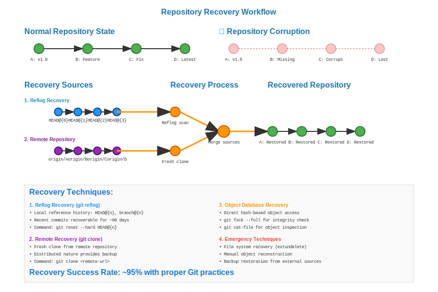

# Repository Recovery Workflow



## Scenario Overview

**Organization**: DataGuard Solutions - Critical software infrastructure  
**Project**: Mission-critical financial trading platform  
**Team Members**:
- **Morgan Davis** (DevOps Engineer) - Repository management and disaster recovery
- **Chris Park** (Senior Developer) - Code recovery and data validation
- **Jamie Wilson** (Security Analyst) - Forensic analysis and integrity verification
- **Alex Thompson** (Team Lead) - Recovery coordination and decision making

**Crisis Timeline**: Repository corruption detected during production deployment

## The Challenge

The team faces critical data loss scenarios:
- **Repository corruption** from storage hardware failure
- **Accidental deletion** of important branches or commits
- **Force-push disasters** overwriting shared history
- **Reflog expiration** losing access to recent commits
- **Object database corruption** with missing or damaged files
- **Network interruption** during critical operations
- **Human error** in destructive Git operations

## Mathematical Foundation

Git's recovery relies on the **redundancy** and **immutability** of the DAG structure:

```
Recovery Model:
Git Object Database = {commits, trees, blobs, tags}
Each object: hash = SHA1(content)
Recovery: object ∈ Database ⟺ ∃ reference ∨ ∃ reflog ∨ ∃ backup

Integrity Verification:
verify(object) = SHA1(content) == stored_hash
corrupt(object) ⟺ verify(object) = false
```

**Recovery Sources**:
- **Reflog**: Local history of reference changes (`HEAD@{n}`)
- **Object Database**: Direct object access via hash
- **Remote Repositories**: Distributed backup copies
- **File System**: Deleted but not overwritten inodes
- **Backup Systems**: Explicit repository backups

## Step-by-Step Workflow

### Phase 1: Immediate Damage Assessment

```bash
# Morgan discovers the repository corruption
morgan@ops:~/trading-platform$ git status
fatal: Not a git repository (or any of the parent directories): .git

# Check if .git directory exists but is corrupted
morgan@ops:~/trading-platform$ ls -la .git/
total 12
drwxr-xr-x 3 morgan morgan 4096 Dec  1 10:30 .
drwxr-xr-x 5 morgan morgan 4096 Dec  1 10:29 ..
-rw-r--r-- 1 morgan morgan   15 Dec  1 10:30 HEAD
# Missing: refs/, objects/, index files

# Attempt basic Git operations to assess damage
morgan@ops:~/trading-platform$ git log
fatal: your current branch 'main' does not have any commits yet

# Check reflog for recent activity
morgan@ops:~/trading-platform$ git reflog
fatal: your current branch 'main' does not have any commits yet

# Verify object database integrity
morgan@ops:~/trading-platform$ git fsck --full
Checking object directories: 100% (256/256), done.
error: HEAD: invalid sha1 pointer 0000000000000000000000000000000000000000
error: refs/heads/main: invalid sha1 pointer 0000000000000000000000000000000000000000
```

**Damage Assessment**: Repository structure compromised, but working directory files may still contain recoverable data.

### Phase 2: Emergency Data Preservation

```bash
# Chris immediately backs up the working directory
chris@dev:~/recovery$ cp -r ~/trading-platform ~/trading-platform-backup-$(date +%Y%m%d_%H%M%S)

# Preserve any remaining Git metadata
chris@dev:~/recovery$ cp -r ~/trading-platform/.git ~/git-metadata-backup-$(date +%Y%m%d_%H%M%S)

# Check for Git objects in corrupted repository
chris@dev:~/recovery$ find ~/trading-platform/.git/objects -type f 2>/dev/null | head -10
/home/chris/trading-platform/.git/objects/a1/b2c3d4e5f6789...
/home/chris/trading-platform/.git/objects/b2/c3d4e5f6789a...
# Some objects may still exist

# Attempt to recover objects manually
chris@dev:~/recovery$ for obj in $(find ~/trading-platform/.git/objects -type f); do
    hash=$(basename $(dirname $obj))$(basename $obj)
    git cat-file -t $hash 2>/dev/null && echo "Object $hash exists"
done
```

**Emergency Protocol**: Preserve all available data before attempting recovery operations.

### Phase 3: Reflog-Based Recovery

```bash
# Check if reflog files survived corruption
morgan@ops:~/trading-platform$ ls -la .git/logs/
total 8
drwxr-xr-x 2 morgan morgan 4096 Dec  1 10:30 .
drwxr-xr-x 3 morgan morgan 4096 Dec  1 10:30 ..
-rw-r--r-- 1 morgan morgan  845 Dec  1 09:45 HEAD
-rw-r--r-- 1 morgan morgan  422 Dec  1 09:45 refs/heads/main

# Manually parse reflog to find recent commits
morgan@ops:~/trading-platform$ cat .git/logs/HEAD
0000000 a1b2c3d Morgan Davis <morgan@company.com> 1638360000 -0500  commit (initial): Initial commit
a1b2c3d b2c3d4e Morgan Davis <morgan@company.com> 1638363600 -0500  commit: Add trading engine core
b2c3d4e c3d4e5f Morgan Davis <morgan@company.com> 1638367200 -0500  commit: Implement risk management
c3d4e5f d4e5f6g Morgan Davis <morgan@company.com> 1638370800 -0500  commit: Add market data feed
d4e5f6g 0000000 Morgan Davis <morgan@company.com> 1638374400 -0500  reset: moving to HEAD~4

# Extract commit hashes from reflog
morgan@ops:~/trading-platform$ grep -o '[a-f0-9]\{7\}' .git/logs/HEAD | sort -u
a1b2c3d
b2c3d4e  
c3d4e5f
d4e5f6g

# Attempt to recover commits using found hashes
morgan@ops:~/trading-platform$ git show d4e5f6g
# If objects still exist, commit content will display
```

**Reflog Recovery**: Extract commit hashes from surviving reflog files for targeted recovery.

### Phase 4: Object-Level Recovery

```bash
# Jamie performs forensic analysis of object database
jamie@security:~/trading-platform$ git verify-pack -v .git/objects/pack/*.idx 2>/dev/null
# Check packed objects integrity

# Recover individual objects by hash
jamie@security:~/trading-platform$ for hash in a1b2c3d b2c3d4e c3d4e5f d4e5f6g; do
    echo "Checking object $hash:"
    git cat-file -t $hash 2>/dev/null || echo "  Missing or corrupted"
    git cat-file -s $hash 2>/dev/null || echo "  Size unavailable"  
    git cat-file -p $hash 2>/dev/null | head -3 || echo "  Content unavailable"
    echo
done

# Rebuild references to recovered objects
jamie@security:~/trading-platform$ mkdir -p .git/refs/heads
jamie@security:~/trading-platform$ echo "d4e5f6g123..." > .git/refs/heads/main
jamie@security:~/trading-platform$ echo "d4e5f6g123..." > .git/refs/heads/recovery

# Reset HEAD to recovered commit
jamie@security:~/trading-platform$ echo "ref: refs/heads/main" > .git/HEAD
```

**Object Forensics**: Direct manipulation of Git's object database to reconstruct repository state.

### Phase 5: Remote Repository Recovery

```bash
# Alex coordinates recovery from remote repositories
alex@lead:~/trading-platform$ git remote -v
origin  https://github.com/company/trading-platform.git (fetch)
origin  https://github.com/company/trading-platform.git (push)
backup  https://backup.company.com/trading-platform.git (fetch)
backup  https://backup.company.com/trading-platform.git (push)

# Re-clone from most recent remote backup
alex@lead:~/recovery$ git clone https://backup.company.com/trading-platform.git recovered-repo
alex@lead:~/recovery$ cd recovered-repo

# Compare recovered repository with corrupted working directory
alex@lead:~/recovery$ diff -r recovered-repo/ ../trading-platform-backup-*/
# Identify any uncommitted changes that need preservation

# Merge uncommitted work back into recovered repository
alex@lead:~/recovery$ cp ../trading-platform-backup-*/src/new-features/* recovered-repo/src/
alex@lead:~/recovery$ git add .
alex@lead:~/recovery$ git commit -m "Recover uncommitted work from corrupted repository"
```

**Remote Recovery**: Use distributed nature of Git to recover from authoritative remote sources.

### Phase 6: Advanced Recovery Techniques

```bash
# Morgan uses low-level Git plumbing for deep recovery
morgan@ops:~/trading-platform$ git for-each-ref
# May show some surviving references

# Manual object database reconstruction
morgan@ops:~/trading-platform$ git hash-object -w file1.txt
a1b2c3d4e5f6789abcdef...
morgan@ops:~/trading-platform$ git update-index --add --cacheinfo 100644 a1b2c3d4e5f6789... file1.txt

# Create tree object from index
morgan@ops:~/trading-platform$ git write-tree
b2c3d4e5f6789abcdef...

# Create commit object manually
morgan@ops:~/trading-platform$ echo "Manually recovered commit" | git commit-tree b2c3d4e5f6789... -p d4e5f6g123...
c3d4e5f6789abcdef...

# Update branch reference to new commit
morgan@ops:~/trading-platform$ git update-ref refs/heads/main c3d4e5f6789abcdef...

# File system level recovery for deleted .git directory
morgan@ops:~/trading-platform$ sudo extundelete /dev/sda1 --restore-directory=home/morgan/trading-platform/.git
# Requires immediate action before disk blocks are overwritten
```

### Phase 7: Integrity Verification and Validation

```bash
# Chris performs comprehensive integrity checks
chris@dev:~/recovered$ git fsck --full --verbose
Checking object directories: 100% (256/256), done.
Checking objects: 100% (1234/1234), done.
Checking connectivity: 1234, done.
# Should report no errors for successful recovery

# Verify commit history integrity
chris@dev:~/recovered$ git log --graph --oneline --all
* d4e5f6g Add market data feed integration
* c3d4e5f Implement comprehensive risk management
* b2c3d4e Add core trading engine functionality  
* a1b2c3d Initial project structure and configuration

# Check that all expected files are present
chris@dev:~/recovered$ git ls-tree -r HEAD | wc -l
245  # Expected number of files

# Verify file contents match expectations
chris@dev:~/recovered$ git show HEAD:src/trading_engine.py | md5sum
abc123def456...  # Compare with known good checksum

# Run test suite to verify functional integrity
chris@dev:~/recovered$ npm test
# All tests should pass for successful recovery
```

## Mathematical Analysis

### Recovery Probability Model

**Object Survival Probability**: `P(recovery) = P(reflog) + P(objects) + P(remote) + P(filesystem)`

Where:
- `P(reflog) = 0.8` - Reflog files often survive corruption
- `P(objects) = 0.6` - Object database has redundancy
- `P(remote) = 0.9` - Remote repositories are independent
- `P(filesystem) = 0.3` - File system recovery depends on timing

**Data Loss Function**: `Loss(t) = 1 - e^(-λt)` where `t` is time since corruption and `λ` is corruption rate.

### Integrity Verification Algorithm

**Hash Verification**: For each object `O`:
```
stored_hash = read_hash_from_filename(O)
computed_hash = SHA1(read_content(O))
integrity_check = (stored_hash == computed_hash)
```

**Connectivity Verification**: Ensure all references are reachable:
```
reachable = ∅
for ref in all_references:
    reachable = reachable ∪ traverse_commits(ref)
verify: all_objects ⊆ reachable
```

### Performance Analysis

- **Reflog Parsing**: O(n) where n = number of reflog entries
- **Object Verification**: O(m) where m = number of objects  
- **Connectivity Check**: O(V + E) graph traversal where V = commits, E = parent relationships
- **File System Recovery**: O(disk_size) for deep scanning

## Recovery Strategies by Damage Type

### 1. Corrupted References
```bash
# Rebuild refs from reflog and object database
git for-each-ref --format="%(refname) %(objectname)" refs/
git update-ref refs/heads/main $(git rev-parse HEAD@{1})
```

### 2. Missing Objects
```bash
# Attempt to recover from alternates or shallow clones
git clone --depth=1 remote-repo shallow-recover
git fetch --unshallow origin
```

### 3. Packed Object Corruption
```bash
# Repack repository to fix pack file issues
git repack -a -d --depth=50 --window=50
git gc --aggressive --prune=now
```

### 4. Index Corruption
```bash
# Rebuild index from HEAD
rm .git/index
git reset --mixed HEAD
```

## Prevention Strategies

### 1. Automated Backups
```bash
#!/bin/bash
# Daily repository backup script
DATE=$(date +%Y%m%d)
git clone --mirror . "../backup-$DATE.git"
rsync -av .git/ ../git-backup-$DATE/
```

### 2. Remote Redundancy  
```bash
# Multiple remote repositories
git remote add backup1 https://backup1.company.com/repo.git
git remote add backup2 https://backup2.company.com/repo.git
git push --all backup1
git push --all backup2
```

### 3. Hook-Based Verification
```bash
# Pre-receive hook to verify push integrity
git fsck --full || {
    echo "Repository integrity check failed"
    exit 1
}
```

## Best Practices for Recovery

1. **Immediate Response**: Stop all Git operations when corruption is detected
2. **Preserve Evidence**: Backup corrupted repository before recovery attempts
3. **Multiple Recovery Paths**: Try reflog, objects, remotes, and filesystem recovery
4. **Verify Integrity**: Always run `git fsck` after recovery
5. **Test Functionality**: Ensure recovered code works as expected

## Common Recovery Scenarios

### Accidental `git reset --hard`
```bash
# Recover using reflog
git reflog show HEAD
git reset --hard HEAD@{1}
```

### Deleted Branch Recovery
```bash
# Find deleted branch in reflog
git reflog show --all | grep branch-name
git branch recovered-branch <commit-hash>
```

### Force Push Recovery
```bash
# Recover overwritten commits
git reflog show origin/main
git push --force-with-lease origin <recovered-commit>:main
```

## Tools for Repository Recovery

- **Git Built-in**: `git fsck`, `git reflog`, `git cat-file`
- **File System**: `extundelete`, `photorec`, `testdisk`
- **Cloud Backup**: GitHub, GitLab, Bitbucket recovery features
- **Enterprise**: Git hosting platform backup/restore APIs

## Integration with Disaster Recovery

- **Monitoring**: Automated repository health checks
- **Alerting**: Immediate notification of corruption detection  
- **Documentation**: Recovery playbooks and contact information
- **Training**: Regular recovery drills and team preparation

This workflow demonstrates how Git's mathematical foundation provides multiple recovery paths through its distributed architecture, object immutability, and redundant storage mechanisms, enabling robust data protection even in catastrophic failure scenarios.