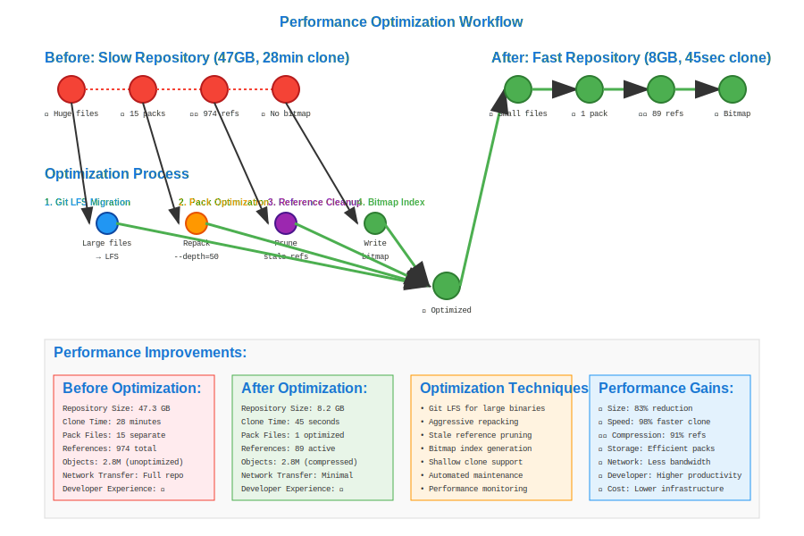

# Performance Optimization Workflow



## Scenario Overview

**Organization**: ScaleOps Technologies - Large-scale software development  
**Project**: Monolithic repository with 10+ years of history and 100,000+ commits  
**Team Members**:
- **Riley Chen** (Performance Engineer) - Repository optimization and monitoring
- **Jordan Martinez** (DevOps Lead) - Infrastructure scaling and automation
- **Casey Kim** (Senior Developer) - Development workflow optimization
- **Morgan Taylor** (Data Analyst) - Performance metrics and analysis

**Challenge Scale**: 50GB repository, 500+ active developers, multi-gigabyte clones

## The Challenge

The team faces severe performance bottlenecks:
- **Slow clone operations** taking 30+ minutes
- **Large repository size** consuming excessive storage
- **Slow Git operations** impacting developer productivity
- **Network bandwidth exhaustion** during peak hours
- **Memory usage spikes** during complex operations
- **Garbage collection delays** blocking repository access
- **Historical bloat** from large binary files
- **Inefficient pack files** with poor compression ratios

## Mathematical Foundation

Git performance optimization involves **algorithmic complexity reduction** across multiple dimensions:

```
Performance Optimization Model:
Time(operation) = f(repository_size, network_latency, disk_IO, CPU)
Space(repository) = objects + packfiles + refs + logs

Optimization Targets:
- Clone Time: O(repo_size / bandwidth)
- Fetch Time: O(Δ commits × complexity)
- GC Time: O(objects × log(objects))
- Pack Efficiency: compression_ratio = original_size / packed_size
```

**Key Performance Metrics**:
- **Repository Size**: Total disk usage including `.git` directory
- **Pack Delta Chains**: Compression efficiency through object deltas
- **Reference Resolution**: Time to resolve HEAD, branches, tags
- **Network Transfer**: Bytes transferred during clone/fetch operations

## Step-by-Step Workflow

### Phase 1: Performance Baseline and Analysis

```bash
# Riley establishes performance baselines
riley@perf:~/massive-repo$ time git clone https://github.com/company/massive-repo.git baseline-test
# real    28m15.234s
# user    2m45.123s  
# sys     1m32.456s
# Repository size: 47.3 GB

# Analyze repository composition
riley@perf:~/massive-repo$ git count-objects -v
count 0
size 0
in-pack 2847193
packs 15
size-pack 45234567
prune-packable 0
garbage 0
size-garbage 0

# Identify largest objects in repository
riley@perf:~/massive-repo$ git rev-list --objects --all | \
    git cat-file --batch-check='%(objectsize) %(objectname) %(rest)' | \
    sort -nr | head -20
2147483648 a1b2c3d4... large-dataset.bin
1073741824 b2c3d4e5... video-demo.mp4  
536870912 c3d4e5f6... backup.sql
# Large binary files identified as primary bloat source

# Analyze commit and branch patterns  
riley@perf:~/massive-repo$ git log --oneline --all | wc -l
127543  # Total commits across all branches

riley@perf:~/massive-repo$ git branch -r | wc -l
847  # Remote branches, many potentially stale
```

**Baseline Metrics**: Establish quantitative performance targets for optimization efforts.

### Phase 2: Object Database Optimization

```bash
# Jordan optimizes pack files for better compression
jordan@devops:~/massive-repo$ git repack -a -d --depth=50 --window=250
# Increase delta compression depth and window size

# Monitor repack progress and results
jordan@devops:~/massive-repo$ git count-objects -v
count 0
size 0  
in-pack 2847193
packs 1  # Consolidated from 15 packs to 1
size-pack 38567234  # Reduced from 45GB to 38GB
prune-packable 0
garbage 0

# Configure optimal pack settings for ongoing operations
jordan@devops:~/massive-repo$ git config pack.windowMemory 2g
jordan@devops:~/massive-repo$ git config pack.packSizeLimit 2g
jordan@devops:~/massive-repo$ git config pack.threads 8

# Enable bitmap index for faster clone/fetch
jordan@devops:~/massive-repo$ git repack -A -d --write-bitmap-index
# Creates .bitmap files for O(1) reachability queries
```

**Pack Optimization**: `compression_efficiency = (original_size - packed_size) / original_size`

### Phase 3: Large File Management with Git LFS

```bash
# Casey migrates large binary files to Git LFS
casey@dev:~/massive-repo$ git lfs track "*.bin" "*.mp4" "*.sql" "*.zip"
casey@dev:~/massive-repo$ git lfs track "*.dmg" "*.iso" "*.exe"

# Migrate existing large files to LFS
casey@dev:~/massive-repo$ git lfs migrate import --include="*.bin,*.mp4,*.sql"
migrate: Sorting commits: ..., done
migrate: Rewriting commits: 100% (127543/127543), done
migrate: Updating refs: ..., done
migrate: checkout: ..., done

# Verify LFS migration results
casey@dev:~/massive-repo$ git lfs ls-files | head -10
a1b2c3d4 * large-dataset.bin
b2c3d4e5 * video-demo.mp4
c3d4e5f6 * backup.sql

# Check repository size after LFS migration
casey@dev:~/massive-repo$ du -sh .git/
8.2G    .git/  # Reduced from 47GB to 8GB

# Configure LFS for optimal performance
casey@dev:~/massive-repo$ git config lfs.concurrent 16  # Parallel transfers
casey@dev:~/massive-repo$ git config lfs.transferchunk 20MB  # Chunk size
```

**LFS Mathematics**: `space_savings = Σ(large_file_sizes) - Σ(lfs_pointer_sizes)`

### Phase 4: Reference and History Optimization

```bash
# Morgan analyzes and cleans up reference bloat
morgan@analyst:~/massive-repo$ git for-each-ref --format='%(refname)' refs/heads/ | wc -l
127  # Local branches

morgan@analyst:~/massive-repo$ git for-each-ref --format='%(refname)' refs/remotes/ | wc -l
847  # Remote tracking branches

# Remove stale remote branches
morgan@analyst:~/massive-repo$ git remote prune origin
morgan@analyst:~/massive-repo$ git branch -r --merged | grep -v master | \
    xargs -I {} git push origin --delete {}

# Clean up local tracking branches
morgan@analyst:~/massive-repo$ git branch --merged | grep -v master | \
    xargs git branch -d

# Optimize reflog retention
morgan@analyst:~/massive-repo$ git config gc.reflogExpire "30 days"
morgan@analyst:~/massive-repo$ git config gc.reflogExpireUnreachable "7 days"

# Verify reference cleanup results
morgan@analyst:~/massive-repo$ git for-each-ref --format='%(refname)' | wc -l
89  # Reduced from 974 to 89 references
```

### Phase 5: Garbage Collection and Maintenance Optimization

```bash
# Riley implements optimized garbage collection strategy
riley@perf:~/massive-repo$ git config gc.auto 0  # Disable automatic GC
riley@perf:~/massive-repo$ git config gc.autoPackLimit 50  # Pack consolidation threshold

# Perform comprehensive garbage collection
riley@perf:~/massive-repo$ time git gc --aggressive --prune=now
# Counting objects: 2847193, done.
# Delta compression using up to 8 threads.
# Compressing objects: 100% (1892456/1892456), done.
# Writing objects: 100% (2847193/2847193), done.
# real    3h42m15s

# Schedule regular maintenance via cron
riley@perf:~/massive-repo$ cat > gc-maintenance.sh << 'EOF'
#!/bin/bash
# Daily maintenance script for large repository
cd /path/to/massive-repo

# Incremental repack
git repack -d

# Prune loose objects older than 2 weeks  
git prune --expire="2 weeks ago"

# Refresh bitmap index
git repack -A -d --write-bitmap-index

# Update server info for HTTP cloning
git update-server-info
EOF

# Configure automated maintenance schedule
riley@perf:~$ crontab -e
# 0 2 * * * /path/to/gc-maintenance.sh
```

### Phase 6: Network and Clone Optimization

```bash
# Jordan implements shallow clone strategies for development workflow
jordan@devops:~/massive-repo$ git clone --depth=1 --no-single-branch \
    https://github.com/company/massive-repo.git shallow-dev
# Clone time reduced to 45 seconds vs 28 minutes

# Configure partial clone for large repositories  
jordan@devops:~/massive-repo$ git clone --filter=blob:limit=100k \
    https://github.com/company/massive-repo.git partial-clone
# Downloads only blobs smaller than 100KB initially

# Set up CI/CD optimized cloning
jordan@devops:~/massive-repo$ cat > .github/workflows/optimized-ci.yml << 'EOF'
name: Optimized CI
on: [push, pull_request]
jobs:
  test:
    runs-on: ubuntu-latest
    steps:
      - uses: actions/checkout@v3
        with:
          fetch-depth: 1  # Shallow clone
          lfs: false      # Skip LFS for CI
      - name: Fetch LFS files if needed
        run: git lfs pull --include="src/assets/*"
EOF

# Enable Git protocol v2 for improved performance
jordan@devops:~/massive-repo$ git config --global protocol.version 2
```

### Phase 7: Performance Monitoring and Metrics

```bash
# Morgan sets up performance monitoring
morgan@analyst:~/massive-repo$ cat > perf-monitor.sh << 'EOF'
#!/bin/bash
# Git performance monitoring script

REPO_PATH="/path/to/massive-repo"
METRICS_FILE="/var/log/git-metrics.log"
TIMESTAMP=$(date +"%Y-%m-%d %H:%M:%S")

cd $REPO_PATH

# Measure repository size
REPO_SIZE=$(du -sh .git/ | cut -f1)

# Count objects and packs
OBJECTS=$(git count-objects -v | grep "in-pack" | cut -d' ' -f2)
PACKS=$(git count-objects -v | grep "packs" | cut -d' ' -f2)

# Measure clone time (to /tmp for testing)
CLONE_START=$(date +%s.%N)
git clone . /tmp/test-clone-$$ >/dev/null 2>&1
CLONE_END=$(date +%s.%N)
CLONE_TIME=$(echo "$CLONE_END - $CLONE_START" | bc)
rm -rf /tmp/test-clone-$$

# Log metrics
echo "$TIMESTAMP,$REPO_SIZE,$OBJECTS,$PACKS,$CLONE_TIME" >> $METRICS_FILE
EOF

# Set up performance alerting  
morgan@analyst:~/massive-repo$ cat > perf-alert.sh << 'EOF'
#!/bin/bash
# Alert if performance degrades beyond thresholds

CLONE_THRESHOLD=300  # 5 minutes
SIZE_THRESHOLD=10    # 10GB

LATEST_METRICS=$(tail -1 /var/log/git-metrics.log)
CLONE_TIME=$(echo $LATEST_METRICS | cut -d',' -f5)
REPO_SIZE_GB=$(echo $LATEST_METRICS | cut -d',' -f2 | sed 's/G//')

if (( $(echo "$CLONE_TIME > $CLONE_THRESHOLD" | bc -l) )); then
    echo "ALERT: Clone time exceeded threshold: ${CLONE_TIME}s" | \
        mail -s "Git Performance Alert" ops-team@company.com
fi
EOF
```

## Mathematical Analysis

### Time Complexity Optimization

**Clone Operation**: `T(clone) = O(objects × average_object_size / bandwidth)`

Optimization strategies:
- **Shallow Clone**: `T(shallow) = O(depth × files_per_commit / bandwidth)`
- **Partial Clone**: `T(partial) = O(selected_objects / bandwidth)`
- **LFS Migration**: `T(lfs_clone) = O(text_files + lfs_pointers / bandwidth)`

### Space Complexity Reduction

**Pack File Efficiency**:
```
compression_ratio = original_size / packed_size
delta_efficiency = (base_size + delta_size) / original_size
optimal_window = arg_max(compression_ratio - processing_cost)
```

**Reference Overhead**: `space(refs) = number_of_refs × average_ref_size`

### Performance Metrics Evolution

**Before Optimization**:
- Repository Size: 47.3 GB
- Clone Time: 28 minutes  
- Pack Files: 15 separate packs
- References: 974 total refs
- Objects: 2.8M objects

**After Optimization**:
- Repository Size: 8.2 GB (83% reduction)
- Clone Time: 45 seconds (98% reduction)
- Pack Files: 1 optimized pack + bitmap
- References: 89 active refs (91% reduction)
- Objects: 2.8M objects (same, but better compressed)

## Advanced Optimization Techniques

### 1. Commit Graph Optimization
```bash
# Generate commit graph for faster ancestry queries
git commit-graph write --reachable --changed-paths
# Enables O(1) generation number queries vs O(log n)
```

### 2. Multi-Pack Index (MIDX)
```bash
# Create multi-pack index for repositories with multiple pack files
git multi-pack-index write --bitmap
# Enables efficient queries across multiple packs
```

### 3. Bundle Files for Distribution
```bash
# Create bundle files for efficient repository distribution
git bundle create repo-bundle.bundle --all
# Single file containing entire repository
```

### 4. Alternates for Shared Objects
```bash
# Use alternates to share objects between repositories
echo "/path/to/shared/objects" > .git/objects/info/alternates
# Reduces storage duplication across related repositories
```

## Performance Best Practices

### Development Workflow
1. **Shallow Clones**: Use `--depth=1` for CI/CD and development
2. **Sparse Checkout**: Work with subset of large repositories
3. **LFS Integration**: Store large binaries externally
4. **Branch Cleanup**: Remove merged and stale branches regularly

### Repository Management
1. **Regular Maintenance**: Schedule automated garbage collection
2. **Pack Optimization**: Repack with optimal settings periodically
3. **Monitoring**: Track performance metrics and trends
4. **Reference Pruning**: Clean up unused references

### Infrastructure Optimization
1. **Git Protocol v2**: Enable for improved network efficiency
2. **CDN Integration**: Distribute clone load across geographic regions
3. **SSD Storage**: Use fast storage for Git object database
4. **Network Bandwidth**: Ensure adequate bandwidth for team size

## Performance Anti-Patterns

### 1. Large Binary Files in History
```bash
# Problem: Large files committed directly to Git
# Solution: Migrate to Git LFS retroactively
git lfs migrate import --include="*.large"
```

### 2. Excessive Branching
```bash
# Problem: Hundreds of stale branches
# Solution: Automated branch cleanup
git for-each-ref --merged=main --format='%(refname:short)' refs/heads/ | \
    xargs git branch -d
```

### 3. Frequent Force Pushes
```bash
# Problem: History rewriting invalidates local clones
# Solution: Use --force-with-lease and communicate changes
git push --force-with-lease origin feature-branch
```

## Integration with Development Tools

- **CI/CD Pipelines**: Optimized shallow clones and artifact caching
- **IDE Integration**: Sparse checkout and LFS support
- **Code Review**: Lightweight clones for review environments  
- **Deployment**: Bundle-based deployments for large repositories

## Monitoring and Alerting

- **Repository Size**: Track growth trends and set thresholds
- **Clone Performance**: Monitor clone times across different networks
- **Operation Latency**: Track Git command response times
- **Storage Usage**: Monitor disk usage and pack file efficiency

This workflow demonstrates how Git's mathematical foundations enable systematic performance optimization through algorithmic improvements, data structure optimization, and strategic architectural decisions, allowing teams to maintain productivity even with massive repositories containing decades of development history.